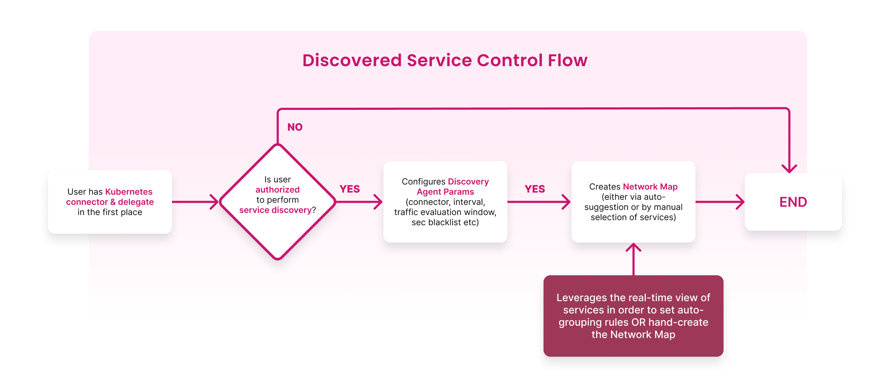
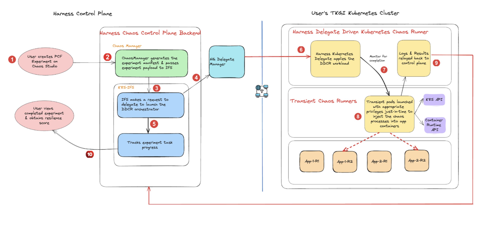
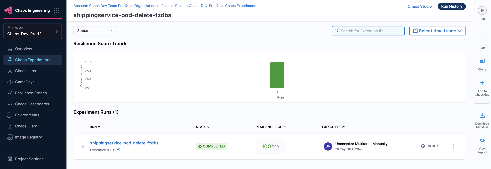

This topic describes Delegate-Driven Chaos Infrastructure, its characteristics, and installation. 

## What is DDCR?

DDCR, aka [Harness Delegate or DDCI (Delegate-Driven Chaos Infrastructure) or DDCR (Delegate-Driven Chaos Runners)](/docs/platform/delegates/delegate-concepts/delegate-overview) is a service that runs in your local network that helps connect your infrastructure, artifacts with Harness Manager. It allows for quick onboarding and optimized chaos execution for microservices-based targets on Kubernetes.

To install a new Delegate, go to [enable chaos](/docs/chaos-engineering/guides/infrastructures/types/)

The diagram below describes the high-level flow of how you can [discover services](/docs/chaos-engineering/guides/service-discovery) and [create application maps](/docs/chaos-engineering/guides/application-maps).

    

:::info note
- To execute chaos experiments, HCE supports Delegate version `24.09.83900` and above.
:::

### Experiment execution using DDCR

The schematic diagram below describes how chaos experiments are executed in using Harness Delegate. It highlights the use of Harness Delegate which eliminates the need for a separate chaos agent, which simplifies the experiment orchestration mechanism.

    

Go to [permissions required](/docs/chaos-engineering/guides/infrastructures/#what-is-ddcrpermissions) to know the detailed list of permissions to execute Kubernetes faults with a Delegate.

The diagram below describes the detailed flow of control (step 5 of the earlier diagram), for an example chaos experiment- [pod DNS chaos](/docs/chaos-engineering/faults/chaos-faults/kubernetes/pod/pod-dns-error).

    

### Characteristics of DDCR

- Automated Kubernetes [service discovery](/docs/chaos-engineering/guides/service-discovery) and workloads with network traffic patterns between them through a transient discovery agent.
- [Automated](/docs/chaos-engineering/get-started#choose-between-automatic-and-customizable-application-map-creation) and [guided](/docs/chaos-engineering/guides/application-maps#create-an-application-map) application map creation that represent a fully functional application within the cluster (which comprises of several constituent microservices).
- [Chaos experiment auto-creation](#auto-create-experiment) for a given [application map](/docs/chaos-engineering/guides/application-maps) based on the workload specification and its lineage in terms of network traffic.
- Reuse the Harness Delegate for chaos experiment execution on the user cluster without a dedicated (or separate) chaos agent.
- Application-level and application map level resilience scores.

### Auto-create experiments
Experiments are auto-created based on levels (or categories) you select during automated or guided onboarding. The default setting is that HCE creates all the recommended experiments for the selected application map.

    

### Speed of execution
Earlier, chaos experiments that executed on dedicated chaos infrastructure would typically take more time (in the order of 4 minutes) whereas with Harness Delegate, you can complete experiment execution in less than half the time (in the order of 1.5 minutes).

The diagram below shows the execution time for experiments that use legacy Kubernetes infrastructure.

    

The diagram below shows the execution time for experiments that use Harness Delegate.

    

### Fault tunables
The number of tunables configured in an experiment that uses Harness Delegate is different. Harness Delegate provides better control over the experiments because of the presence of advanced tunables.

### Resilience score

Earlier, resilience score was measured at the experiment level. With Harness Delegate, you can gain insights into an application along with its associated application map. This way, you can view the application-level resilience score and application-map-level resilience score.

## Next Steps

- [Permissions Required](/docs/chaos-engineering/guides/infrastructures/types/ddcr/permissions)
- [Install Delegate](/docs/chaos-engineering/guides/infrastructures/types/ddcr/installation)
- [Delegate versus Dedicated infrastructure](/docs/chaos-engineering/guides/infrastructures/types/ddcr-vs-dedicated)