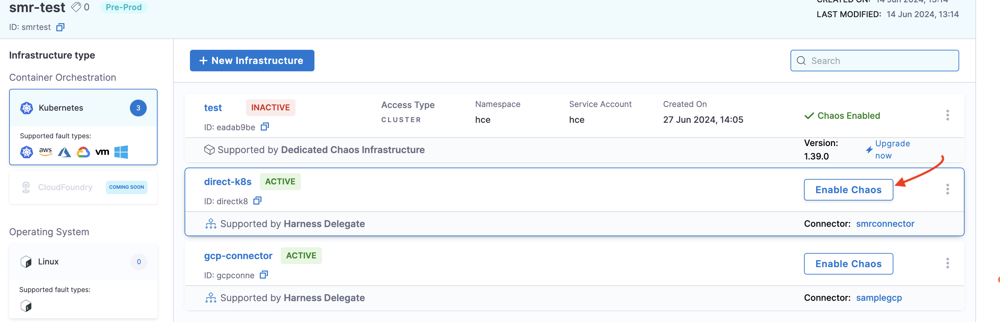

This topic describes how you can install Harness Delegate and enable chaos on it. You can follow the interactive demo or the steps to install Harness Delegate.

:::info Delegate Image Options
Harness provides two delegate image types:
- **Standard Delegate Image** (Recommended) - Includes all required binaries for chaos experimentation and discovery. Follow the standard installation steps below.
- **Delegate-Minimal Image** - Lightweight image that requires additional configuration. See [Using Delegate-Minimal Image](#using-delegate-minimal-image) if you specifically need to use the minimal image.
:::

## Standard Delegate Installation

This section covers the installation of the standard delegate image.

### Prerequisites

- [Create an Environment](/docs/chaos-engineering/on-premise-vs-saas)

### Interactive Demo
Navigate through the demo below to see how to create an environment, a new infrastructure, a new connector and a Delegate. 

If you have created a connector and a Harness Delegate earlier, you can find their names in the list that is displayed while selecting the connector and Delegate, respectively. Select it instead of creating a new one.

<iframe 
  src="https://app.tango.us/app/embed/9c5307d6-ec41-4706-bacc-6dfdd84cde49"
  title="Create a Harness Delegate"
  style={{minHeight:'640px'}}
  width="100%" 
  height="100%" 
  referrerpolicy="strict-origin-when-cross-origin" 
  frameborder="0" 
  webkitallowfullscreen="webkitallowfullscreen" 
  mozallowfullscreen="mozallowfullscreen" 
  allowfullscreen="allowfullscreen"></iframe>


### Step-by-Step Installation

1. Select the **Environment** you created, and choose the **Infrastructure type**. In this example, select **Kubernetes** and click **+ New Infrastructure**.

2. To use Harness Delegate, select **Yes**. To use a dedicated chaos infrastructure, select **No**. In this example, select **Yes**, and click **Next**.

3. Provide a **Name**, **Deployment Type**, **Select Infrastructure Type**, and provide **Cluster Details**, such as **Connector**, and **Namespace**. 
  
    a. To create a new connector, go to [Create Kubernetes Connector](/docs/platform/connectors/cloud-providers/add-a-kubernetes-cluster-connector/#add-a-kubernetes-cluster-connector). Harness CE supports creating two types of connectors:         
      - [Kubernetes (Direct Connection)](/docs/platform/connectors/cloud-providers/ref-cloud-providers/kubernetes-cluster-connector-settings-reference) 
      - [GCP](/docs/platform/connectors/cloud-providers/ref-cloud-providers/gcs-connector-settings-reference)

    b. While creating a Kubernetes connector, select or [create a new Delegate](/docs/platform/delegates/install-delegates/overview/#install-the-helm-chart). Once your Delegate shows up in the list, enter its name in the search bar, and select **Save and Continue**. This will test your connection and describe if it was a success or no. Contact [Harness Support](mailto:support@harness.io) if you encounter issues with the verification.

4. To **Enable Chaos** and use **Configure Advanced Settings (Optional)**, navigate to **Environments** and **Enable Chaos** on the infrastructure you created earlier.

    

5. Choose between **Beginner** or **Expert** and click **Go**. 

    

6. You can choose to provide additional configurations in the **Configure Advanced Settings (Optional)** section to configure [chaos runner and Discovery Agent](/docs/platform/service-discovery/customize-agent) and click **Go**. This creates application maps and chaos experiments for you.

    


:::tip
- Ensure your Delegate version is `24.09.83900` or above to support executing chaos experiments using DDCR. 
- Currently, DDCR (or Harness Delegate) can only be installed to execute Kubernetes-based faults. This means you can only create Kubernetes connectors.
- To execute faults on Linux and Windows, install Linux and Windows agents respectively.
- To configure mTLS with DDCR and Discovery Agent, go to [mTLS Support](/docs/chaos-engineering/guides/infrastructures/types/ddcr/mtls-support).
- To configure mTLS with DDCR and and Discovery Agent proxy settings, go to [proxy Support](/docs/chaos-engineering/guides/infrastructures/types/ddcr/proxy-support).
:::

---

## Using Delegate-Minimal Image

:::warning Important
The **standard delegate image** includes all required binaries for chaos experimentation and discovery out-of-the-box. Use the steps above for standard delegate installation.

If you are using the **delegate-minimal image**, additional setup is required as described below.
:::

By default, chaos experimentation and discovery are **not supported** with the `delegate-minimal` image. The delegate-minimal image does not include `kubectl` and `go-template` binaries, which are required for discovery and chaos experimentation.

### Prerequisites for Delegate-Minimal

If you are using a `delegate-minimal` image, you must install `kubectl` and `go-template` binaries using one of the following methods:

### Option 1: Create a Custom Delegate Image

Create your own custom version of the `delegate-minimal` image with `kubectl` and `go-template` binaries pre-installed.

### Option 2: Use INIT_SCRIPT Environment Variable (Recommended)

Provide an installation script in the `INIT_SCRIPT` environment variable of the delegate deployment:

```yaml
- env:
  - name: INIT_SCRIPT
    value: |
      ##kubectl
      curl -L0 https://app.harness.io/public/shared/tools/kubectl/release/v1.28.7/bin/linux/amd64/kubectl -o kubectl
      chmod +x ./kubectl
      mv kubectl /usr/local/bin/
      ## go-template
      curl -L0 https://app.harness.io/public/shared/tools/go-template/release/v0.4.1/bin/linux/amd64/go-template -o go-template
      chmod +x ./go-template
      mv go-template /usr/local/bin/
```

<details>
<summary>View Complete Deployment Example</summary>

Below is a complete example of a delegate deployment using the minimal image with the `INIT_SCRIPT` configuration:

```yaml
apiVersion: apps/v1
kind: Deployment
metadata:
  annotations:
    deployment.kubernetes.io/revision: "12"
    meta.helm.sh/release-name: minimal-delegate
    meta.helm.sh/release-namespace: harness-delegate-ng
  creationTimestamp: "2025-12-24T14:59:12Z"
  generation: 14
  labels:
    app.kubernetes.io/instance: minimal-delegate
    app.kubernetes.io/managed-by: Helm
    app.kubernetes.io/name: minimal-delegate
    harness.io/name: minimal-delegate
    helm.sh/chart: harness-delegate-ng-1.0.30
  name: minimal-delegate
  namespace: harness-delegate-ng
  resourceVersion: "1766592671187615000"
  uid: e722c89a-b32a-4967-b0d1-18b30875ec5a
spec:
  minReadySeconds: 120
  progressDeadlineSeconds: 600
  replicas: 1
  revisionHistoryLimit: 10
  selector:
    matchLabels:
      app.kubernetes.io/instance: minimal-delegate
      app.kubernetes.io/name: minimal-delegate
      harness.io/name: minimal-delegate
  strategy:
    rollingUpdate:
      maxSurge: 25%
      maxUnavailable: 25%
    type: RollingUpdate
  template:
    metadata:
      annotations:
        checksum/configmap: 7035b94e3fa40ca0d141e84bae671bb39a14c87607df12e987c795c13ff0a88
        checksum/secret: 9e0e62b1a5d981d355a1098af3828757de0c4a287fb6657566da29bea504dc0
        prometheus.io/path: /api/metrics
        prometheus.io/port: "3460"
        prometheus.io/scrape: "true"
      creationTimestamp: null
      labels:
        app.kubernetes.io/instance: minimal-delegate
        app.kubernetes.io/name: minimal-delegate
        harness.io/name: minimal-delegate
    spec:
      containers:
      - env:
        - name: INIT_SCRIPT
          value: |
            ##kubectl
            curl -L0 https://app.harness.io/public/shared/tools/kubectl/release/v1.28.7/bin/linux/amd64/kubectl -o kubectl
            chmod +x ./kubectl
            mv kubectl /usr/local/bin/
            ## go-template
            curl -L0 https://app.harness.io/public/shared/tools/go-template/release/v0.4.1/bin/linux/amd64/go-template -o go-template
            chmod +x ./go-template
            mv go-template /usr/local/bin/
        envFrom:
        - configMapRef:
            name: minimal-delegate
        - secretRef:
            name: minimal-delegate
        - configMapRef:
            name: minimal-delegate-proxy
            optional: true
        - secretRef:
            name: minimal-delegate-proxy
            optional: true
        - configMapRef:
            name: minimal-delegate-shared-certificates
            optional: true
        image: us-docker.pkg.dev/gar-prod-setup/harness-public/harness/delegate:25.08.86602.minimal
        imagePullPolicy: Always
        livenessProbe:
          failureThreshold: 3
          httpGet:
            path: /api/health
            port: 3460
            scheme: HTTP
          initialDelaySeconds: 30
          periodSeconds: 20
          successThreshold: 1
          timeoutSeconds: 1
        name: delegate
        ports:
        - containerPort: 8080
          protocol: TCP
        - containerPort: 3460
          name: api
          protocol: TCP
        resources: {}
        securityContext:
          allowPrivilegeEscalation: false
          runAsUser: 0
        startupProbe:
          failureThreshold: 40
          httpGet:
            path: /api/health
            port: 3460
            scheme: HTTP
          initialDelaySeconds: 10
          periodSeconds: 10
          successThreshold: 1
          timeoutSeconds: 1
        terminationMessagePath: /dev/termination-log
        terminationMessagePolicy: File
      dnsPolicy: ClusterFirst
      restartPolicy: Always
      schedulerName: default-scheduler
      securityContext:
        fsGroup: 1001
      serviceAccount: minimal-delegate
      serviceAccountName: minimal-delegate
      terminationGracePeriodSeconds: 600
```

</details>

---

## Harness Terraform Provider

Go to [create Harness Delegate (DDCR)](https://registry.terraform.io/providers/harness/harness/latest/docs/resources/chaos_infrastructure) to create a Harness Delegate using [Harness Terraform provider](https://developer.harness.io/docs/platform/automation/terraform/harness-terraform-provider-overview/).

## Next Steps

- [Deploy Delegate on a Cluster](/docs/chaos-engineering/guides/infrastructures/types/ddcr/dedicated-delegate)
- [Use mTLS with Delegate](/docs/chaos-engineering/guides/infrastructures/types/ddcr/mtls-support)