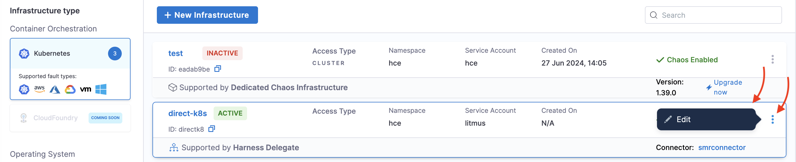

This topic describes when Harness Network Proxy (HNP) is required, how you can install it, and configure DDCR and discovery HNP settings.

When you have a restricted network and when you want all the outbound connections to go from a single node/cluster, you can use your own proxy or Harness Network Proxy (HNP).
If direct connectivity exists, the proxy can be bypassed entirely.

:::tip
You can configure HNP with custom certificates that offers greater control over secure communication.
:::

The diagram below describes how the **Discovery Agent** and **Chaos Runner** communicate with Harness Control Plane.

    

The diagram above describes the following:
- All the inbound connections go through the Delegate.
- If your cluster has connectivity with the Harness portal (Harness Control Plane in the diagram), you won't need any proxy.
- If your cluster does not have connectivity with the Harness portal (Harness Control Plane in the diagram), then such requests goes through the proxy.
    - In case you already have a proxy set up, you can [provide the URL of the proxy in the UI](/docs/chaos-engineering/guides/infrastructures/types/ddcr/proxy-support#delegate-driven-chaos-runner-ddcr).
    - In case you don't have a proxy set up, you can [install](#installation) HNP.
    - In case you don't have a proxy set up, you can [install](#installation) HNP.

:::tip
Chaos runner supports token-based authentication with the Harness Platform. If you want to add another authentication on top of Harness authentication, you can [enable mTLS](/docs/chaos-engineering/guides/infrastructures/types/ddcr/mtls-support) for the account.
:::

## Installation

To install HNP, execute the below Helm command.

```bash
helm repo add harness-chaos https://harness.github.io/chaos-infra-helm-chart
```

```bash
helm upgrade --install chaos-agent-proxy harness-chaos/chaos-infra -n hce -f override.yaml
```

You can install HNP with or without using mTLS. Described below are sample configurations for both of them.
To install HNP, execute the below Helm command.

```bash
helm repo add harness-chaos https://harness.github.io/chaos-infra-helm-chart
```

```bash
helm upgrade --install chaos-agent-proxy harness-chaos/chaos-infra -n hce -f override.yaml
```

You can install HNP with or without using mTLS. Described below are sample configurations for both of them.

### Without mTLS

```yaml
tags:
  agentProxy: true
global:
  serverAddress: https://app.harness.io
```

### With mTLS

Go to [create client certificate](/docs/platform/delegates/secure-delegates/delegate-mtls-support/#configure-mtls-on-delegate) before configuring with mTLS.

```yaml
tags:
  agentProxy: true
global:
  serverAddress: https://<customer-name>.agent.app.harness.io

agent-proxy:
  volumes:
  - name: client-certificate
    secret:
      secretName: client-certificate

  volumeMounts:
  - mountPath: /etc/mtls
    name: client-certificate
    readOnly: true

  env:
  - name: CLIENT_CERT_PATH
    value: /etc/mtls/client.crt
  - name: CLIENT_KEY_PATH
    value: /etc/mtls/client.key
```

## HNP Configuration for Delegate-Driven Chaos Runner (DDCR)
You can enable proxy settings in DDCR that enables you to restrict all the outbound traffic to go through the proxy.

DDCR supports standard proxy variables `HTTP_PROXY` , `HTTPS_PROXY`, and `NO_PROXY`.

In general, the Harness portal connection goes through the proxy and you will need to specify `NO_PROXY` which is the `kubernetes` service IP in the `default` namespace.

- Go to **Environments** and select the environment that houses your Harness Delegate.

    

- Select the Delegate you installed, and select the **`⋮`** icon against the name of the Delegate and click **Edit**.

    

- Configure the proxy settings and click **Save**.

    

- Instead, you can also provide `PROXY_URL` setting that is used to communicate with the Harness portal.

      

## HNP Configuration for Discovery Agent

You can enable proxy settings in Discovery Agent that enables you to restrict all the outbound traffic to go through the proxy.

Discovery Agent supports standard proxy variables `HTTP_PROXY` , `HTTPS_PROXY`, and `NO_PROXY`.

In general, the Harness portal connection goes through the proxy and you will need to specify `NO_PROXY` which is Kubernetes service IP in default namespace.

- Go to **Project Settings** -> **Discovery**.

  

- Select the discovery agent you have created, and click **Edit**.

    

- Configure values for Proxy.

    

- Instead, you can also provide `PROXY_URL` setting that is used to communicate with the Harness portal.

      
