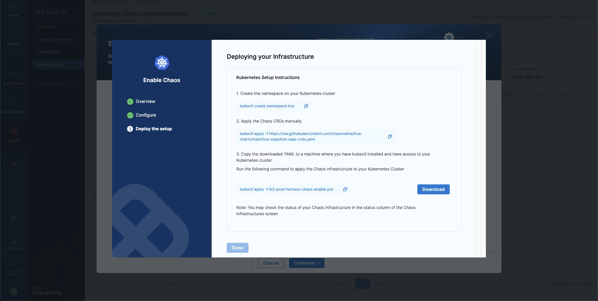
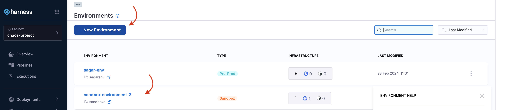
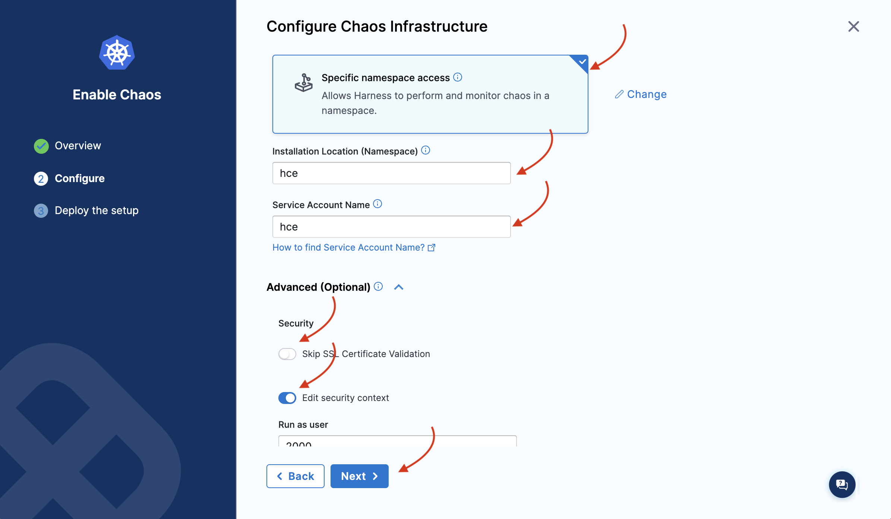
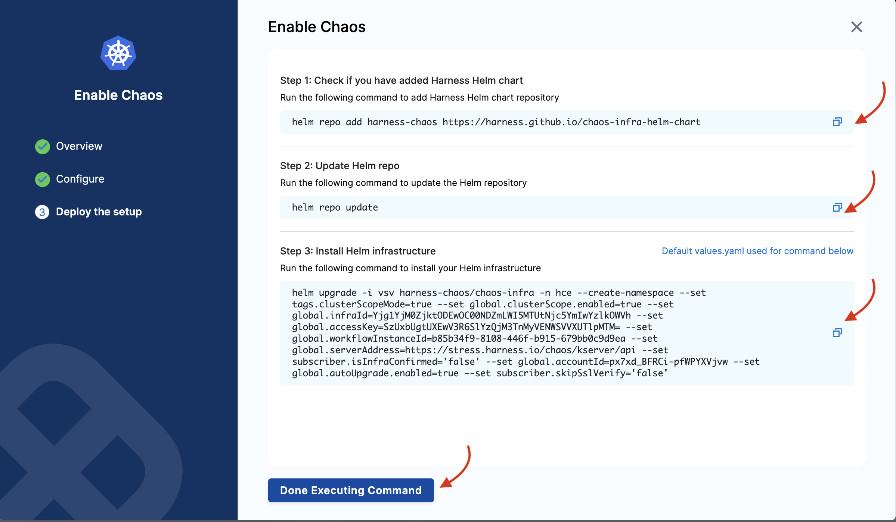

This topic describes the following:
  - [What is Dedicated Chaos Infrastructure?](/docs/chaos-engineering/guides/infrastructures/types/legacy-infra/kubernetes#what-is-harness-chaos-infrastructure)
  - [Resource Requirements](/docs/chaos-engineering/guides/infrastructures/types/legacy-infra/kubernetes#chaos-infrastructure-requirements)
  - [Installation steps](/docs/chaos-engineering/guides/infrastructures/types/legacy-infra/kubernetes#install-dedicated-chaos-infrastructure)
  - [Validate the installation](/docs/chaos-engineering/guides/infrastructures/types/legacy-infra/kubernetes#validate-installation)
  - [Disable the infrastructure](/docs/chaos-engineering/guides/infrastructures/types/legacy-infra/kubernetes#disable-infrastructure)

## What is Harness Chaos Infrastructure?

Harness Chaos Infrastructure (also known as Legacy Kubernetes Infrastructure) uses a dedicated infrastructure to facilitate and execute chaos experiments.

:::tip
Unless specified, chaos infrastructure refers to the dedicated chaos infrastructure (or legacy chaos infrastructure), and **NOT** DDCR.
:::

## Chaos infrastructure requirements

The table below lists the chaos infrastructure execution plane components and the required resources for Legacy Kubernetes Infrastructure. You can install these components in your target cluster, allowing the chaos infrastructure to run experiments here. Chaos infrastructure runs within your target environment to aid HCE in accessing the target resources and injecting chaos at a cloud-native scale.

<table>
    <thead>
        <tr>
            <th>Deployment</th>
            <th>Container</th>
            <th>CPU Required</th>
            <th>Memory Required</th>
            <th>Image</th>
        </tr>
    </thead>
    <tbody>
        <tr>
            <td>chaos-operator-ce</td>
            <td>chaos-operator-ce</td>
            <td>125m</td>
            <td>300M</td>
            <td>docker.io/harness/chaos-operator</td>
        </tr>
        <tr>
            <td>chaos-exporter</td>
            <td>chaos-exporter</td>
            <td>125m</td>
            <td>300M</td>
            <td>docker.io/harness/chaos-exporter</td>
        </tr>
        <tr>
            <td>subscriber</td>
            <td>subscriber</td>
            <td>125m</td>
            <td>300M</td>
            <td>docker.io/harness/chaos-subscriber</td>
        </tr>
        <tr>
            <td>workflow-controller</td>
            <td>workflow-controller</td>
            <td>125m</td>
            <td>300M</td>
            <td>docker.io/harness/chaos-workflow-controller</td>
        </tr>
    </tbody>
</table>

## Install Dedicated Chaos Infrastructure

You can enable chaos **on existing infrastructure** that uses a Harness cluster connector (also known as Harness Kubernetes connector) or **on new infrastructure**.

:::tip
You can choose between Kubernetes and Kubernetes (Harness infrastructure). The former refers to a dedicated infrastructure whereas the latter refers to Harness Delegate.
:::

### On Existing Infrastructure
To enable chaos on an existing Harness Kubernetes connector:

1. Go to **Chaos > Environments**, and then select the environment you want to add chaos infrastructure to.

1. On the environment details page, select **+ Enable Chaos**.

1. On the next screen, select where to add chaos infrastructure, and then select **Continue**.

4. If you selected **On Existing Infrastructures**, on the next screen, select any connector under the **Project**, **Organization**, or **Account** scope. Select **Continue**.

    

  :::info note
  A Harness Kubernetes connector with:
    * **Cluster-wide read/write access** can be used to set up chaos infrastructure in cluster scope and namespace scope.
    * **Specific namespace access** can be used to set up a chaos infrastructure in that specific Kubernetes namespace scope only.
    * **Cluster-wide read access** cannot be used to set up a chaos infrastructure.
  :::

5. The **Configure Chaos Infrastructure** screen appears. Select the installation type, access type, namespace, and service account name. Select **Next**.

  Under **Choose Access Type**, choose one of the following modes.

    * **Cluster Wide:** This mode of infrastructure installation allows targeting resources across the entire cluster, in all the namespaces, as part of an experiment.
    * **Namespace Mode:** This mode of infrastructure installation allows targeting resources only in the namespace where the chaos infrastructure is deployed.

  By default, chaos is installed in the `hce` namespace and uses `hce` service account, which you can configure under the K8s cluster details.

  Optionally, you can specify the node selectors and Kubernetes toleration for chaos infrastructure deployment.

:::tip
- There can only be one cluster-wide chaos infrastructure per cluster.
- There may be multiple namespace-scoped chaos infrastructures per cluster.
:::

    

6. The **Deploying your Infrastructure** screen appears. If you're deploying **on existing infrastructure**, select **Done**. This is your final step. Harness installs the chaos infrastructure on your behalf.

### On New Infrastructure

1. If you're deploying on **new infrastructure**, provide a name for the new infrastructure, a **Description** (optional) and a **Tag** (optional). Select **Next**.

2. On the **Configure Chaos Infrastructure** screen, provide details like the installation type, access type, namespace, and service account name. Select **Next**.

3. Copy the given command(s), download the installation manifest YAML and run it on the terminal, based on cluster-wide or namespace access.

    * **For cluster-wide access:**

      1. Select **Download**, and then copy and run the `kubectl` command shown on your screen to install the chaos infrastructure. Select **Done**.

          

    * **For namespace access:**

      1. Run the first `kubectl` command to create the target namespace.
      1. Run the second `kubectl` command to apply the chaos CRDs.
      1. Select **Download**, and then copy and run the third command to install the chaos infrastructure. Select **Done**.

          

### Use Helm Template to Install Chaos Infrastructure

Harness CE provides Helm support to install chaos infrastructure, in addition to installing with the help of a manifest (as explained earlier).

To use Helm to install a chaos infrastructure,

1. Navigate to **Chaos Experiments** -> **Environment**. Select **New environment** and create an environment and install or upgrade chaos infrastructure. To enable chaos in an existing environment, click the environment.

    

2. Click **Enable chaos**.

    

3. You can use Helm commands to enable chaos on new infrastructure only. Click **On new infrastructures** and **Continue**. Add a name, description (optional), and a tag (optional). Click **Next**.

    

4. Choose the installation type as **Helm**, and one of the access types (namespace or cluster-wide). Specify namespace and service account.

    

5. Depending on the type of access you choose, you will see a set of commands. If you select namespace type, you will need to enter some advanced input values. Click **Next**.

    

6. You will see the following commands that you need to execute on your terminal. Once you are done, click **Completed Command Execution**.

    

7. If you select the namespace scope, you will see some commands that you need to execute on your terminal. One you are done, click **Completed Command Execution**.

### Upgrade Infrastructure

To upgrade Helm-based installation's infrastructure, go to [Upgrade Infrastructure](/docs/chaos-engineering/guides/infrastructures/upgrade-infra#use-helm-template-to-upgrade-chaos-infrastructure).

## Validate Installation

After adding chaos infrastructure, Harness takes some time to set up all the chaos infrastructure resources. On the UI, if you navigate to **Environments** -> **Kubernetes**, you can see the connection status is `CONNECTED`.

  

That's it! Now you have a dedicated Kubernetes chaos infrastructure and you're all set to inject chaos into your infrastructure.

## Disable Infrastructure

1. Select the `⋮` icon against the chaos infrastructure name and select **Disable**.

    

2. Execute the commands displayed in the modal from your terminal to remove the chaos infrastructure components. Finally, select **Confirm**.

This disables your Kubernetes infrastructure.

## Next Steps

- [Delegate-Driven Chaos Infrastructure](/docs/chaos-engineering/guides/infrastructures/types/ddcr/)
- [Dedicated versus Delegate Driven Infrastructure](/docs/chaos-engineering/guides/infrastructures/types/ddcr-vs-dedicated)
- [Upgrade Infrastructure](/docs/chaos-engineering/guides/infrastructures/upgrade-infra)