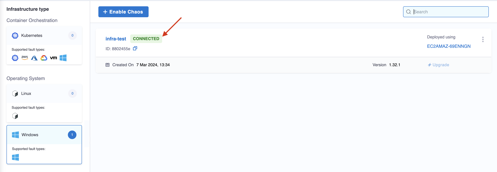

This topic describes Linux Chaos Infrastructure (LCI), how to use flags to configure some characteristics of the infrastructure, how to enable, and disable chaos on LCI.

## Configure with Flags

A set of mandatory input flags is required to install chaos infrastructure, including the `infra-id`, `access-key` and the `server-url`. However, you can use the following flags to tune some aspects of the infrastructure.
1. **log-directory**: Custom log directory to store the log files. By default, the logs are stored at `/var/log/linux-chaos-infrastructure`.
2. **task-poll-interval-seconds**: Interval between subsequent poll queries to the server for a new experiment. The default value is **5 seconds**.
3. **task-update-interval-seconds**: Duration between subsequent status updates of an active fault to the server. The default value is **5 seconds**.
4. **update-retries**: Maximum number of retries in case of a failure while sending a fault status or result.

    * If the retry count is breached while sending the status, the active fault is aborted after logging the error during each attempts and the result is then attempted to be sent.

    * If the retry count is breached while sending the result, no result is sent by the infrastructure but the error during the attempts are logged.

    The default value is **5**.

5. **update-retry-interval-seconds**: Interval between the subsequent attempts to send a fault status or result, in case of a failure. The default value for it is **5 seconds**.
6. **chaos-infra-liveness-update-interval-seconds**: Interval between the chaos infrastructure liveness heartbeats. The default value is **5 seconds**.
7. **chaos-infra-log-file-max-size-mb**: Maximum size limit for the chaos infrastructure log file rotation. Upon breaching the size limit, a new log file is created to store the logs and the old log file is retired as a backup archive. The default value is **5 MB**.
8. **chaos-infra-log-file-max-backups**: Maximum number of backup archives to be retained at any given time. The oldest archive is deleted when a new log file is created. The default value is **2**.
9. **experiment-log-file-max-age-days**: Number of days after which the experiment log files will be deleted. The default value is **30**.
10. **custom-tls-certificate**: TLS certificate used to communicate with the control plane.
11. **http-proxy**: HTTP proxy URL used to communicate with the control plane.
12. **http-client-timeout**: HTTP client timeout for communicating with the control plane. The default value is **30s**.

:::info note
- LCI currently does not support executing [parallel faults](/docs/chaos-engineering/guides/chaos-experiments/create-experiments) in SaaS (the self-managed platform (SMP) supports executing parallel faults on LCI).
:::

### Infrastructure Service
The Linux chaos infrastructure is installed as an executable binary on your Linux machine. This infrastructure is managed as a `Systemd` service.
- The service starts automatically when the system starts.
- If the service stops unexpectedly, it automatically attempts to restart after a cool down period of 5 seconds.
- By default, the service ensures that the chaos infrastructure process is owned by the root user.

To check if the infrastructure service is active and running, use the following command:
```
systemctl status linux-chaos-infrastructure.service
```


Any status other than the `active` status would indicate an issue with the infrastructure.

### Logs
Logs generated are stored in the `/var/log/linux-chaos-infrastructure` directory by default. There are two types of logs:
1. **Infrastructure logs:** Infrastructure logs are generated as a result of any infrastructure operation that is not directly related to the execution of an experiment. For example:
    - Start of execution of an experiment
    - End of execution of an experiment
    - Error during the creation of an experiment log file
    - Error while querying for an experiment
    - Error while sending the experiment status or result, etc.

    By default, this log file is located at `/var/log/linux-chaos-infrastructure/linux-chaos-infrastructure.log` and can be used for troubleshooting the infrastructure.

The file is rotated based on its size; when the file size is a specified size, it is archived in a separate file with the timestamp of rotation suffixed to the file name. By default, this value is **5 MB**.

Eventually, the old archives will be deleted. The maximum number of most recent archives that are retained at any given time can be specified. By default, this value is **2**.


2. **Experiment logs:** Experiment logs are stored in separate files, which are scoped to the faults of the experiment. It contains information about the various steps of the execution of that fault, including any errors caused during the execution of the fault. The files use the unique fault name mentioned in the experiment as their filename.
These files are rotated based on their age; where files older than a specific number of days are removed. By default, this value is **30 days**.


:::info note
If you're installing the chaos infrastructure alongside SElinux, you must add a policy module to enable `timedatectl`. SElinux is enabled by default in distributions such as **CentOS**, **SUSE Linux**, **RHEL**, and **Fedora** among others.

<details>

If you have enabled SELinux for your OS, you must add a policy module prior to the installation of the infrastructure to access `timedatectl`, which is used in the **linux-time-chaos** fault.

To add the policy module:

1. Create the file `timedatectlAllow.te` in your Linux machine as follows:

  ```te

  module timedatectlAllow 1.0;

  require {
          type systemd_timedated_t;
          type initrc_t;
          class dbus send_msg;
  }

  #============= systemd_timedated_t ==============
  allow systemd_timedated_t initrc_t:dbus send_msg;

  ```

1. Install the utilities that will help in compiling and packaging the policy module for your system. Here, we're using the yum package manager to install them:

  ```bash
  sudo yum install -y policycoreutils-python checkpolicy
  ```

1. After the installation of these packages, compile the policy module with the following command:

  ```bash
  sudo checkmodule -M -m -o timedatectlAllow.mod timedatectlAllow.te
  ```

  This creates the binary policy module file `timedatectlAllow.mod`.

1. Use the policy module file from the previous step to create a policy module package:

  ```bash
  sudo semodule_package -o timedatectlAllow.pp -m timedatectlAllow.mod
  ```

  This creates the policy module package file `timedatectlAllow.pp`.

1. Add the package file from the previous step alongside the other SELinux modules in your system:

  ```bash
  sudo semodule -i timedatectlAllow.pp
  ```

The SELinux policy module is now added, and you can proceed to install the infrastructure.

</details>
:::

## Enable Chaos on Linux

To enable chaos on Linux, follow the steps below:

1. Go to **Chaos > Environments**, and then select the environment you want to add chaos infrastructure.

1. In the environment details page, under **Infrastructure type**, select **Linux**, and then select **+ Enable Chaos**.

    

1. On the next screen, enter a **Name** for the infrastructure, and optionally, a **Description** and **Tags**. Select **Next**.
You can also specify [different values](/docs/chaos-engineering/key-concepts) for the infrastructure.

    

1. On the next screen, copy the command to set up Linux chaos access, select **Done**, and then execute the copied command on your Linux machine.

## Upgrade Infrastructure

Go to [Upgrade Saas or SMP for Linux](/docs/chaos-engineering/guides/infrastructures/upgrade-infra#upgrade-linux-infrastructure) to upgrade your installation.

## Validate Installation

After adding chaos infrastructure, Harness takes some time to set up all the chaos infrastructure resources. On the UI, if you navigate to **Environments** -> **Linux**, you can see the connection status is `CONNECTED`.

  

That's it! Now you have a Linux chaos infrastructure and you're all set to inject chaos into your infrastructure.

## Disable Infrastructure

1. Go to the **Environments** under the **Chaos** tab, that lists all the environments created under the current project. Select the environment that has the chaos infrastructure to be deleted. Select the **Infrastructure Type** as **Linux**.

2. Select the `⋮` icon against the chaos infrastructure name and select **Disable**.

    

2. Copy the command displayed in the modal, and execute it in your Linux machine to uninstall the chaos infrastructure components. Finally, select **Confirm**.

This disables your Linux chaos infrastructure. 