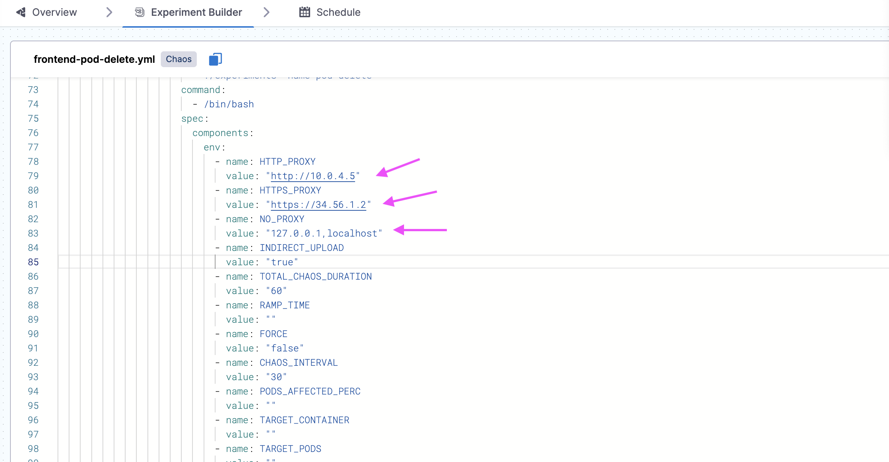

This topic describes the method to connect your chaos infrastructure to the control plane on [app.harness.io](https://app.harness.io) or Self-Managed Platform (SMP) via proxy when using a [dedicated chaos infrastructure](/docs/chaos-engineering/guides/infrastructures/types/legacy-infra/).

Go to configure proxy settings for [Harness Delegate Driven Chaos runner](/docs/chaos-engineering/guides/infrastructures/types/ddcr/proxy-support#hnp-configuration-for-delegate-driven-chaos-runner-ddcr) and proxy settings for [Discovery Agent](/docs/chaos-engineering/guides/infrastructures/types/ddcr/proxy-support#hnp-configuration-for-discovery-agent) to configure DDCR and Discovery agent related proxy settings, respectively.

:::tip
To know about new feature releases, enhancements, and fixed issues, go to [SMP release notes](/release-notes/self-managed-enterprise-edition).
:::

To deploy a chaos infrastructure in an air-gapped cluster that accesses [app.harness.io](https://app.harness.io) or SMP control plane via proxy, configure the `HTTP_PROXY` , `HTTPS_PROXY`, and `NO_PROXY` environment variables for the subscriber, and apply the manifest, where:

- `HTTP_PROXY` is set if you deploy the SMP control plane over HTTP.

- `HTTPS_PROXY` is set if you deploy the SMP control plane over HTTPS or if you want to connect to [app.harness.io](https://app.harness.io).

- `NO_PROXY` is set with the cluster IP of the cluster where you deploy the chaos infrastructure. This allows requests to be directed to the Kube API server directly instead of going through a proxy. In addition, the proxy may not be able to connect to the Kube API server if it is deployed outside the cluster.


The above environment variables are set without providing any credentials. An example of a proxy without credentials:
```
http://<proxy-ip>:<proxy-port>
```

When the infrastructure is `CONNECTED`, an experiment is created. 
To stream logs in real-time during experiment execution, configure the following environment variables in the experiment manifest (for the experiment you created earlier).

Select **YAML** view in the **Experiment Builder**, and click **Edit Yaml**, and provide values for `HTTP_PROXY`, `HTTPS_PROXY`, `NO_PROXY` and `INDIRECT_UPLOAD` as shown in the diagram.

    

The environment variables are described below:

- `HTTP_PROXY` is set if you deploy the SMP control plane over HTTP.

- `HTTPS_PROXY` is set if you deploy the SMP control plane over HTTPS or if you want to connect to [app.harness.io](https://app.harness.io).

- `NO_PROXY` is set with the cluster IP of the cluster where you deploy the chaos infrastructure. This allows requests to be directed to the Kube API server directly instead of going through a proxy. In addition, the proxy may not be able to connect to the Kube API server if it is deployed outside the cluster.

- `INDIRECT_UPLOAD`is set to "true".


:::tip
- You can provide `HTTP_PROXY` and `HTTPS_PROXY` with endpoints that have credentials. For this, you have to first URL Encode the username and the password and provide them.
- An example of a proxy with credentials:

```
http://<url-encoded-username>:<url-encoded-password>@<proxy-ip>:<proxy-port>
```
:::

