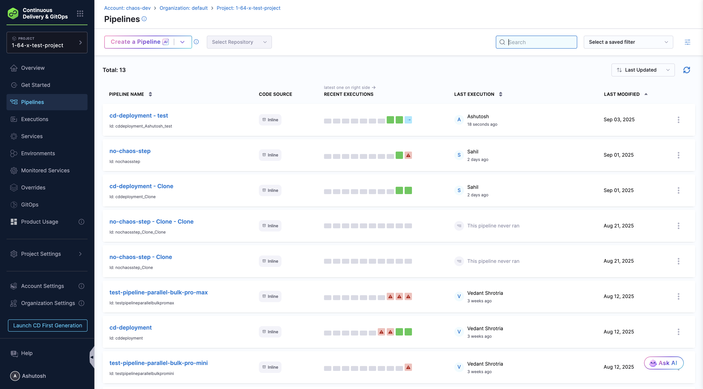
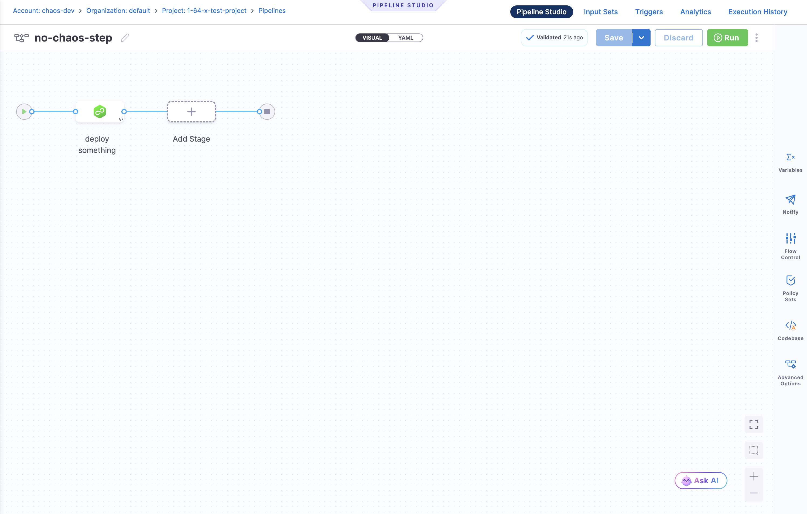
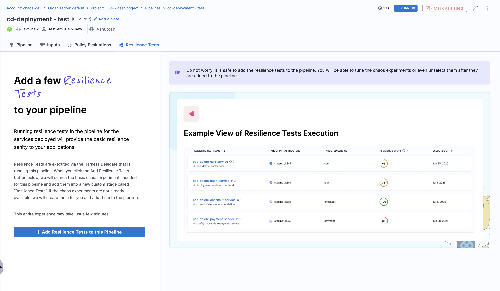
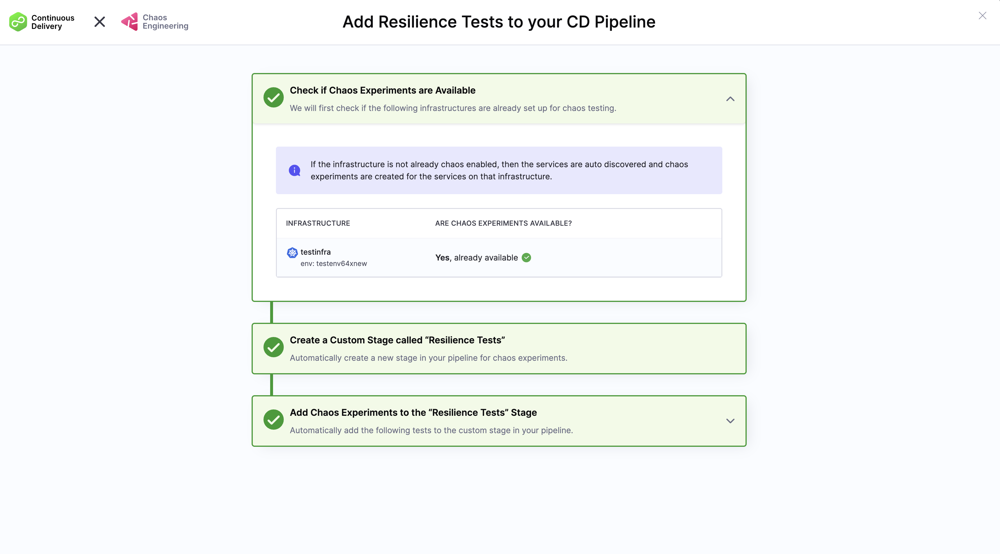
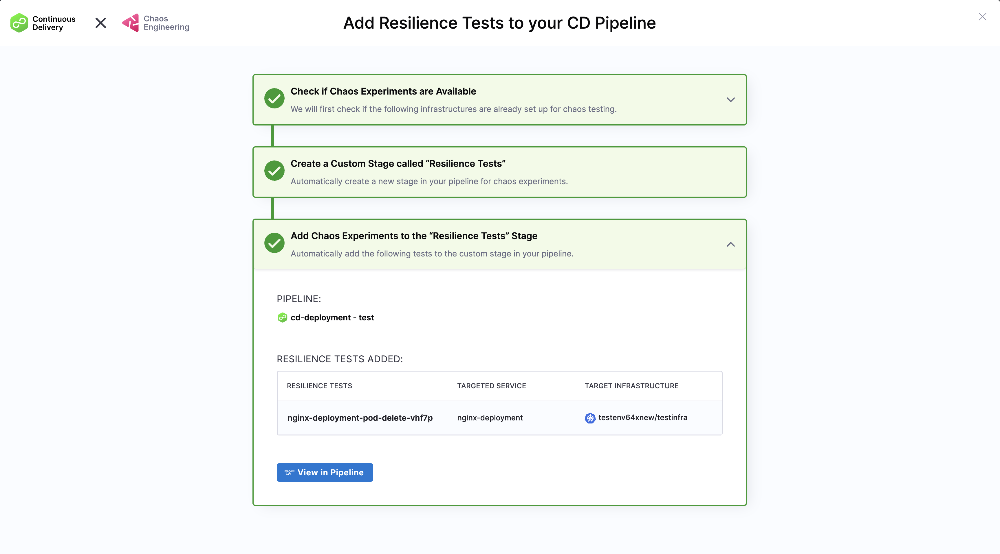

:::info Feature Flag Required
This feature is currently behind the `CHAOS_RESILIENCE_TESTS_TAB_ENABLED` feature flag. Contact your Harness support representative to enable this feature for your account.
:::

# One-Click Harness CD Onboarding

The One-Click Harness CD Onboarding feature makes it incredibly easy for Harness CD customers to add resilience testing to their existing pipelines with just one click. The system automatically analyzes your cluster, identifies deployed services, determines appropriate chaos experiments for each service, creates chaos steps with the exact parameters needed, and integrates them directly into your CD pipeline.

## Overview

The automated workflow includes:
- **Cluster Analysis**: Scans your target cluster to understand the infrastructure
- **Service Discovery**: Identifies all deployed services and their configurations
- **Experiment Matching**: Determines which chaos experiments are appropriate for each service
- **Parameter Configuration**: Creates chaos steps with exact parameters tailored to your services
- **Pipeline Integration**: Automatically adds the configured chaos steps directly into your CD pipeline

## Prerequisites

Before using One-Click CD Onboarding, ensure you have:

- **Harness Continuous Delivery**: Active access to the Harness CD module
- **Harness Chaos Engineering**: Active access to the Harness Chaos Engineering module

## Getting Started

1. Navigate to **Harness CD module** and click on **Pipelines**

      

2. Create a new pipeline or select an existing pipeline. You'll see there's no chaos step in the pipeline.

      

3. Click on **Run** to run that pipeline.
4. Go to **Resilience Tests** tab and click on **Add Resilience Tests to this Pipeline**.

      

5. The system will automatically perform the following workflow:
   - **Check Infrastructure**: Verifies if chaos experiments are already available for your infrastructure
   - **Auto-Discovery**: If not chaos-enabled, the system discovers services and creates chaos experiments for the infrastructure
   - **Create Custom Stage**: Automatically creates a new "Resilience Tests" stage in your pipeline
   - **Add Chaos Experiments**: Automatically adds the appropriate chaos experiments to the custom stage in your pipeline

      

6. Review the **Resilience Tests Added** summary:
   - **Pipeline**: Shows which pipeline the tests were added to (e.g., "cd-deployment - test")
   - **Resilience Tests**: Lists the specific chaos experiments created (e.g., "nginx-deployment-pod-delete-vhf7p")
   - **Targeted Service**: Shows the service being tested (e.g., "nginx-deployment")
   - **Target Infrastructure**: Displays the infrastructure where tests will run (e.g., "testenv64new/testinfra")
   - Click **View in Pipeline** to see the updated pipeline with the new resilience tests stage

      

7. **Run the Updated Pipeline**:
   - You'll now see your pipeline with the new **Resilience Testing** stage automatically added between your deployment stages
   - The pipeline shows the complete flow: deployment → resilience testing → additional stages
   - Click the **Run** button to execute the pipeline with chaos experiments included
   - The resilience tests will run automatically as part of your CD workflow

      

## Next Steps

After successful onboarding:

- [Configure Advanced Deployment Strategies](/docs/continuous-delivery/deploy-srv/deployment-concepts/deployment-types/deployment-concepts-overview)
- [Set Up GitOps Workflows](/docs/continuous-delivery/gitops/get-started/harness-git-ops-basics)
- [Implement Policy as Code](/docs/continuous-delivery/x-platform-cd-features/advanced/cd-governance/harness-governance-overview)
- [Explore Infrastructure as Code](/docs/continuous-delivery/cd-infrastructure/terraform-infra/terraform-how-tos)
