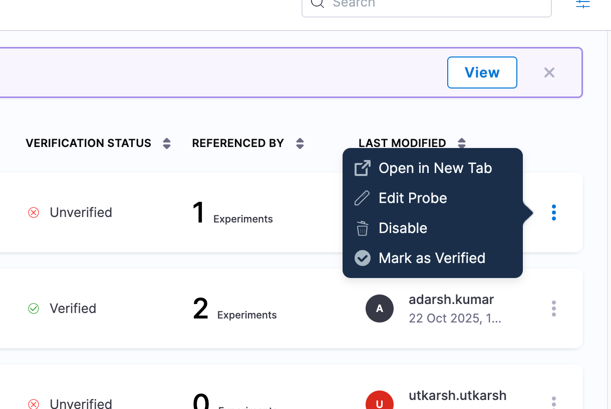

Probes are validation mechanisms that continuously monitor and verify the health and behavior of your system throughout chaos experiments. They act as automated checkpoints that help you:

- **Validate system resilience** - Verify that your applications and infrastructure maintain expected behavior under failure conditions
- **Define success criteria** - Set clear, measurable conditions that determine whether an experiment passes or fails
- **Collect evidence** - Gather real-time data about system state, performance metrics, and application health
- **Automate validation** - Replace manual observation with automated checks that run at specific points during experiments

Probes can query various data sources including HTTP endpoints, command outputs, Kubernetes resources, and APM systems to provide comprehensive visibility into your system's resilience.

:::info Important: Probe Scope Differences
- **Old Chaos Studio**: Probes are scoped to individual faults and execute only during fault injection
- **New Chaos Studio**: Probes operate along the entire experiment lifecycle and can be configured to run before, during, and after the complete experiment execution
:::

## Probe Verification

Probes can be marked as **Verified** to ensure only tested and approved probes are used in production experiments. This governance feature helps teams:

- **Maintain quality standards** - Only allow probes that have been validated and approved by your team
- **Prevent misconfigurations** - Reduce the risk of using untested or incorrectly configured probes in critical experiments
- **Enforce compliance** - Use with [ChaosGuard](/docs/chaos-engineering/guides/governance/governance-in-execution/govern-run) policies to mandate that only verified probes can be executed

### How to Mark a Probe as Verified

1. Navigate to the **Probes & Actions** section in the Chaos Engineering module
2. Locate the probe you want to verify
3. Click on the three-dot menu (⋮) next to the probe
4. Select **Mark as Verified**

    

Once marked as verified, the probe will display a green checkmark (✓) in the **Verification Status** column. You can then configure ChaosGuard conditions to allow only verified probes in your experiments, adding an extra layer of safety and governance.

:::tip
Combine probe verification with ChaosGuard policies to create a robust governance framework that ensures only approved, tested probes are used in your chaos experiments.
:::

## Probe Types

Select the probe type you want to learn more about:

import DynamicMarkdownSelector from '@site/src/components/DynamicMarkdownSelector/DynamicMarkdownSelector';

<DynamicMarkdownSelector
  options={{
    "HTTP Probe": {
      path: "/chaos-engineering/content/probes/http-probe.md"
    },
    "Command Probe": {
      path: "/chaos-engineering/content/probes/command-probe.md"
    },
    "Prometheus Probe": {
      path: "/chaos-engineering/content/probes/prometheus-probe.md"
    },
    "K8S Probe": {
      path: "/chaos-engineering/content/probes/k8s-probe.md"
    },
    "Datadog Probe": {
      path: "/chaos-engineering/content/probes/datadog-probe.md"
    },
    "Dynatrace Probe": {
      path: "/chaos-engineering/content/probes/dynatrace-probe.md"
    },
    "SLO Probe": {
      path: "/chaos-engineering/content/probes/slo-probe.md"
    },
    "APM Probe": {
      path: "/chaos-engineering/content/probes/apm-probe.md"
    },
    "Container Probe": {
      path: "/chaos-engineering/content/probes/container-probe.md"
    }
  }}
  toc={toc}
  disableSort={true}
/>

## Built-in Probe Templates

Harness provides pre-built Command Probe templates to help you quickly validate common scenarios in your chaos experiments. These templates are ready to use and can be customized to fit your specific requirements.

:::note
Currently, built-in templates are available for **Command Probes** targeting **Kubernetes** infrastructure. Templates for other probe types and platforms will be added in future releases.
:::

import ChaosFaults from '@site/src/components/ChaosEngineering/ChaosFaults';
import { probeTemplateCategories } from '../content/probes/probe-templates';

<ChaosFaults categories={probeTemplateCategories} />

## Next Steps
- [Create Chaos Experiments](/docs/chaos-engineering/guides/experiments) - Build experiments with probes for validation

