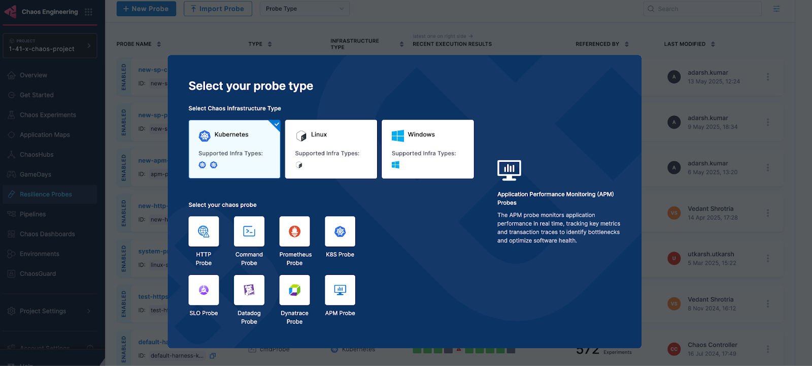

The AppDynamics probe allows you to query AppDynamics metrics and compare the results against specified criteria.

### Prerequisites
To use the AppDynamics probe, you need:

* An active AppDynamics account
* Access to the AppDynamics API from the kubernetes execution plane
* Authentication credentials (either basic auth or OAuth token)

### Interactive Setup Guide

Follow along with this interactive guide to learn how to configure AppDynamics probe:

<DocVideo src="https://app.tango.us/app/embed/8a20f18d-a78a-4d2f-ac8c-5aef92a4243e?skipCover=false&defaultListView=false&skipBranding=false&makeViewOnly=false&hideAuthorAndDetails=true" title="Create AppDynamics APM Probe" />

### Steps to configure

1. In Resilience probe section under chaos module, click on **New Probe** button

    

2. Select the **APM Probe**

3. Provide the name of the probe and select **AppDynamics** under APM Type

    
    
4. Under AppDynamics connector select connector

5. In Connector settings, you can either choose an existing connector or click **New Connector**

    

6. Provide the credentials of the appdynamics controller

    

   :::info note
   If you select **API Client** as the authentication type, ensure that the API client has at minimum the **Applications & Dashboards Viewer (Default)** role assigned.
   :::

7. Select the delegate and verify the connection and click on **Finish**

    

8. Now connector is created and selected, click on **Configure Details**

    

9. Under Probe Properties, Pass the value of **AppDynamics Metric Full Path** and **Lookback Window**

    

   * **AppDynamics Metric Full Path**:
     * A metric full path in AppDynamics is the complete hierarchical string that uniquely identifies a specific metric within an application for use in dashboards, alerts, and API queries
     * You can get the Metric Full Path from the Browse Metrics section in AppDynamics controller. For more details, refer to [AppDynamics docs](https://docs.appdynamics.com/appd/23.x/latest/en/appdynamics-essentials/metrics-and-graphs/metric-browser).
     * **Examples**:
       * `Application Infrastructure Performance|Root|Individual Nodes|boutique/adservice-54d59c5594-gggb9|Hardware Resources|CPU|%Busy`
       * `Application Infrastructure Performance|Root|Individual Nodes|boutique/adservice-54d59c5594-gggb9|Hardware Resources|Memory|Used (MB)`

      

   * **LookBack Window (In Minutes)**:
     * The lookback window refers to the time range from a specified number of minutes ago up to the current moment, over which data is aggregated

10. Provide the comparison criteria under AppDynamics Data Comparison

    

11. Provide the Run Properties

    

12. Then click on **Create Probe**

