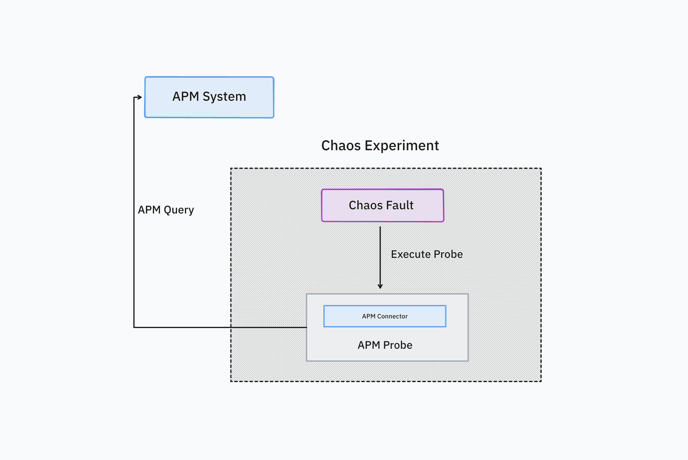

## What is an APM Probe?
APM probe or Application Performance Monitoring Probe is used to query a resource value on a specific APM system such as Prometheus or AppDynamics and compare it to an expected value. The APM probe is currently supported only on Kubernetes, that too while using a Kubernetes Infrastructure that is driven by Harness Delegate. The APM probe uses Harness Platform connectors for securely storing the credentials of the target APM system in the Harness Security Manager or HSM.

The usage of an APM probe is exactly the same as the other probes where the probe is added in a chaos experiment in one of the probe modes such as Continuous, Edge, SOT or EOT. The probe when successfully executed will result in either SUCCESS or FAILED state and this state contributes to the overall resilience score of the chaos experiment.

When will you use it?
APM probes are used when your application is being monitored by an APM system. The chaos experiment injects controlled faults either into an application or the associated infrastructure and the resilience of the system is observed by running multiple APM probes. The APM probe can also be used in combination with other probes such as Command or Http.

## What are the supported APM probe types?

| APM Probe Type | Kubernetes HD | Kubenetes | Linux | Windows |
|---------------|--------------|-----------|-------|---------|
| [Prometheus](./prometheus-probe) | YES | NO | NO | NO |
| [Datadog](../datadog-probe) | YES | NO | NO | NO |
| [Dynatrace](../dynatrace-probe) | YES | NO | NO | NO |
| [Splunk](./splunk-probe) | YES | NO | NO | NO |

:::info note
Kubernetes HD means the Kubernetes infrastructure that is driven by Harness Delegate.
:::
