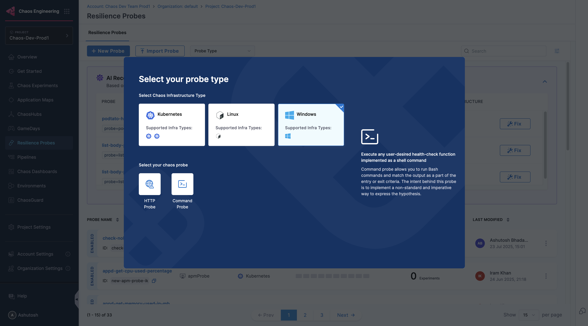
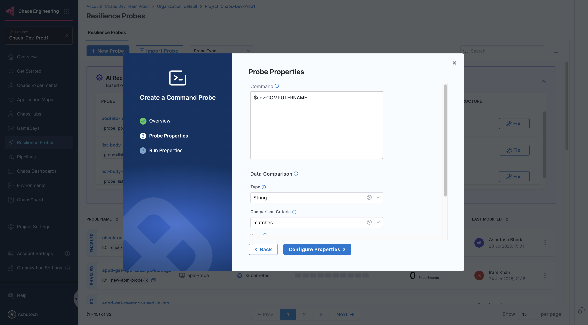
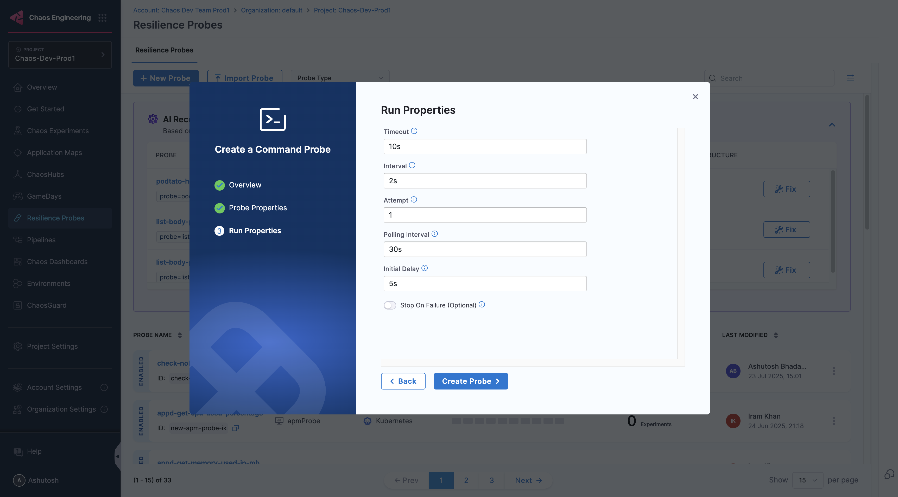
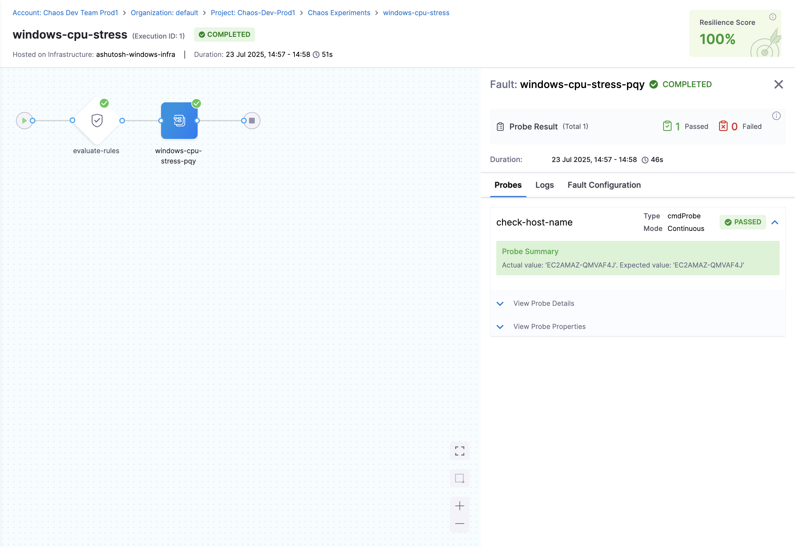

This topic describes how to use the **Windows command probe** to execute Windows-specific commands and PowerShell scripts as part of chaos experiments targeting Windows environments. The Windows command probe extends the standard command probe functionality to support Windows Command Prompt (cmd) and PowerShell execution contexts.

In this guide, we'll walk you through setting up a Windows command probe that checks the system hostname during a Windows CPU stress experiment, demonstrating how to validate system responsiveness under load.

## Prerequisites

- [Setup Windows chaos infrastructure](/docs/chaos-engineering/guideßs/infrastructures/types/legacy-infra/windows)
- [Command Probe](/docs/chaos-engineering/guides/probes/command-probes/)
- [Create a resilience probe](/docs/chaos-engineering/guides/probes/#create-a-resilience-probe)
- [Windows chaos faults](/docs/chaos-engineering/chaos-faults/windows/)

## Steps to configure Windows command probe

1. Navigate to **Resilience Probe** in the left navigation pane, select **Windows** as your target infrastructure type, and then select **Command Probe**.

    

2. Enter a name for your command probe in the **Name** field.

    

3. Enter the **Command**, **Type**, **Comparison criteria**, and the **Value**. Click **Configure Properties**.

    

4. Provide other values like **Timeout**, **Interval**, **Attempt**, **Polling Interval**, and **Verbosity**. Click **Create Probe**.

    

5. Your Windows command probe is now ready to be attached to chaos experiments. You can monitor probe execution results during experiment runs to validate system behavior.

    

## Related topics

- [Command probe configuration](/docs/chaos-engineering/guides/probes/command-probes/command-probe-usage)
- [Windows chaos faults](/docs/chaos-engineering/chaos-faults/windows/)
- [Probe modes and timing](/docs/chaos-engineering/guides/probes/#probe-modes)
- [Creating resilience probes](/docs/chaos-engineering/guides/probes/#create-a-resilience-probe)