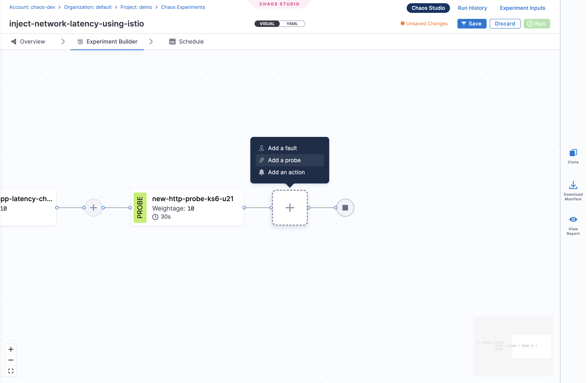
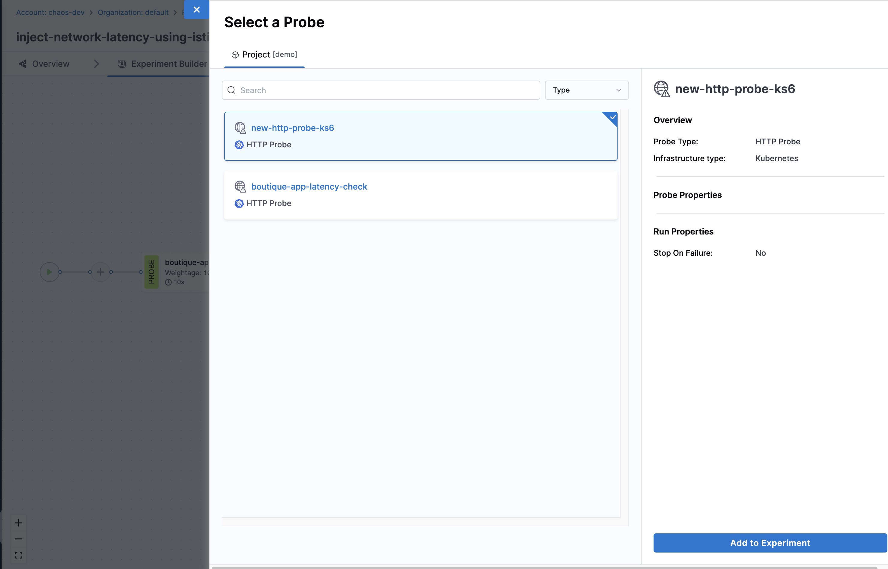
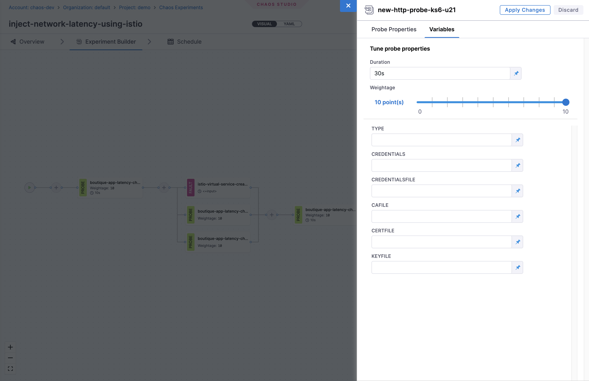

:::info Feature Availability
This feature is available under the `CHAOS_NG_EXPERIENCE` feature flag. For new onboardings, this feature is enabled by default. 

If you are an existing Harness Chaos customer and would like to access this feature, please contact your Harness support representative to have it enabled for your account.
:::

## What are Experiment-Level Probes?

Experiment-level probes are resilience validation checks that operate across the entire chaos experiment lifecycle, rather than being scoped to individual faults. These probes provide:

- **Global Validation**: Monitor system health across all faults in an experiment
- **End-to-End Assessment**: Validate overall system behavior from start to finish
- **Cross-Fault Correlation**: Understand how multiple faults interact and affect system resilience
- **Comprehensive Monitoring**: Track metrics and health indicators throughout the experiment

Unlike fault-specific probes that validate individual chaos injections, experiment-level probes assess the cumulative impact of all chaos activities within an experiment.

## Getting Started

Follow these steps to add experiment-level probes to your chaos experiments:

### Step 1: Create or Open an Experiment

1. Navigate to **Chaos Experiments** in your Harness project
2. Either create a new experiment or open an existing one

### Step 2: Add Experiment-Level Probes

1. In the experiment builder, click on the '+' icon, then click **Add a Probe**.

    

2. Choose the probe you want to add to the experiment.

    

3. Configure the probe properties and click **Apply Changes**.

    

### Step 3: Validate and Run

1. Save the experiment with the configured probe
2. **Run** the experiment to see probe results

## Next Steps

- [Learn about Probe Types and Modes](/docs/chaos-engineering/guides/probes/types-and-modes)
- [Create and Run Chaos Experiments](/docs/chaos-engineering/guides/chaos-experiments/create-experiments)
- [Explore Experiment Timeline View](/docs/chaos-engineering/guides/chaos-experiments/timeline-view-experiments)
