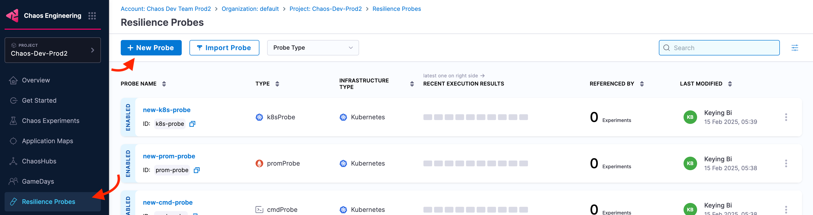
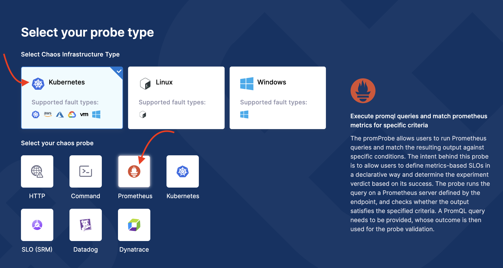
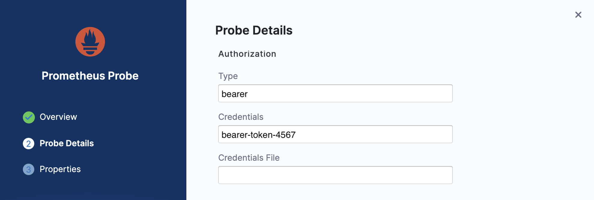
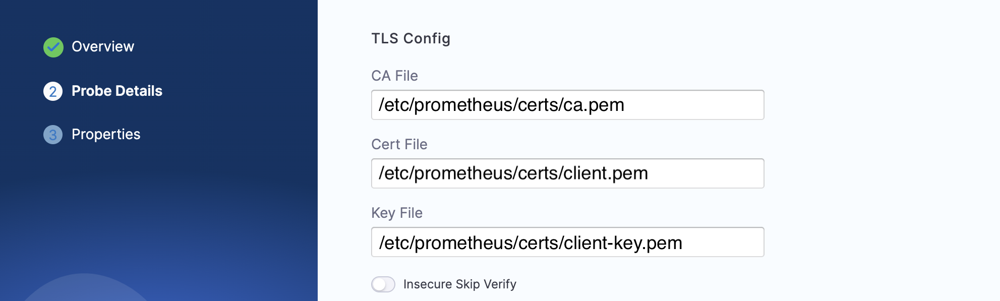
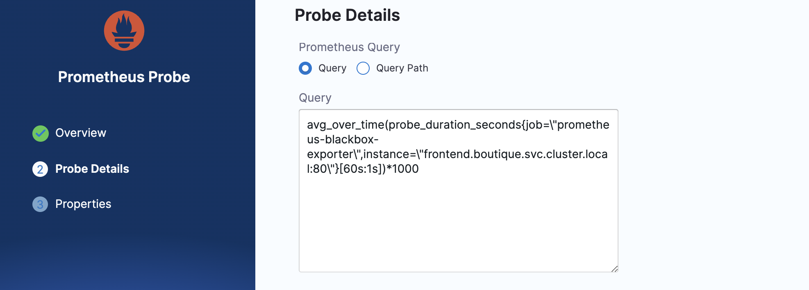
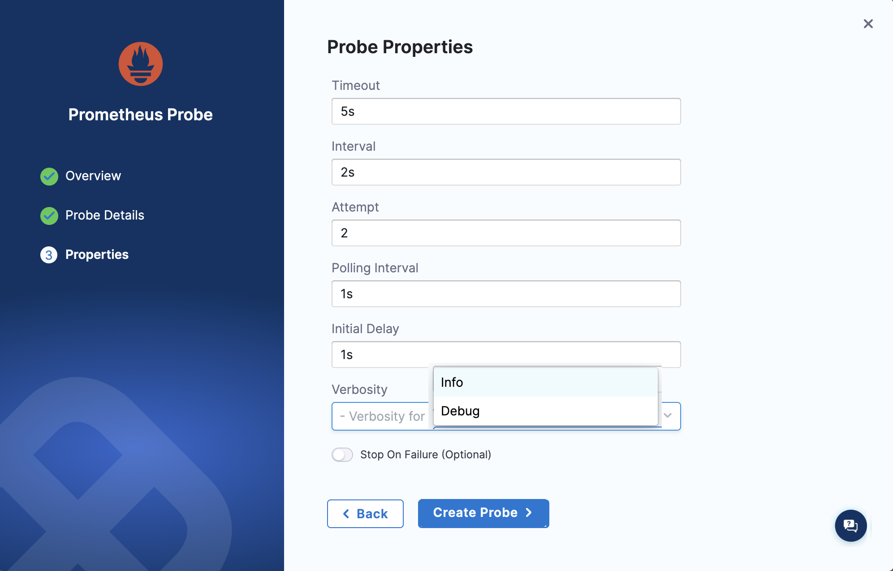

## Before you begin, review the following:

- [What is a Resilience Probe?](/docs/chaos-engineering/guides/probes/#what-is-a-resilience-probe)
- [Prometheus Probe](/docs/chaos-engineering/guides/probes/prometheus-probes/)

### Configuration

1. Go to **Chaos Engineering** module and select **Resilience Probes**. Select **New Probe**.

    

2. Select infrastructure type as **Kubernetes** and chaos probe as **Prometheus**.

    

3. Provide the name, and click **Configure Details**.

    

4. Based on your application's requirements, provide values for the following parameters. 

- **Prometheus Endpoint**: It is the target HTTP/HTTPS endpoint that the probe will send requests to.

    

5. **Authorization** section has the following fields:

    - **Type**: Type of HTTP request to be performed. Supports `GET` and `POST`.
    - **Credentials**: Authentication credentials (username and password) required to access the target URL/endpoint. This field is mutually exclusive with **Credentials file** field.
    - **Credentials file**: Path of the file that contains authentication credentials to access the HTTP endpoint. This field is mutually exclusive with **Credentials** field.

    Go to [Authorization](/docs/chaos-engineering/guides/probes/prometheus-probes/#authentication) for more information.

        **TLS Config** has the following fields:

            - **CA file**: Path of the file to validate the custom certificates for TLS of the target URL.
            - **Cert file**: Path of the file to the client certificate required for mTLS.
            - **Key file**: Path of the file to the client key required for mTLS.
            - **Insecure Skip Verify**: If enabled, the probe bypasses the SSL/TLS certificate verification, allowing requests to proceed even if the certificate is invalid or self-signed.
        
    Go to [TLS](/docs/chaos-engineering/guides/probes/prometheus-probes/#tls) for more information.

    
    

6. Provide the **Prometheus Query** (**Query** or **Query Path** depending on your usage).

    - **Query**: The PromQL query used with the probe to fetch the desired Prometheus metrics. Ensure that the strings inside the query are enclosed within backslash ("/"). This field is mutually exclusive with **Query Path** field.
    - **Query Path**: Path of the file where PromQL query is present. This field is mutually exclusive with **Query** field.

    Go to [Schema](/docs/chaos-engineering/guides/probes/prometheus-probes/#schema) for more information. 

        

7. Specify the data comparison fields, and click **Configure Properties**.

    The data returned using the PromQL **Query** or **Query Path** is compared to the following fields:

        - **Type**: Type of data compared with result of Prometheus query. Accepts only `float` data type.
        - **Comparison Criteria**: The criteria (`>=`, `<=`, `==`, `<`, `>`, `!=`, and so on) based on which the **value** and the result of Prometheus query are compared.
        - **Value**: The value with which the result of Prometheus query is compared
        
        Go to [Comparator](/docs/chaos-engineering/guides/probes/prometheus-probes/#comparator) for more information.

            

8. Specify general probe properties such as timeout, interval, and so on. Click **Create Probe**.

- **Timeout**: Time limit for the probe to execute the check and return the expected output.
- **Interval**: Duration for which the probe waits between subsequent attempts.
- **Attempt**: Number of times a check is executed upon failure in the previous attempts before declaring the probe status as `FAILED`.
- **Polling Interval**: Time interval for which `continuous` and `onchaos` probe modes should wait after each iteration.
- **Intitial Delay**: Duration to wait before the probe begins execution.
- **Verbosity**: Level of detail to include in the logs generated during the execution of the probe. Choose between `info` (essential logs, probe status are printed) and `debug` (in-depth logs, timestamps, and execution logs are printed) mode.
- **Stop on Failure (Optional)**: Enable it to continue or disable it to stop the experiment execution after the probe fails. Disabled by default.

Go to [Run Properties](/docs/chaos-engineering/guides/probes/prometheus-probes/#run-properties) for more information.

    
