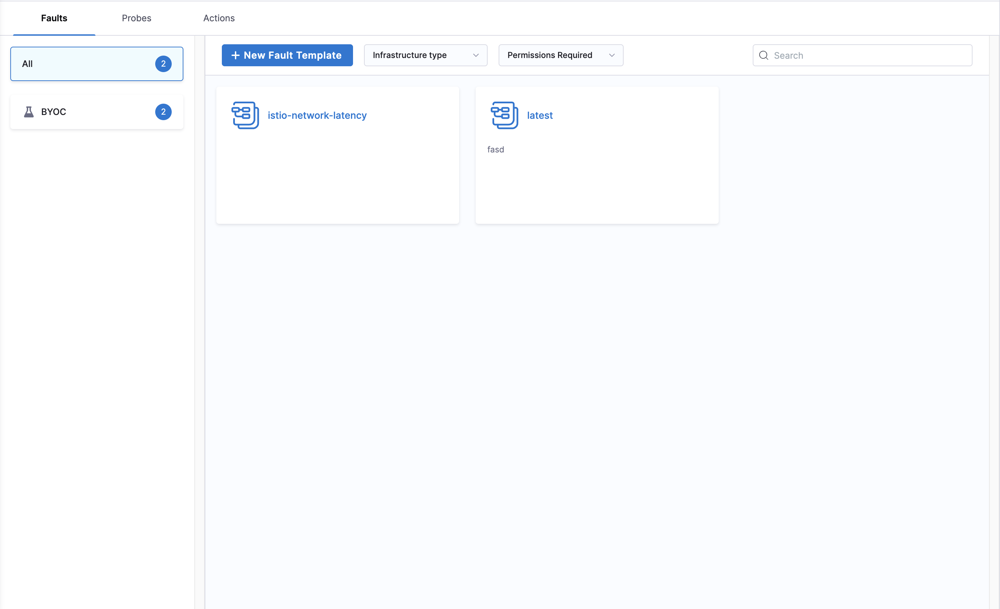

:::info New Chaos Studio Feature
**Templates** are part of the enhanced **New Chaos Studio** experience. The studio version you see depends on your onboarding date:

- **New Chaos Studio**: Available for customers onboarded on or after August 24, 2025
- **Old Chaos Studio**: Available for customers onboarded before August 24, 2025

If you're an existing customer and want to access the New Chaos Studio features, contact your Harness support representative.
:::

**Templates** are reusable, pre-configured components that help you standardize and accelerate your chaos engineering practices. Templates provide a foundation for creating consistent experiments across your organization while maintaining flexibility for customization.

You can create faults, probes, and actions in two ways:
- **Direct Creation**: Create components directly through their specific sections (Faults, Probes, Actions) for one-time use
- **Template-Based Creation**: Create components from templates when you need reusable, standardized configurations across multiple experiments

Templates allow you to:
- Standardize chaos engineering practices across teams
- Reduce experiment creation time with pre-built components
- Ensure best practices and consistent configurations
- Share proven patterns across projects and environments
- Maintain version control for your chaos engineering assets

## Types of Templates

Harness Chaos supports templates for three core components:

### 1. Fault Templates

**Fault Templates** provide pre-configured chaos faults that can be reused across experiments.

    

### 2. Probe Templates

**Probe Templates** offer reusable validation and monitoring configurations.

    

### 3. Action Templates

**Action Templates** provide reusable workflow actions for experiment orchestration.

    

## Template Scopes

Templates can be managed at different organizational levels:
- **Account Level**: Shared across projects within an account
- **Organization Level**: Available across the entire organization
- **Project Level**: Available within a specific project

## Getting Started with Templates

### Creating Templates

1. Navigate to **ChaosHubs** in your **Project Settings**

    

2. Choose the **ChaosHub** you want to create templates in.

    

3. Start creating **Faults**, **Probes** or **Actions** templates.

    

4. Import the templates into your project to make them available for use

    

5. Start using the templates in your experiments

    

## Next Steps

- [Create your first experiment using templates](/docs/chaos-engineering/guides/chaos-experiments/create-experiments)
- [Learn about ChaosHubs](/docs/chaos-engineering/guides/chaoshubs/)
- [Explore Fault Templates](/docs/chaos-engineering/faults/custom-faults/custom-fault-templates)
- [Understand Actions](/docs/chaos-engineering/guides/actions/)
