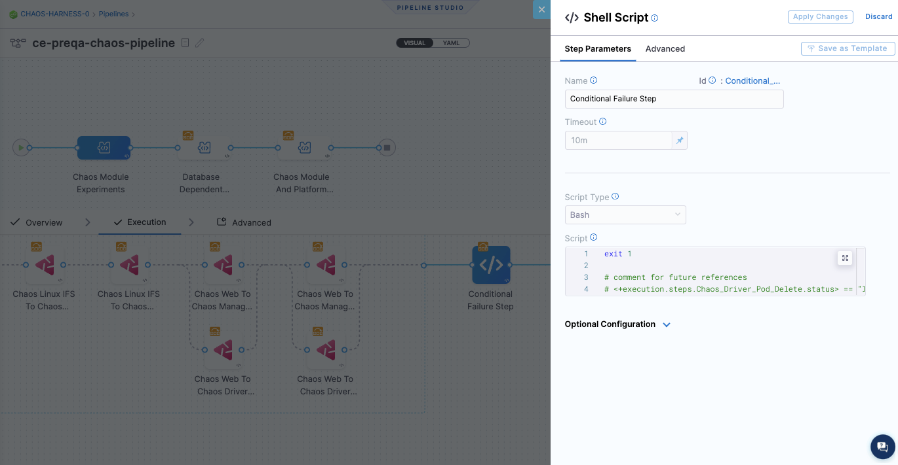

You can add chaos experiments to [Harness Continuous Delivery (CD)](https://harness.io/products/continuous-delivery) pipelines as part of your deployment process. This ensures that you validate your system resiliency with every new deployment. Some benefits include:

* Uncovering resilience unknowns
* Increasing developer efficiency
* Reducing resilience debt

You might use chaos experiments in CD pipelines to validate deployments against:

* Existing resilience conditions
* Newly added resilience conditions
* Changes to the platform on which the target deployments run
* Production incidents and alerts
* Configuration changes

Learn more about these benefits in our [CE/CD integration blog](https://www.harness.io/blog/chaos-experiments-in-harness-cd-pipelines).

## Examples of chaos faults to use in your CD pipeline

You might consider injecting these types of faults as chaos steps in your CD pipeline:

* **Network chaos faults** can be used for verifying service or microservice dependencies on each other when there's latency, or when one of the microservices is down. The [Pod network latency](/docs/chaos-engineering/technical-reference/chaos-faults/kubernetes/pod/pod-network-latency/) fault is an example.

* **Stress chaos faults** can be used for verifying how microservices behave when there is a noisy neighbor. The [Pod CPU hog](/docs/chaos-engineering/technical-reference/chaos-faults/kubernetes/pod/pod-cpu-hog/) fault is an example.

* **HTTP chaos faults** can be used for verifying how services or APIs behave when one of the APIs is under chaos. The [Pod HTTP latency](/docs/chaos-engineering/technical-reference/chaos-faults/kubernetes/pod/pod-http-latency/) fault is an example.

For more information about Harness CD, go to the [CD tutorials](/tutorials/cd-pipelines).

## Integrate CE with CD

To use CE with CD using a selected experiment (though you can use many experiments), you need to:

1. [Add a chaos experiment](#step-1-add-a-chaos-experiment-and-run-it) and run it to make sure it completes.
1. [Add this experiment to the CD pipeline](#step-2-add-a-chaos-experiment-to-a-cd-pipeline) as a chaos step.
1. [Choose a failure strategy](#step-3-choose-a-failure-strategy).

### Step 1: Add a chaos experiment and run it

[Create a chaos experiment](/docs/chaos-engineering/configure-chaos-experiments/experiments/construct-and-run-custom-chaos-experiments) and run it to make sure it runs to completion. 

In the example below, the relevant [probes](/docs/chaos-engineering/configure-chaos-experiments/probes/configure-and-add-probe) are added to avoid a false positive or false negative scenario around the resilience score.

### Step 2: Add a chaos experiment to a CD pipeline

Pipelines are organized into stages, each of which handles a major segment of the pipeline process. There are several types of stages available, and you can add chaos experiments as steps in these three stage types:

* Feature Flag
* Deploy
* Custom Stage

#### Add a chaos experiment as a step in your CD pipeline

1. In your Harness project, select **Deployments > Pipelines**, and then select the pipeline where you want to add a chaos experiment.
1. In the selected pipeline, select **Add Stage**, and then select a stage type.

	Chaos steps are available for **Feature Flag**, **Deploy**, and **Custom Stage** types. 

	

1. Enter a **Stage Name** (and Deployment Type if applicable), and then select **Set Up Stage**.

1. With the stage you want selected, select **Add Step > Add Step**.

	

	The Step Library appears.

	

1. Scroll down the list to find the Chaos step icon, and then select it.

	

1. In the Configure Chaos Experiment screen, enter a **Name** for this step.

1. Select **Select Chaos Experiment** to see the chaos experiments you can add to this stage.

	

	When you select an experiment, the experiment's last resilience score, a preview of the experiment, and its chaos faults, are displayed.

1. (Optional) On this screen you can:
	* Select **New Experiment** to [create a new experiment](/docs/chaos-engineering/configure-chaos-experiments/experiments/construct-and-run-custom-chaos-experiments) in Chaos Studio. 
	* Select **Edit in Chaos Studio** to edit a selected experiment.

	Selecting these options takes you to Chaos Studio without saving your work.

1. Select the experiment you want to run in this step, and then select **Add to Pipeline**.

1. Back in **Configure Chaos Experiment**, enter the **Expected Resilience Score** for this experiment.

	If the resilience score is not met, this chaos step fails and the [stage failure strategy](/docs/platform/pipelines/w_pipeline-steps-reference/step-failure-strategy-settings) is initiated.
	
	For more information, go to [Analyze chaos experiments](/docs/chaos-engineering/configure-chaos-experiments/experiments/create-complex-chaos-experiments#analyze-chaos-experiments).

1. (Optional) Expand **Optional Configuration**, and enter an assertion (you can enter a fixed value, an expression, or a runtime input).

1. (Optional) Select the **Advanced** tab to configure more settings.

	For more information on these settings, go to [Harness pipelines](/docs/category/pipelines).

1. Select **Apply Changes** to save this step in the pipeline, and then select **Save** to save changes to the pipeline.

### Step 3: Choose a failure strategy

[A failure strategy](/docs/platform/pipelines/define-a-failure-strategy-on-stages-and-steps) specifies the actions to take if pipeline stages or steps fail due to different conditions. You can configure a failure strategy against each chaos step (experiment) in the pipeline, or through a shell script step at the end of the execution of all chaos steps. Below are examples showing these two options.

#### Example 1: Failure strategy for one chaos step

In this example, the failure strategy is **Rollback** for **All Errors** on a specific chaos step. You can also choose different types of errors and different strategies to use for each.

#### Example 2: Conditional failure step at the end of several chaos steps

In this example, the failure strategy uses a **Shell Script** step after all the chaos steps in the CD pipeline. This step conditionally applies a shell script that specifies actions to take in case of failure. You can configure this step to add the script, and specify the conditions under which it is executed.

## What happens when the CD pipeline runs with a chaos step

When the CD pipeline is triggered:

* The chaos step you added to the pipeline triggers the experiment to run on the target application.

* The Chaos Experiments page (**Chaos > Chaos Experiments**) records the experiment run as part of a pipeline, and you can select the experiment to view its execution.

* In the CD pipeline, if the chaos step (the experiment) fails, you can select the failed step to see the log, which includes the resilience score obtained and how many chaos probes passed or failed.
	* You can select **View Detailed Execution** to go to the experiment's execution page in CE.

* Based on the experiment's success or failure, you can decide whether to continue with the deployment. You can automate this by defining a [failure strategy](#step-3-choose-a-failure-strategy) in your pipeline. 

	For more information, go to [Define a failure strategy on stages and steps](/docs/platform/pipelines/define-a-failure-strategy-on-stages-and-steps).

## Tutorial - Integrate CE with CD

This tutorial uses the `cart-pod-delete` experiment created in the tutorial on [running chaos experiments with API](../configure-chaos-experiments/experiments/construct-and-run-custom-chaos-experiments.md#run-chaos-experiments-with-apis).

Tutorial - Integrate CE with CD

This tutorial explains how to execute a chaos experiment as part of a Harness CD pipeline where you validate the resiliency of the application in a continuous manner.

As part of the tutorial, we have a pre-curated CD pipeline for deploying our demo application, Online Boutique Shop, to a Kubernetes cluster that you can get from a fork of [this repository](https://github.com/chaosnative/harness-chaos-demo/tree/main/boutique-app-manifests). Also, we have defined a pipeline webhook trigger for the repository such that any code change in the `main` branch triggers the CD pipeline to create a new deployment.

It can be observed that currently the pipeline is able to deploy the application and we have exactly one replica of each microservice, including the **cart** deployment which we are going to target.

1. Add a chaos step to this pipeline so that the chaos experiment you created in the [running chaos experiments with API tutorial](../configure-chaos-experiments/experiments/construct-and-run-custom-chaos-experiments.md#run-chaos-experiments-with-apis), `cart-pod-delete`, will run whenever a new pipeline deployment is triggered. This will allow you to validate the deployment against the chaos hypothesis.

   To add the chaos step, select the **Add Step** icon next to the **Rollout Deployment** icon for the CD deployment stage, and then select **Chaos Step**.

   

2. Configure the Chaos step. Name the step as **Boutique Cart Delete**. You can also provide a description, optionally. Next, under **Select Chaos Experiment** dropdown, search and select the **cart-pod-delete** experiment.

   

3. Select **Add to Pipeline**. For expected resiliency score, provide **100**, which means that only mark the step as passed if the resiliency score obtained upon the experiment execution is 100%.

   

4. Go to the **Advanced** tab. Under **Failure Strategy** select **Add**. For **On failure of type** select **All Errors** and for **Perform Action** select **Rollback Stage**.

   This will ensure that if the chaos experiment's resiliency score is less than 100%, the deployment will be rolled back to the previous version. Hence, the application deployment is continuously validated to be resilient before it gets deployed, otherwise the deployment is safely rolled back to the previous version until the weakness in the application can be mitigated.

   

5. Select **Apply Changes** to save the step, and then select **Save** to save the pipeline.

   

6. Run the pipeline.

The pipeline will attempt to deploy the application as part of the CD deployment stage. However, the stage will fail with an error due to the failure of the **Boutique Cart Delete** chaos step, causing the CD to initiate a rollback and revert to the previous healthy deployment.

At this point we can validate that the application is still accessible, which indicates that the rollback was indeed successful.

A closer inspection indicates that the failure of the chaos step is caused by a resiliency score of only 50%, which is less than the passing criteria of 100%. This can be validated by checking the **cart-pod-delete** experiment under the **Chaos Experiments** page, where the last experiment run has yielded a resiliency score of 50% only.

Hence, we were able to verify a potential weakness in our application using the HCE experiment and observed how the Harness CD pipeline integration can benefit from the continuous chaos validation.

Now, let us see how you can resolve this weakness in your application so that it can be successfully deployed. We can apply [this](https://raw.githubusercontent.com/chaosnative/harness-chaos-demo/main/boutique-app-manifests/manifest/cart.yaml) manifest for the existing **cartservice** deployment, which should bump up the number of deployment replicas to **2**, according to the manifest specification.

As soon as the changes are pushed to the `main` branch of the repo, we can observe that a new pipeline has been triggered, due to the repository webhook that we have defined.

Upon the completion of the pipeline, we can observe that the deployment is successful with the chaos step obtaining 100% resiliency score. Hence, the experiment has passed and our resilient application is now deployed. We can also validate that the corresponding chaos experiment run has been successful with a 100% resiliency score.

