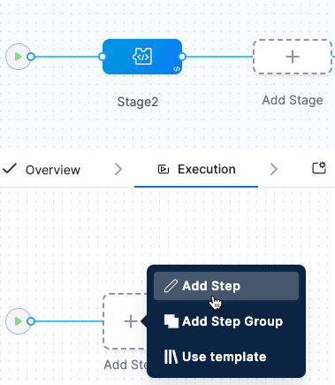

You can add chaos experiments to Harness Feature Flags (FF) pipelines as part of the process to control release of new software. An [FF pipeline](/docs/feature-flags/ff-build-pipeline/build-feature-flag-pipeline) runs every time a feature flag changes, and lets you specify actions to take before the flag change takes effect. For example, you might want to have an approval step for all flag changes, or run a chaos experiment as part of the pipeline.

When you add a chaos experiment as a step in an FF pipeline, the experiment runs as part of that pipeline whenever you change a feature flag. For example, if you put a new feature behind a feature flag, you might want to run a chaos experiment on the target application affected by the new code. In this way, you can see how the application responds to chaos faults before changing the flag to release the new feature to users.

For more information, see: 
* [Build a Feature Flag pipeline](/docs/feature-flags/ff-build-pipeline/build-feature-flag-pipeline)
* [Add a default pipeline for flag changes](/docs/feature-flags/ff-build-pipeline/default-pipeline-ff)
* [Harness pipelines](/docs/category/pipelines)

## Add a chaos experiment to an FF pipeline

Pipelines are organized into stages, each of which handles a major segment of the pipeline process. There are several types of stages available, and you can add chaos experiments as steps in these three stage types:

* Feature Flag
* Deploy
* Custom Stage

**To add a chaos experiment as a step in your FF pipeline:**

1. In Harness, select **Feature Flags > Pipelines**, and then select the pipeline where you want to add a chaos experiment.
1. In the selected pipeline, select **Add Stage**, and then select a stage type.

	Chaos steps are available for **Feature Flag**, **Deploy**, and **Custom Stage** types. 

	

1. Enter a **Stage Name**, and then select **Set Up Stage**.

1. With the stage you want selected, select **Add Step > Add Step**.

	

	The Step Library appears.

	

1. Scroll down the list to find the Chaos step icon, and then select it.

	

1. In the Configure Chaos Experiment screen, enter a **Name** for this step.

1. Select **Select Chaos Experiment** to see the chaos experiments you can add to this stage.

	

	When you select an experiment on this screen, the experiment's last resilience score, and a preview of the experiment and the chaos faults included in it, is displayed on the right.

1. (Optional) On this screen you can:
	* Select **New Experiment** to create a new experiment in Chaos Studio. 
	* Select **Edit in Chaos Studio** to edit a selected experiment.

	Either of the above links you to Chaos Studio without saving your work.

1. Select the experiment you want to run in this pipeline step, and then select **Add to Pipeline**.

1. Back on the Configure Chaos Experiment screen, enter the **Expected Resilience Score** for this experiment.

	If the resilience score is not met, this chaos step fails.

	For more information, see [Analyze chaos experiments](/docs/chaos-engineering/configure-chaos-experiments/experiments/create-complex-chaos-experiments#analyze-chaos-experiments).

1. (Optional) Expand **Optional Configuration**, and enter an assertion (you can enter a fixed value, an expression, or a runtime input).

1. (Optional) Select the **Advanced** tab to configure more settings.

	For more information on these settings, see [Harness pipelines](/docs/category/pipelines).

1. Select **Apply Changes** to save this step in the pipeline, and then select **Save** to save changes to the pipeline.

## What happens when the FF pipeline runs with a chaos step

When a flag change triggers the FF pipeline:

* The chaos step you added to the pipeline triggers the experiment to run on the target application.

* The Chaos Experiments page records the experiment run as part of a pipeline, and you can select the experiment to view its execution.

* In the FF pipeline, if the chaos step (the experiment) fails, you can click the failed step to see the log, which includes the resilience score obtained and how many chaos probes passed or failed.
	* You can select **View Detailed Execution** to go to the experiment's execution page in CE.

* Based on the experiment's success or failure, you can decide whether to enable the flag change to show or hide the feature in the target environment.

