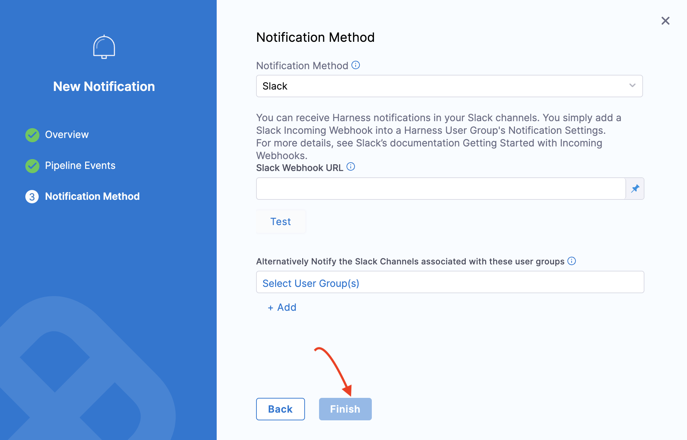

# Pipeline Notifications and Approvals

This guide explains how to configure notifications and approvals for chaos experiment pipelines to enhance collaboration and control over chaos testing execution.

## Overview

Pipeline notifications and approvals provide:
- **Real-Time Updates**: Instant notifications about experiment execution status
- **Approval Workflows**: Control over when chaos experiments can be executed
- **Team Collaboration**: Keep stakeholders informed about resilience testing
- **Audit Trail**: Track who approved and executed chaos experiments

## Why Use Pipelines for Chaos Experiments?

### Orchestration Benefits
Pipelines facilitate orchestrating chaos experiments across:
- **Multiple Infrastructure Types**: Different clusters, zones, and environments
- **Complex Scenarios**: Multi-step experiments with dependencies
- **Parallel Execution**: Running multiple experiments simultaneously
- **Sequential Workflows**: Ordered execution of related experiments

### Governance and Control
- **Approval Gates**: Require approval before executing potentially disruptive experiments
- **Permission Control**: Restrict experiment execution to pipeline-based workflows
- **Audit Logging**: Complete audit trail of experiment executions
- **Notification Integration**: Automated updates to relevant stakeholders

## Setting Up Permissions

### Pipeline Execution Permissions

To enforce pipeline-based execution:

1. **Navigate to Project Settings**: Go to **Project Settings** → **Roles** → **Chaos**
2. **Enable Pipeline Execution**: Select **Execute via Pipeline** permission
3. **Create Custom Roles**: Define roles with appropriate permissions for different user groups


This ensures users can only execute experiments through approved pipeline workflows.

### Role-Based Access Control

Create different roles for different responsibilities:

**Chaos Engineer Role**:
- Create and edit experiments
- Execute via pipeline
- View experiment results

**Approver Role**:
- Approve pipeline executions
- View experiment results
- Cannot directly execute experiments

**Viewer Role**:
- View experiments and results
- Cannot execute or approve

## Configuring Pipeline Notifications

### Step 1: Access Notification Settings

1. **Navigate to Pipelines**: Go to **Pipelines** and select the pipeline containing chaos experiments
2. **Click Notify**: Select the **Notify** button to set up notifications


### Step 2: Create Notification

1. **Add Notification**: Click **Notifications** to configure a new notification
2. **Provide Name**: Enter a descriptive name for the notification and click **Continue**


### Step 3: Configure Notification Method

Choose from available notification methods and configure parameters:

#### Slack Integration
1. **Select Slack**: Choose Slack as the notification method
2. **Configure Webhook**: Provide the **Slack Webhook URL**
3. **Customize Message**: Configure message templates and triggers



#### Email Notifications
```yaml
# Example email notification configuration
notifications:
  - name: chaos-experiment-results
    type: email
    recipients:
      - chaos-team@company.com
      - sre-team@company.com
    triggers:
      - pipeline-start
      - pipeline-success
      - pipeline-failure
    template: |
      Chaos Experiment Pipeline: {{pipeline.name}}
      Status: {{pipeline.status}}
      Resilience Score: {{experiment.resilienceScore}}
      Duration: {{pipeline.duration}}
```

#### Microsoft Teams Integration
```yaml
# Example Teams notification configuration
notifications:
  - name: teams-chaos-updates
    type: teams
    webhook_url: "https://outlook.office.com/webhook/..."
    triggers:
      - experiment-start
      - experiment-failure
      - low-resilience-score
    message_template: |
      🔬 **Chaos Experiment Update**
      
      **Pipeline**: {{pipeline.name}}
      **Experiment**: {{experiment.name}}
      **Status**: {{experiment.status}}
      **Resilience Score**: {{experiment.resilienceScore}}/100
      
      [View Details]({{experiment.url}})
```

## Setting Up Approvals

### Manual Approval Steps

Add approval steps to control experiment execution:

```yaml
# Example pipeline with approval step
stages:
  - name: pre-chaos-approval
    type: Approval
    spec:
      type: HarnessApproval
      approvers:
        - user: sre-lead@company.com
        - user: platform-team-lead@company.com
      approvalMessage: |
        Please approve the execution of chaos experiments:
        - Network latency injection
        - Pod failure simulation
        - Database connection stress
        
        Environment: {{env.name}}
        Expected Impact: Low
        Duration: 10 minutes
      rejectionMessage: "Chaos experiment execution rejected"
      timeout: 1h
  
  - name: chaos-experiments
    type: Custom
    steps:
      - name: network-chaos
        type: Chaos
        spec:
          experimentId: network-latency-exp
      - name: pod-chaos
        type: Chaos
        spec:
          experimentId: pod-delete-exp
```

### Conditional Approvals

Configure approvals based on conditions:

```yaml
# Conditional approval based on environment
- name: production-approval
  type: Approval
  when:
    condition: <+env.type> == "production"
  spec:
    type: HarnessApproval
    approvers:
      - user: cto@company.com
      - user: head-of-engineering@company.com
    approvalMessage: |
      🚨 **PRODUCTION CHAOS EXPERIMENT APPROVAL REQUIRED**
      
      This will execute chaos experiments in production environment.
      Please review the experiment details and approve only if:
      - All stakeholders have been notified
      - Monitoring is in place
      - Rollback procedures are ready
```

### Time-Based Approvals

```yaml
# Approval with time constraints
- name: business-hours-approval
  type: Approval
  when:
    condition: <+currentTime.hour> >= 9 && <+currentTime.hour> <= 17
  spec:
    type: HarnessApproval
    approvers:
      - userGroup: business-stakeholders
    approvalMessage: |
      Chaos experiment scheduled during business hours.
      Business impact assessment required.
    timeout: 30m
```

## Advanced Notification Configurations

### Multi-Channel Notifications

Configure different notifications for different events:

```yaml
notifications:
  # Start notifications
  - name: experiment-start-slack
    type: slack
    channel: "#chaos-engineering"
    triggers: [pipeline-start]
    message: |
      🚀 Starting chaos experiments for {{pipeline.name}}
      Environment: {{env.name}}
      Estimated Duration: {{pipeline.estimatedDuration}}
  
  # Success notifications
  - name: experiment-success-email
    type: email
    recipients: ["stakeholders@company.com"]
    triggers: [pipeline-success]
    subject: "✅ Chaos Experiments Completed Successfully"
    
  # Failure notifications
  - name: experiment-failure-pagerduty
    type: pagerduty
    service_key: "chaos-experiments-service"
    triggers: [pipeline-failure, low-resilience-score]
    severity: "warning"
```

### Custom Notification Templates

Create rich notification templates:

```yaml
# Slack notification with rich formatting
slack_template: |
  {
    "blocks": [
      {
        "type": "header",
        "text": {
          "type": "plain_text",
          "text": "🔬 Chaos Experiment Results"
        }
      },
      {
        "type": "section",
        "fields": [
          {
            "type": "mrkdwn",
            "text": "*Pipeline:* {{pipeline.name}}"
          },
          {
            "type": "mrkdwn",
            "text": "*Status:* {{pipeline.status}}"
          },
          {
            "type": "mrkdwn",
            "text": "*Resilience Score:* {{experiment.resilienceScore}}/100"
          },
          {
            "type": "mrkdwn",
            "text": "*Duration:* {{pipeline.duration}}"
          }
        ]
      },
      {
        "type": "actions",
        "elements": [
          {
            "type": "button",
            "text": {
              "type": "plain_text",
              "text": "View Details"
            },
            "url": "{{pipeline.url}}"
          }
        ]
      }
    ]
  }
```

## Notification Triggers

### Available Trigger Events

Configure notifications for specific events:

**Pipeline-Level Triggers**:
- `pipeline-start`: When pipeline execution begins
- `pipeline-success`: When pipeline completes successfully
- `pipeline-failure`: When pipeline fails
- `pipeline-paused`: When pipeline is paused for approval

**Experiment-Level Triggers**:
- `experiment-start`: When chaos experiment begins
- `experiment-success`: When experiment completes successfully
- `experiment-failure`: When experiment fails
- `low-resilience-score`: When resilience score is below threshold

**Custom Triggers**:
- `manual-trigger`: Manually triggered notifications
- `scheduled-trigger`: Time-based notification triggers
- `conditional-trigger`: Based on custom conditions

### Trigger Conditions

```yaml
# Example conditional triggers
notifications:
  - name: critical-failure-alert
    type: pagerduty
    triggers: [experiment-failure]
    conditions:
      - experiment.type == "production"
      - experiment.resilienceScore < 50
    
  - name: improvement-celebration
    type: slack
    triggers: [experiment-success]
    conditions:
      - experiment.resilienceScore > previousRun.resilienceScore
    message: |
      🎉 Resilience improvement detected!
      Previous Score: {{previousRun.resilienceScore}}
      Current Score: {{experiment.resilienceScore}}
```

## Integration with External Systems

### ITSM Integration

```yaml
# ServiceNow integration for change management
notifications:
  - name: servicenow-change-request
    type: servicenow
    triggers: [pipeline-start]
    instance: "company.service-now.com"
    table: "change_request"
    fields:
      short_description: "Chaos Engineering Experiment - {{pipeline.name}}"
      description: |
        Automated chaos experiment execution
        Environment: {{env.name}}
        Expected Duration: {{pipeline.estimatedDuration}}
        Risk Level: Low
      category: "Software"
      subcategory: "Application"
      priority: "3"
```

### Monitoring System Integration

```yaml
# Datadog event creation
notifications:
  - name: datadog-event
    type: datadog
    triggers: [experiment-start, experiment-end]
    api_key: "{{secrets.datadog_api_key}}"
    event:
      title: "Chaos Experiment: {{experiment.name}}"
      text: |
        Chaos experiment {{experiment.status}} in {{env.name}}
        Resilience Score: {{experiment.resilienceScore}}
      tags:
        - "environment:{{env.name}}"
        - "experiment:{{experiment.type}}"
        - "team:chaos-engineering"
```

## Best Practices

### Notification Strategy
- **Audience Segmentation**: Send relevant notifications to appropriate stakeholders
- **Frequency Management**: Avoid notification fatigue with smart filtering
- **Rich Context**: Include relevant details and links in notifications
- **Escalation Paths**: Define escalation procedures for critical failures

### Approval Workflows
- **Clear Criteria**: Define clear approval criteria and expectations
- **Reasonable Timeouts**: Set appropriate timeout values for approvals
- **Backup Approvers**: Configure multiple approvers to avoid bottlenecks
- **Documentation**: Provide clear context for approval decisions

### Security Considerations
- **Webhook Security**: Use secure webhook URLs and validate payloads
- **Credential Management**: Store API keys and tokens securely
- **Access Control**: Limit notification configuration to authorized users
- **Audit Logging**: Track all notification and approval activities

## Troubleshooting

### Common Issues

#### Notifications Not Received
```
Issue: Configured notifications are not being sent
```
**Solutions**:
- Verify webhook URLs and API keys
- Check notification trigger conditions
- Validate recipient addresses/channels
- Review pipeline execution logs

#### Approval Timeouts
```
Issue: Approvals are timing out before being reviewed
```
**Solutions**:
- Increase approval timeout values
- Configure multiple approvers
- Set up backup approval processes
- Implement notification reminders

#### Permission Errors
```
Issue: Users cannot approve pipeline executions
```
**Solutions**:
- Verify user has approval permissions
- Check role assignments
- Validate project-level access
- Review approval step configuration

### Debugging Tips

1. **Test Notifications**: Use test pipelines to validate notification configurations
2. **Check Logs**: Review pipeline execution logs for notification errors
3. **Validate Webhooks**: Test webhook endpoints independently
4. **Monitor Delivery**: Track notification delivery success rates
5. **User Feedback**: Gather feedback from notification recipients

## Next Steps

- Set up comprehensive notification strategies for your chaos engineering program
- Implement approval workflows that balance control with efficiency
- Integrate with your existing communication and monitoring tools
- Establish governance policies for chaos experiment execution
- Train teams on approval processes and notification handling

For more information, see [Harness Approvals](/docs/platform/approvals/approvals-tutorial) and [Harness Notifications](/docs/platform/notifications/notification-settings).
