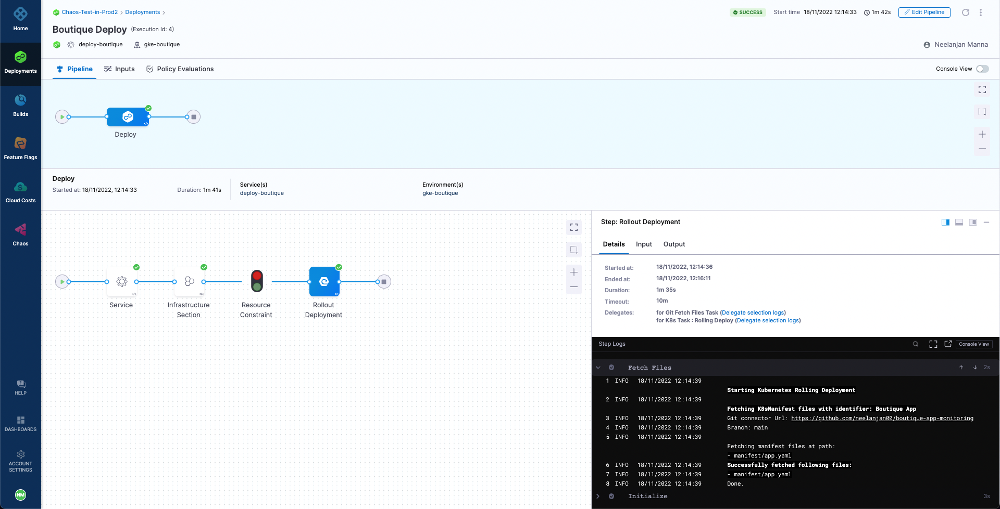
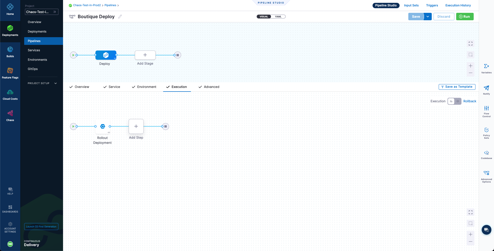
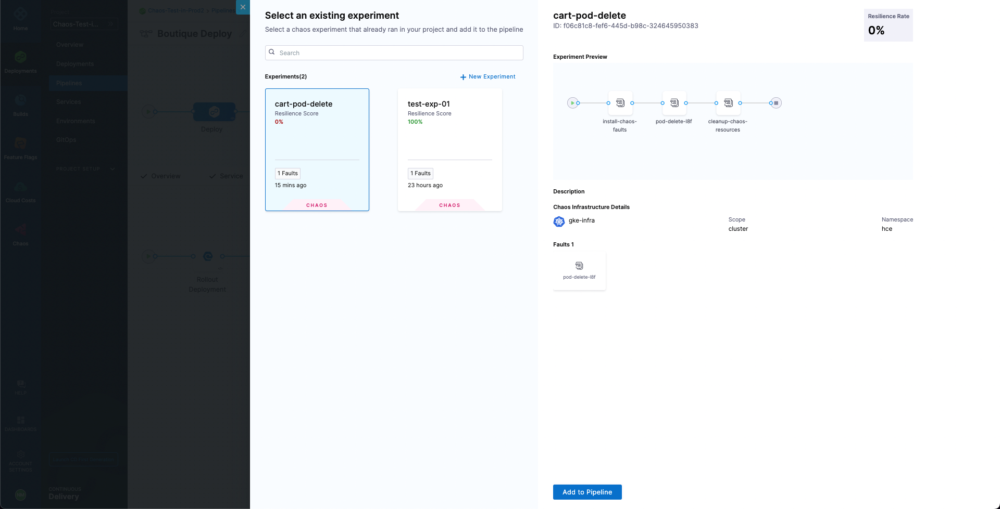
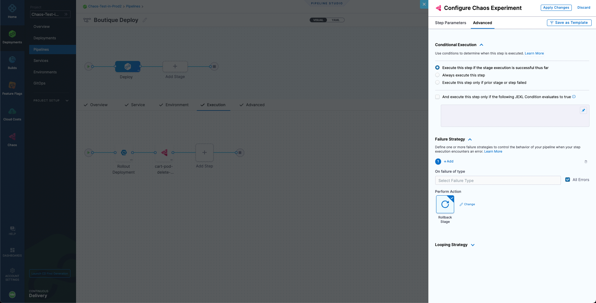
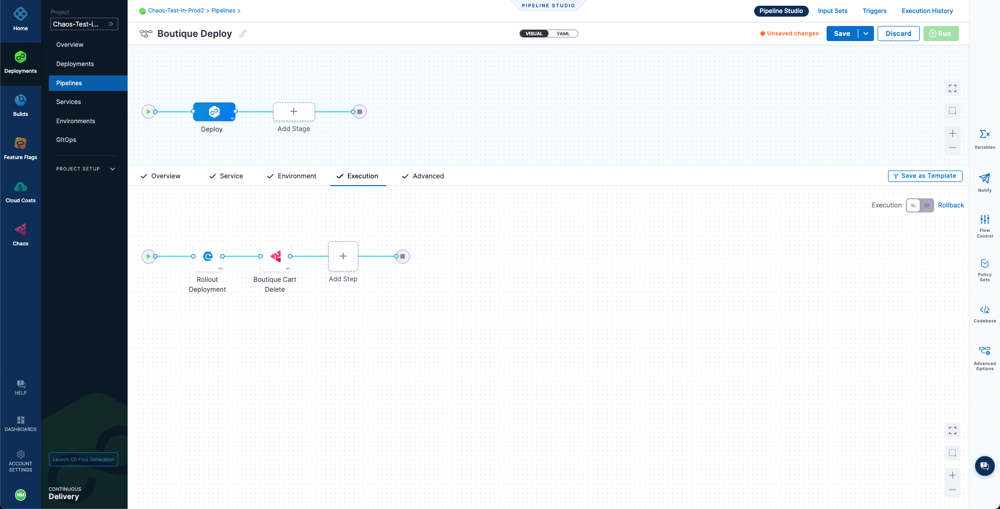
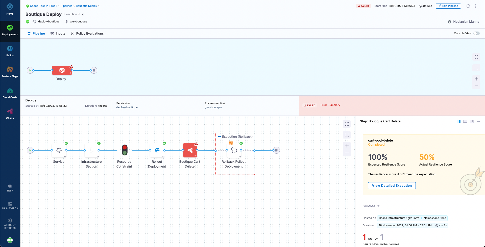
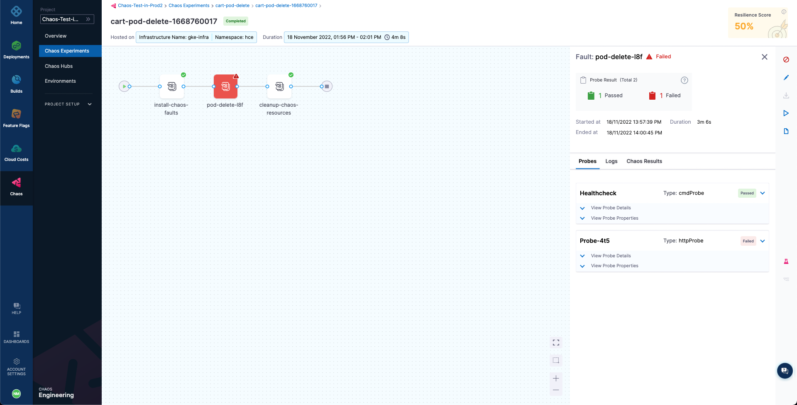
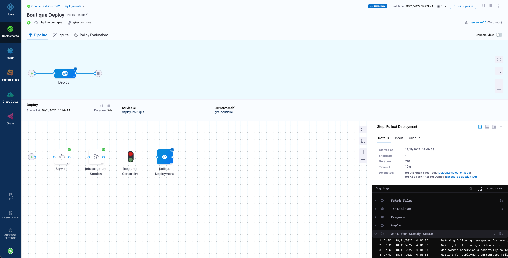
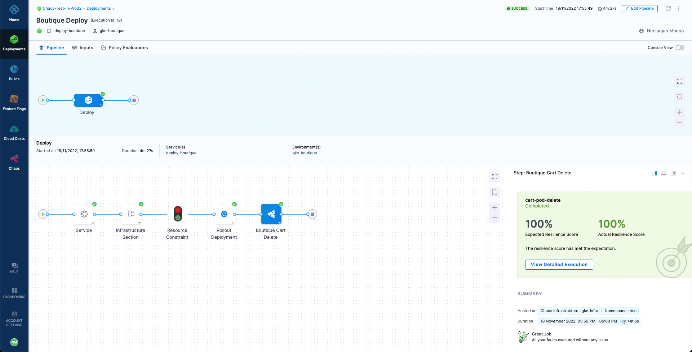

import Tabs from '@theme/Tabs';
import TabItem from '@theme/TabItem';

This tutorial uses the `cart-pod-delete` experiment created in the tutorial on running chaos experiments with API to execute a chaos experiment as part of a Harness CD pipeline to validate the resiliency of an application in a continuous manner.

As part of the tutorial, we have a pre-curated CD pipeline for deploying our demo application, Online Boutique Shop, to a Kubernetes cluster that you can get from a fork of [this repository](https://github.com/chaosnative/harness-chaos-demo/tree/main/boutique-app-manifests). Also, we have defined a pipeline webhook trigger for the repository such that any code change in the `main` branch triggers the CD pipeline to create a new deployment.

It can be observed that currently the pipeline is able to deploy the application and we have exactly one replica of each microservice, including the **cart** deployment which we are going to target.

1. Add a chaos step to this pipeline so that the chaos experiment you created in the running chaos experiments with API tutorial, `cart-pod-delete`, will run whenever a new pipeline deployment is triggered. This will allow you to validate the deployment against the chaos hypothesis.

   To add the chaos step, select the **Add Step** icon next to the **Rollout Deployment** icon for the CD deployment stage, and then select **Chaos Step**.

   

2. Configure the Chaos step. Name the step as **Boutique Cart Delete**. You can also provide a description, optionally. Next, under **Select Chaos Experiment** dropdown, search and select the **cart-pod-delete** experiment.

   

3. Select **Add to Pipeline**. For expected resiliency score, provide **100**, which means that only mark the step as passed if the resiliency score obtained upon the experiment execution is 100%.

   

4. Go to the **Advanced** tab. Under **Failure Strategy** select **Add**. For **On failure of type** select **All Errors** and for **Perform Action** select **Rollback Stage**.

   This will ensure that if the chaos experiment's resiliency score is less than 100%, the deployment will be rolled back to the previous version. Hence, the application deployment is continuously validated to be resilient before it gets deployed, otherwise the deployment is safely rolled back to the previous version until the weakness in the application can be mitigated.

   

5. Select **Apply Changes** to save the step, and then select **Save** to save the pipeline.

   

6. Run the pipeline.

   The pipeline will attempt to deploy the application as part of the CD deployment stage. However, the stage will fail with an error due to the failure of the **Boutique Cart Delete** chaos step, causing the CD to initiate a rollback and revert to the previous healthy deployment.

   

At this point we can validate that the application is still accessible, which indicates that the rollback was indeed successful.

A closer inspection indicates that the failure of the chaos step is caused by a resiliency score of only 50%, which is less than the passing criteria of 100%. This can be validated by checking the **cart-pod-delete** experiment under the **Chaos Experiments** page, where the last experiment run has yielded a resiliency score of 50% only.

Hence, we were able to verify a potential weakness in our application using the HCE experiment and observed how the Harness CD pipeline integration can benefit from the continuous chaos validation.

Now, let us see how you can resolve this weakness in your application so that it can be successfully deployed. We can apply [this](https://raw.githubusercontent.com/chaosnative/harness-chaos-demo/main/boutique-app-manifests/manifest/cart.yaml) manifest for the existing **cartservice** deployment, which should bump up the number of deployment replicas to **2**, according to the manifest specification.

As soon as the changes are pushed to the `main` branch of the repo, we can observe that a new pipeline has been triggered, due to the repository webhook that we have defined.

Upon the completion of the pipeline, we can observe that the deployment is successful with the chaos step obtaining 100% resiliency score. Hence, the experiment has passed and our resilient application is now deployed. We can also validate that the corresponding chaos experiment run has been successful with a 100% resiliency score.

