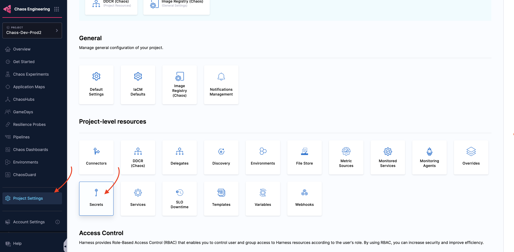
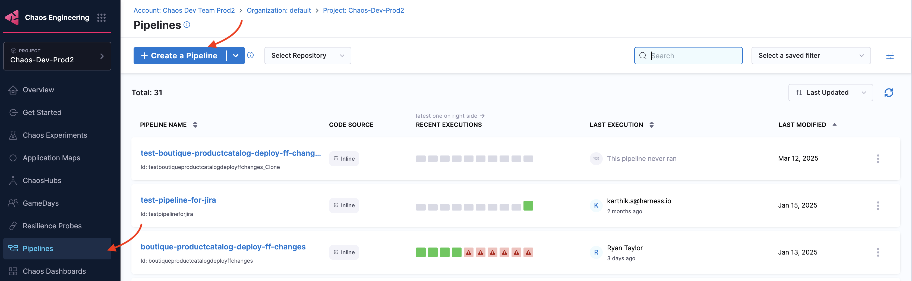
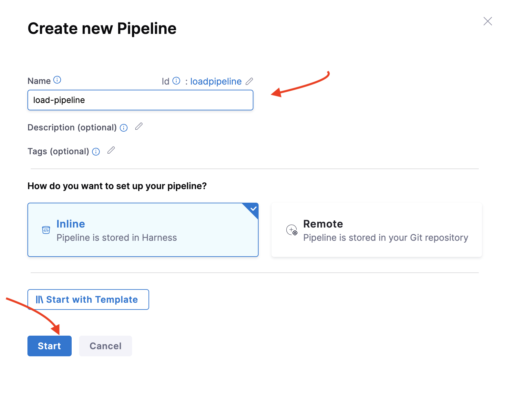
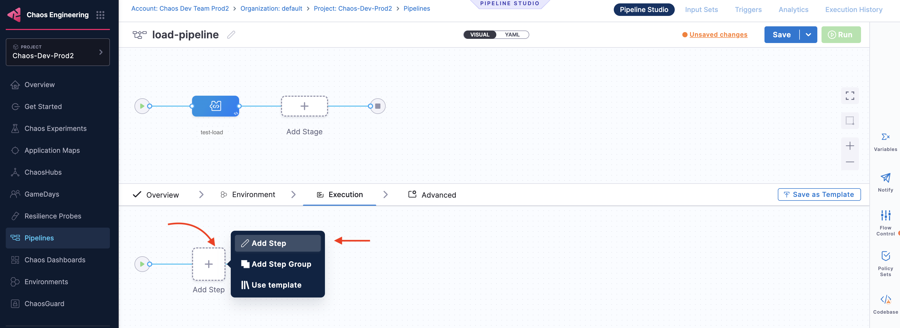
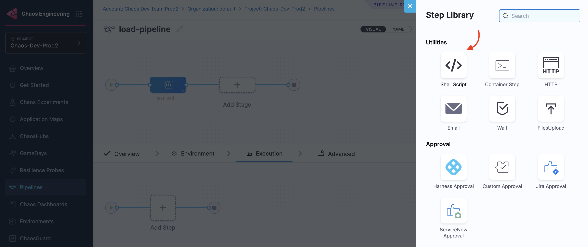
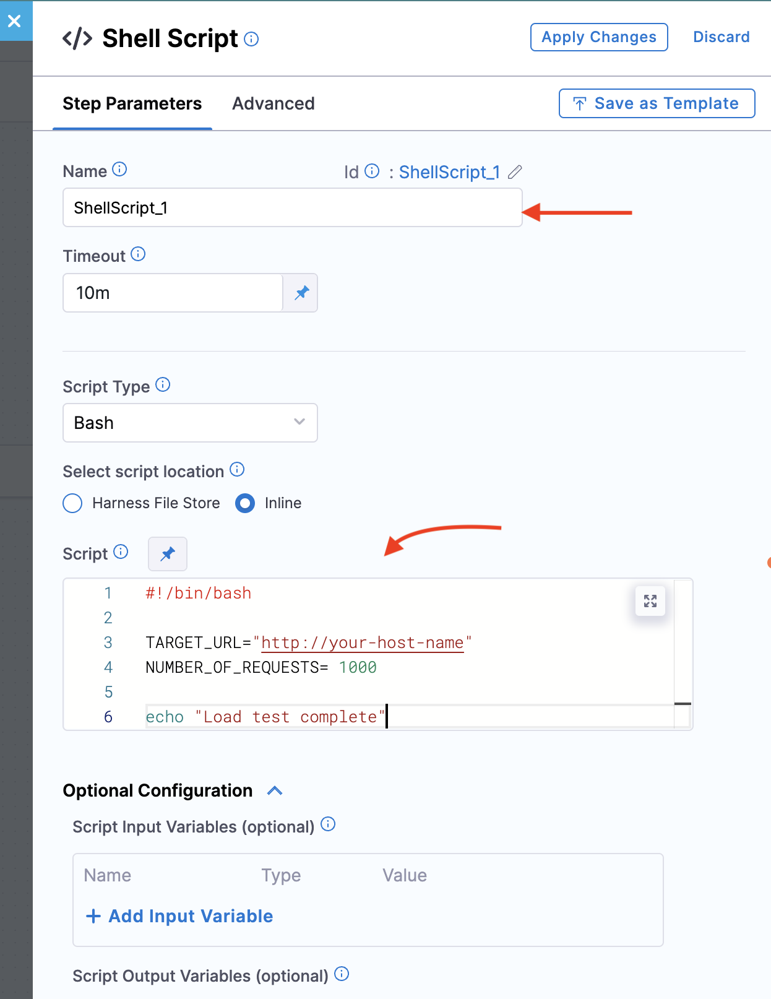
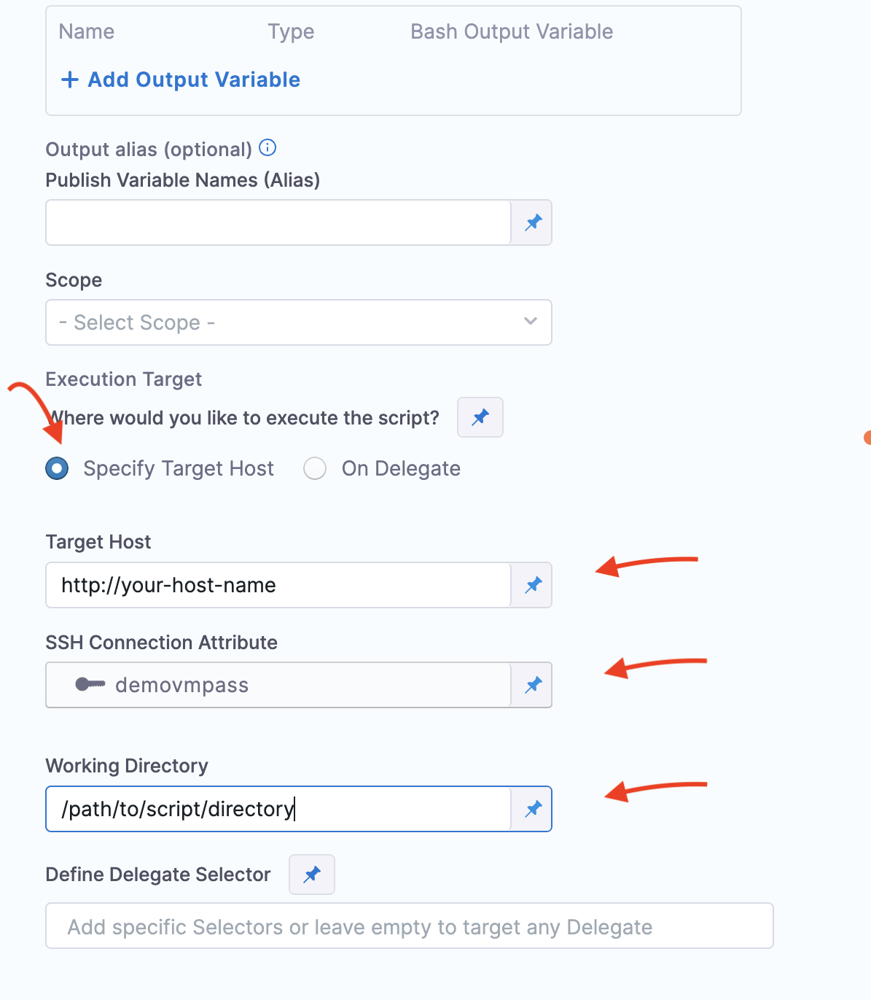
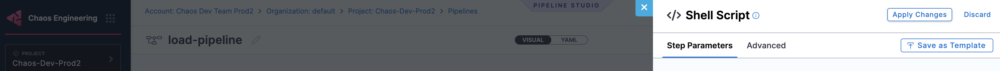
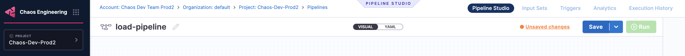
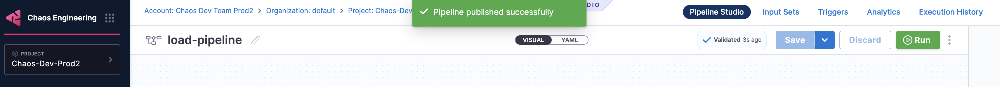

This topic describes integrating load tests from a remote server in parallel with chaos experiments to monitor transactions.

## Prerequisites

A [Harness Delegate](/docs/chaos-engineering/use-harness-ce/infrastructures/types/ddcr/installation) should be installed and have network connectivity to the target cluster.

### Step 1: Create an SSH or WinRM Secret

1. Navigate to Project/Org/Account Settings in the Harness platform. Click Secrets.

	

2. Create an [SSH](https://developer.harness.io/docs/platform/secrets/add-use-ssh-secrets) or [WinRM Secret](https://developer.harness.io/docs/platform/secrets/add-winrm-keys) for secure access to the target machine.

### Step 2: Create a Pipeline

3. Go to **Pipelines** and click **+ Create a Pipeline**. 

	

4. Provide a **Name**, **Description** (optional), and **Tags** (Optional). Select **Inline**. Click **Start**. 

	

### Step 3: Add Shell Script Step

5. Create a [custom Stage](/docs/platform/pipelines/add-a-stage
), and go to the execution section and select **Add Step**.

	

6. Select Shell script step.

	

7. In the shell script step, provide the **Bash Script** to generate. 

	

8. Navigate to **Optional Configuration -> Execution Target** and select **Specify Target Host**. Provide values for **Target Host**, **SSH Connection Attribute** ([created in Step 1](/docs/chaos-engineering/integrations/load-test#step-1-create-an-ssh-or-winrm-secret)) and **Working Directory**. Go to [Optional Configuration](/docs/continuous-delivery/x-platform-cd-features/cd-steps/utilities/shell-script-step/#execution-target) to know more about each configuration.

	

9. Click **Apply Changes** to save the changes to Shell Script Configuration. 

	

10. Click **Save** to save the changes to the pipeline. 

	

11. Click **Run** to execute the pipeline.

	

## Conclusion

By following these steps, you can integrate a remote load test into your chaos experiment pipeline, ensuring that resilience testing is performed to monitor business transactions.

