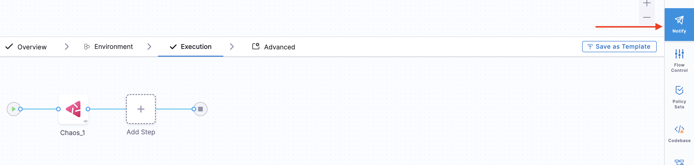
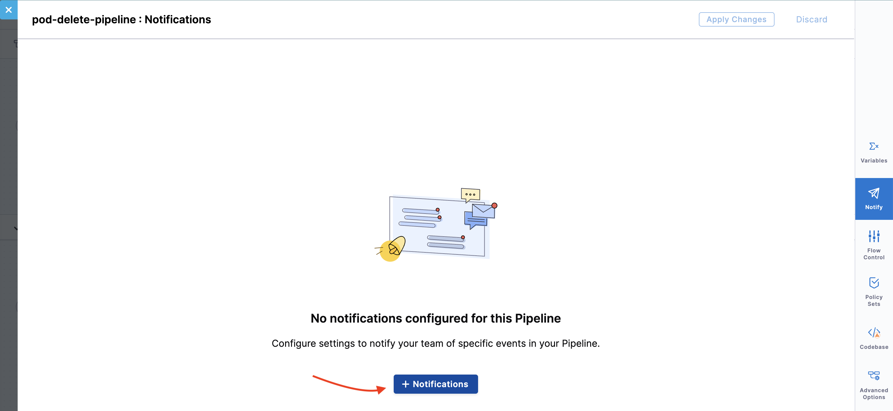
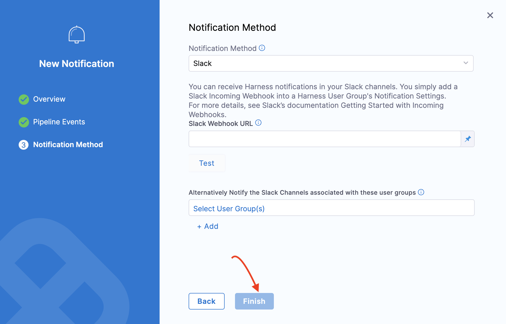

This tutorial describes how you can execute chaos experiment in a pipeline and integrate it with notifications and approvals.

### Why is a pipeline required in chaos experiment execution?

Let us take examples to understand the importance of executing chaos experiments as a pipeline.

- Suppose you want to execute two chaos faults in parallel in a chaos experiment, where both the faults are present in two different zones and clusters. HCE introduces a layer of orchestration at the pipeline level, that helps execute these faults within the chaos module by leveraging the pipelines.

In all, pipelines facilitate orchestrating chaos experiments across infrastructure (or host or cluster) within a project.

- Pipelines also facilitate **approvals** and **notifications**. Approval is a step introduced in the pipeline, that requires a person to approve the step in the pipeline before it is executed.

:::tip
You can configure permissions such that users in your account/project/organization can execute experiments only if they are in a pipeline. Go to **Project Settings** -> **Roles** -> **Chaos** and select **Execute via Pipeline**.
:::

For more information, go to [Approvals](/docs/platform/approvals/approvals-tutorial).

- You can also configure pipelines to receive notifications about various steps that executed or failed in a pipeline. This helps you keep track of the experiment in real-time.

For more information, go to [Notifications](/docs/platform/notifications/notification-settings).

### Integrate Experiment Pipeline with Notification

You can create a chaos experiment as a pipeline and integrate it to receive notifications about the status of the experiment. Go to [create experiment as a pipeline](/docs/chaos-engineering/use-harness-ce/experiments/create-experiments#create-experiment-as-a-pipeline) to get hands-on experience of creating a chaos experiment as a pipeline.

For more information, go to [Pipeline concepts](/docs/continuous-integration/get-started/key-concepts) and [Pipeline Modeling Overview](/docs/continuous-delivery/get-started/cd-pipeline-modeling-overview).

To integrate the pipeline to receive notifications, follow the steps below:
Go to **Pipelines** and select the pipeline that you want to receive notifications about.

1. Click **Notify** to set up notifications.

    

2. Click **Notifications** to configure a notification for the pipeline. Provide a name for the notification and click **Continue**.

    

3. You can choose one of the notification methods. For example, Slack. Provide the relevant parameters, which in this case, is the **Slack Webhook URL**. Click **Finish**.

    

