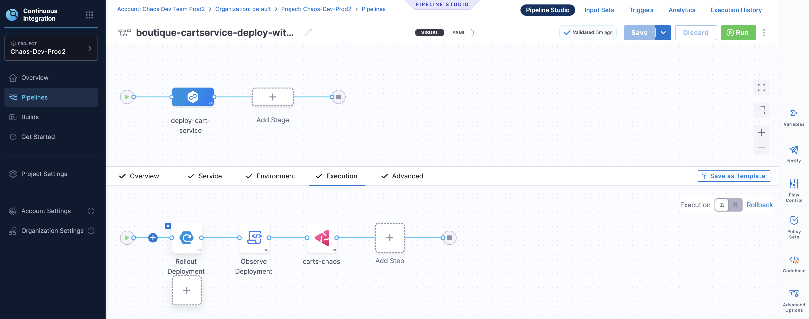
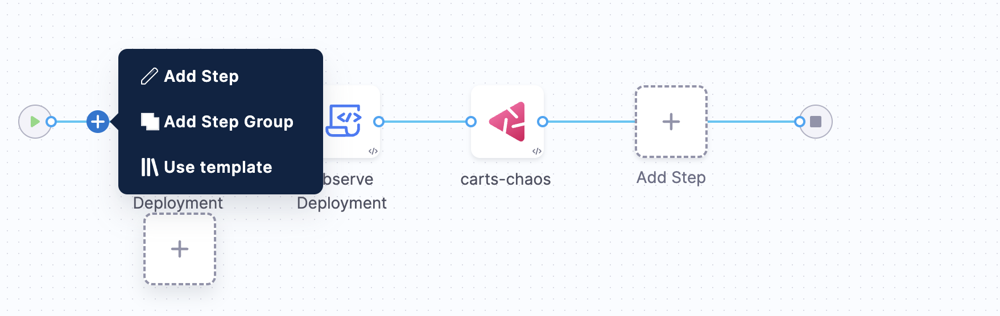
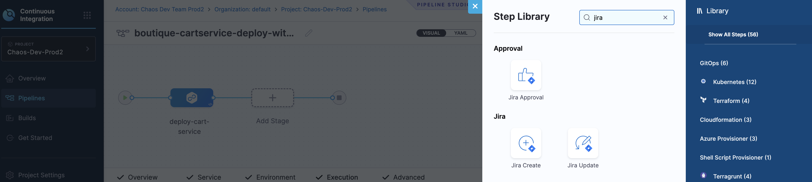

This tutorial describes how you can introduce a step in the chaos experiment execution pipeline that integrates with JIRA. For example, introduce a step that updates or creates a JIRA issue in the pipeline execution. You can also add steps to use JIRA issues to approve steps and stages in the pipeline execution.

Go to [create a chaos execution pipeline](/docs/chaos-engineering/integrations/hce-and-cd/chaos-cd) to understand how to execute chaos experiment as a CD pipeline.

1. Select the **+** at the execution phase in the pipeline where you want to introduce the step.

    

2. You can add a step, a group step or use a template. In this case, you need to choose **Add Step**.

    

3. Search for "Jira" in the search bar, and choose the relevant option. Provide the necessary step parameters based on the option you choose. Click **Apply Changes**.

    

That's all. This creates a JIRA action (creating a JIRA ticket or updating a JIRA ticket or adding a step to approve the pipeline execution) for your pipeline.