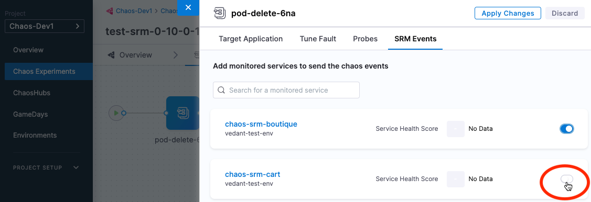
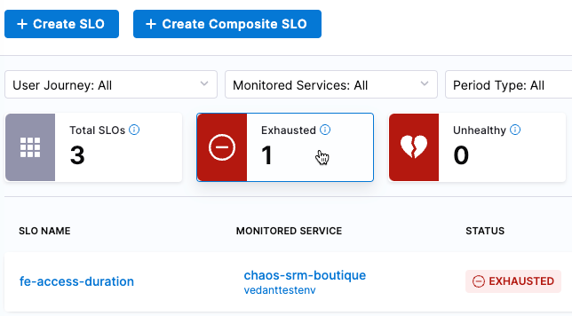
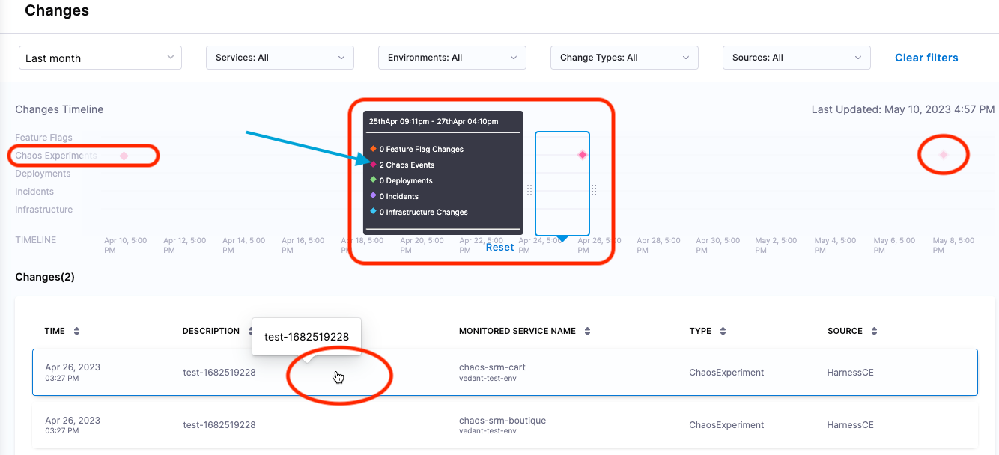

Within Harness, you can see the impact of chaos faults on your target environment by using [SRM](/docs/service-reliability-management).
To do this, you connect any chaos fault within an experiment to monitored services. A monitored service in Harness is a combination of a service and environment that [SRM](/docs/service-reliability-management) monitors for changes, events, and health trends. 

For example, let's say you use SRM to monitor services and to correlate change events to service health. Now you want to see how one or more chaos faults impacts services in your target environment. By adding the target environment as one or more monitored services, and linking faults to those services, you can see the impacts on service health in SRM when you run experiments containing those faults. 

For more information on monitored services, go to the [SRM documentation](/docs/service-reliability-management).

## Before you begin

Create one or more monitored services that represent your target environment for running chaos experiments. Then create one or more Service Level Objectives (SLOs) for the monitored service(s). For instructions, go to: 

* [Create a monitored service](/docs/service-reliability-management/monitored-service/create-monitored-service).
* [Create your first SLO](/docs/service-reliability-management/getting-started/create-first-slo)

## Connect a fault to a monitored service

You can connect any fault within a chaos experiment to one or more monitored services.

To connect a fault to a monitored service:

1. In Harness, select **Chaos > Chaos Experiments**, and then find and select an experiment (or create a new one).
1. In Experiment Builder, select a fault, and then select the **SRM Events** tab.

	

1. Select the toggle on the monitored service(s) that you want to link this fault to, and then select **Apply Changes**.

	:::info note
	Your target environment for chaos experiments may have several monitored services.
	:::

## Check the impact of a fault on a monitored service

Once you've connected faults to monitored services corresponding to your target environment, when you run the experiment(s) containing those faults, you can use the [**SRM SLOs**](/docs/service-reliability-management/getting-started/slo-dashboard) and [**Changes**](/docs/service-reliability-management/change-impact-analysis/change-impact-analysis-changes-dash-board) dashboards page to check the health of those services.

To check the impact of a fault on a monitored service:

1. In Harness, select **Service Reliability**.

	The [Service Level Objectives (SLOs) dashboard](/docs/service-reliability-management/getting-started/slo-dashboard) appears, listing SLOs, their associated monitored service, status, [error budget](/docs/service-reliability-management/getting-started/slo-dashboard#error-budget-details), etc.
	
	 

	Here you can find the monitored service(s) corresponding to your target environment.

1. Use the filters at the top to narrow down the list of SLOs.

	

1. Go to **Service Reliability > Changes** to get another view of the data.

	

	The top part of the [Changes dashboard](/docs/service-reliability-management/change-impact-analysis/change-impact-analysis-changes-dash-board) displays a Changes Timeline, including a separate line for **Chaos Experiments**. Chaos events along this timeline are indicated by diamond icons.

1. Use the filters at the top to narrow down the data, and then move the pointer to the diamond icons in the **Chaos Experiments** timeline to see chaos events at those points in time.

	For example, in the image above, the pointer is centered around one of diamonds on the **Chaos Experiments** timeline, and there are 2 Chaos Events at that point in time. The corresponding events are also listed in the **Changes** section at the bottom of the page.

1. Below the timeline, in the Changes section, select a change event to see [SLO details](/docs/service-reliability-management/getting-started/slo-dashboard#slo-details-page).

	Here you can see performance trends and error budget for the SLO, among other details. 

1. To go to the chaos experiment corresponding to this change event, select **View Chaos Experiment**.

## More information

For more information on Harness SRM and monitored services, go to these topics:

* [Create a monitored service](/docs/service-reliability-management/monitored-service/create-monitored-service)
* [Create your first SLO](/docs/service-reliability-management/getting-started/create-first-slo)
* [Use the Service Health dashboard](/docs/service-reliability-management/change-impact-analysis/change-impact-analysis-service-health-dashboard)
* [Use the SLOs dashboard](/docs/service-reliability-management/getting-started/slo-dashboard)
* [Use the Changes dashboard](/docs/service-reliability-management/change-impact-analysis/change-impact-analysis-changes-dash-board)
