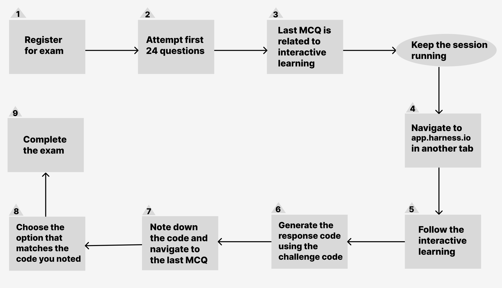
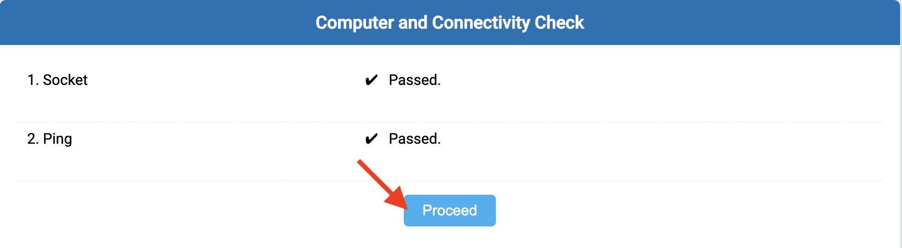

This tutorial guides you through registering for the Harness Chaos developer exam certification and completing it.

Before you begin, refer to the [Chaos Engineering overview](/docs/chaos-engineering/onboarding/hce-onboarding.md) and [Run chaos experiments in sandbox](/docs/chaos-engineering/onboarding/certifications/run-experiments-in-sandbox.md).

## Obtaining developer certification

The diagram represents the steps involved in obtaining the Harness developer certification.

:::tip
In the preceding diagram, steps 4 (navigate to app.harness.io) and 1 (register for exam) can be interchanged. This means you can attempt the interactive learning first and then move to the questions.
:::

## Developer certification exam

1. [Execute the Podtato head application in sandbox](/docs/chaos-engineering/onboarding/certifications/run-experiments-in-sandbox.md) before attempting the Harness Chaos Engineering Developer certification exam.

2. Navigate to [University on Harness developer hub](https://developer.harness.io/university/chaos-engineering?lvl=developer) or select **Go to Harness University**.

   

3. You can **Register for free** or sign in.

   

4. If you haven't previously registered, click **Sign up** and enter the details required. Else **Sign in**.

   

5. Click **Register for exam**.

   

6. Basic connectivity is checked, click **Proceed**.

   

7. Read through the terms and conditions, click **Agree and Continue**.

   

8. Click **I am ready to begin**.

   

9. Choose the options that you think suit the questions the best. At the end, the screen will display a code, with 4 options. Go to the sandbox and enter the code.

   

10. Once you enter the code, click **Generate**.

   

11. The code generated on this page is one of the options on the Harness University exam page. Select the code generated for you, and click **Submit exam**.

  

That's it! The screen will determine and display your results. All the best!
