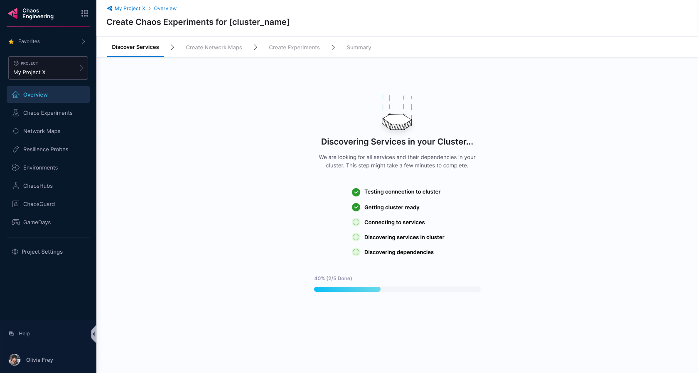
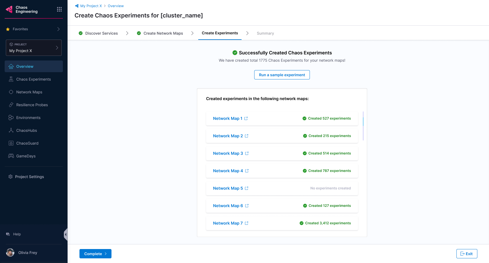

import Tabs from '@theme/Tabs';
import TabItem from '@theme/TabItem';

This topic describes the following operations that constitute the guided onboarding:
1. [Create an environment.](#select-an-environment)
2. [Create an infrastructure.](#select-an-infrastructure)
3. [Automatically discover services on your cluster.](#automatically-create-discovery-agent)
4. [Create application maps with a single click.](#create-application-maps)
5. [Choose the chaos experiments to run.](#create-chaos-experiments)
6. [View the resilience of chaos experiments.](#view-resilience-score)

## Before you begin, review the following:

* [What is chaos engineering?](/docs/chaos-engineering/get-started/overview)
* [Harness Delegate](/docs/chaos-engineering/features/chaos-infrastructure/harness-infra/)
* [Onboarding overview](/docs/chaos-engineering/onboarding/hce-onboarding)
* [HCE automated onboarding](/docs/chaos-engineering/onboarding/single-click-onboarding)
* [Create infrastructure before onboarding](/docs/chaos-engineering/onboarding/hce-onboarding#prerequisites-to-automated-and-guided-onboarding)

:::tip
Currently, this feature is behind the feature flag `CHAOS_V2_ENABLED`. Contact [Harness support](mailto:support@harness.io) to enable the feature.
:::

### What is guided onboarding?
Guided onboarding, as the name suggests, guides you through creating a chaos experiment  with minimal choices for you to make during the process.

For example, you can [select a button to create an environment](/docs/chaos-engineering/onboarding/guided-onboarding#select-an-environment) and HCE creates an environment in the background. On the same lines, you can click a button to use a chaos infrastructure in the environment you created earlier.

### Why choose guided onboarding?
- Guided onboarding gives you multiple options at every step so you know the entire process of creating a chaos experiment and executing it.
- At every step, you have the option of allowing HCE to create the entity for you or you can choose to customize the entity creation too.
- The level of granularity is, that HCE will suggest experiments for you based on earlier steps (application maps and so on) and you can create experiments. But to execute them, you have to select the **Run** button.

### How to onboard with guided onboarding?

If you chose to onboard with guidance, that is, selected **No, I will choose** [here](/docs/chaos-engineering/onboarding/hce-onboarding#automated-and-guided-onboarding), follow the steps below.

### Select an environment

1. Select an environment from a list of environments and select **Next**. It might take a while to set up the environment.

        

### Select an infrastructure

2. You can see that the infrastructure says **Already in use**. This means you can't use this infrastructure, and you need to [create a new one](/docs/chaos-engineering/onboarding/hce-onboarding#prerequisites-to-automated-and-guided-onboarding). Now, you can select an infrastructure from the list and select **Apply**.

        

### Automatically create Discovery Agent

4. HCE creates the discovery agent that automatically discovers services for your application. The next step (optional) collects information about blocked namespaces, service discovery periods, and so on. To learn how to use a custom discovery agent, go to [customize discovery agent](/docs/chaos-engineering/features/service-discovery/service-discovery-usage.md).

5. Once you complete the above steps, HCE looks for services in your cluster (which might take a while).

    

### Create Application Maps

6. Once HCE discovers the services, the UI lists them for your reference. Select **Create Application Maps**.

    

7. HCE prompts you to select one of the options whether to automatically create application maps or not.

### Choose between automatic and customizable application map creation

<Tabs>
 <TabItem value="Automatic">

7a. Select **Yes** to automatically create application maps. Select **Create Application Maps**.

    

7b. You will find application map recommendations from HCE based on the discovered services.

    

</TabItem>

<TabItem value="Customize">

7a. Select **No, I will choose** to customize application map creation and select **Create Application Maps**.

    

7b. Enter a **Application Map Name**, **Tag** (optional), and **Description** (optional). Select **Confirm**.

    

This creates application maps and lists them on the UI.

    

7c. To select and save some or all the created application maps, select **Save application map**.

    

</TabItem>
</Tabs>

### Create chaos experiments

8. HCE lists the application maps for you to choose from. Choose one and select **Next: Create Chaos Experiments**.

    

9. HCE recommends experiments of different complexity (classified based on blast radius of the experiment). You can choose between **Basic**, **Intermediate**, and **Advanced** chaos experiments (categorized based on their blast radius). Select **Create Experiments** to initiate the process.

    

10. Based on your choice, HCE creates chaos experiments and lists the application maps associated with the experiments on the UI. Select **Complete** or **Exit**.

    

### Execute chaos experiments

11. Select **Run** to execute the chaos experiments.

    

Congratulations! You have successfully:

 - Discovered services
 - Created application maps
 - Created chaos experiments
 - Executed the chaos experiments
    

### View resilience score

- Once the experiments you selected complete their execution, you can see the resilience score of these experiments.

    

- You can check the resilience summary once you fulfill the checklist requirements.

    

- You can select **View** to see the progress of different clusters executing various chaos experiments.

    

## Next steps

Don't forget to check other walkthroughs! Some of them are listed below.

* [Run your first chaos experiment](/docs/chaos-engineering/get-started/tutorials/first-chaos-engineering.md)
* [Executing experiments in a sandbox](/docs/chaos-engineering/onboarding/certifications/run-experiments-in-sandbox.md)
* [Create chaos experiments from scratch](/docs/chaos-engineering/get-started/tutorials/chaos-experiment-from-blank-canvas.md)
