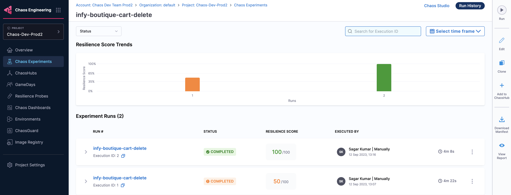

This topic walks you through Harness infrastructure that uses Harness Delegate and how it facilitates quick onboarding and optimizes chaos experiments.

## What is Harness infrastructure?

Harness infrastructure is a beta product in HCE that allows for quick onboarding and optimized chaos execution for microservices-based targets on Kubernetes.
The features described below help achieve quick onboarding and optimized chaos experiment execution.
The diagram below describes the high-level flow of how to [discover services](/docs/chaos-engineering/features/service-discovery/intro-service-discovery) and [create network maps](/docs/chaos-engineering/features/network-maps/intro-network-map).

    

## Features of Harness infrastructure
- Automated Kubernetes [service discovery](/docs/chaos-engineering/features/service-discovery/intro-service-discovery) and workloads with network traffic patterns between them through a transient discovery agent.
- [Automated](/docs/chaos-engineering/onboarding/guided-onboarding#choose-between-automatic-and-customizable-network-map-creation) and [guided](/docs/chaos-engineering/features/network-maps/intro-network-map#create-a-network-map) creation of network maps that represent a fully functional application within the cluster (which comprises of several constituent microservices).
- [Chaos experiment auto-creation](#auto-create-experiment) for a given [network map](/docs/chaos-engineering/features/network-maps/intro-network-map) based on the workload specification and its lineage in terms of network traffic.
- Reuse of the Harness Delegate for chaos experiment execution on the user cluster without a dedicated (or separate) chaos agent.

### Auto-create experiment
Experiments are auto-created based on levels (or categories) you select during automated or guided onboarding. The default setting is that HCE creates all the recommended experiments for the selected network map.

    

### Speed of execution
Previously, chaos experiments would typically take more time (in the order of 4 minutes) whereas with Harness infrastructure, you can complete experiment execution in less than half the time (in the order of 1.5 minutes).
The diagram below shows the execution time for experiments that use legacy Kubernetes infrastructure.

    

The diagram below shows the execution time for experiments in Delegate-driven Harness infrastructure.

    

### Fault tunables
The number of tunables to specify has changed, and Harness infrastructure gives better control since it provides advanced tunables.

The diagram below shows the tunables used in experiments that use legacy Kubernetes infrastructure..

    

The diagram below shows the tunables used in experiments that use Delegate-driven Harness infrastructure.

    

### Delegate Driven Chaos Injection (DDCI)

The schematic diagram below describes how chaos experiments are executed in Harness infrastructure using Harness Delegate. It highlights the use of Harness Delegate which eliminates the need for a dedicated chaos agent, which simplifies the experiment orchestration mechanism.

    

Go to [permissions required](/docs/chaos-engineering/onboarding/harness-infra/permissions) to know the detailed list of permissions to execute DDCR-based Kubernetes faults.

The diagram below describes the detailed flow of control (step 5 of the earlier diagram), for an example chaos experiment- [pod DNS chaos](/docs/chaos-engineering/chaos-faults/kubernetes/pod/pod-dns-error).

    
