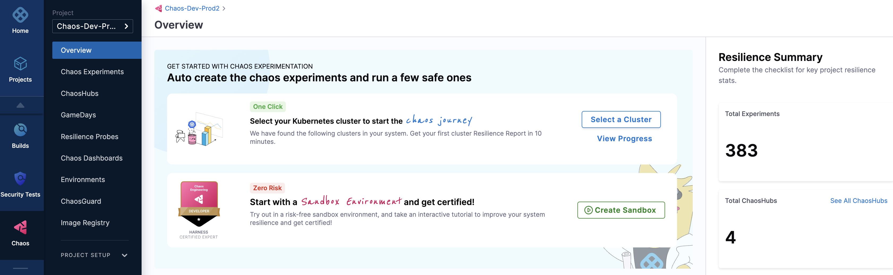
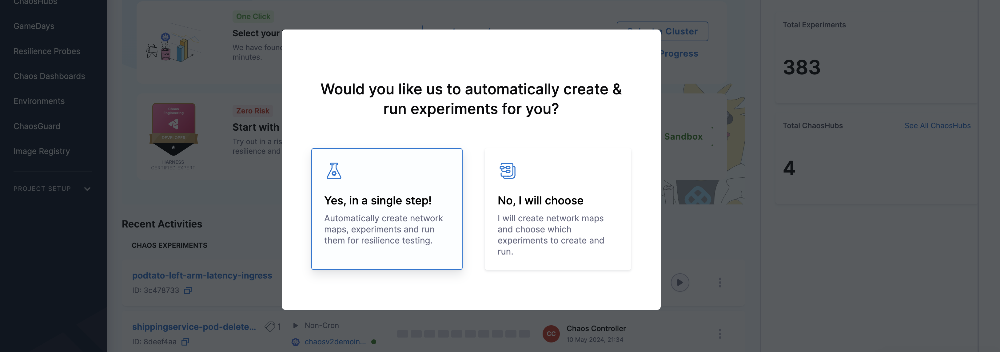
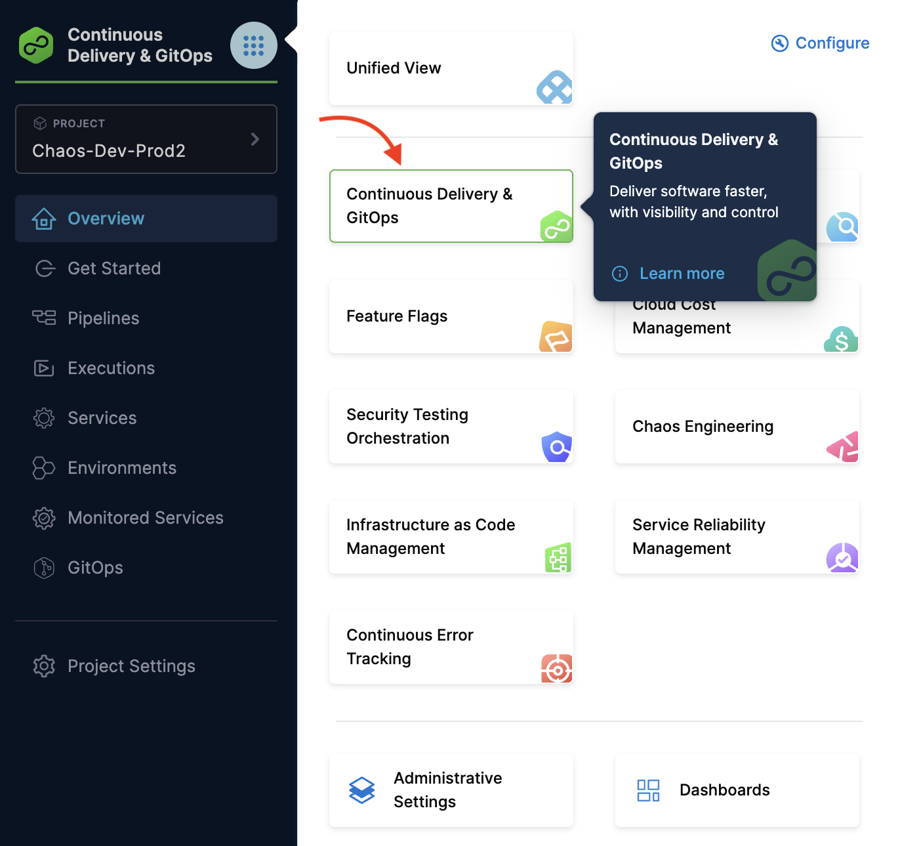
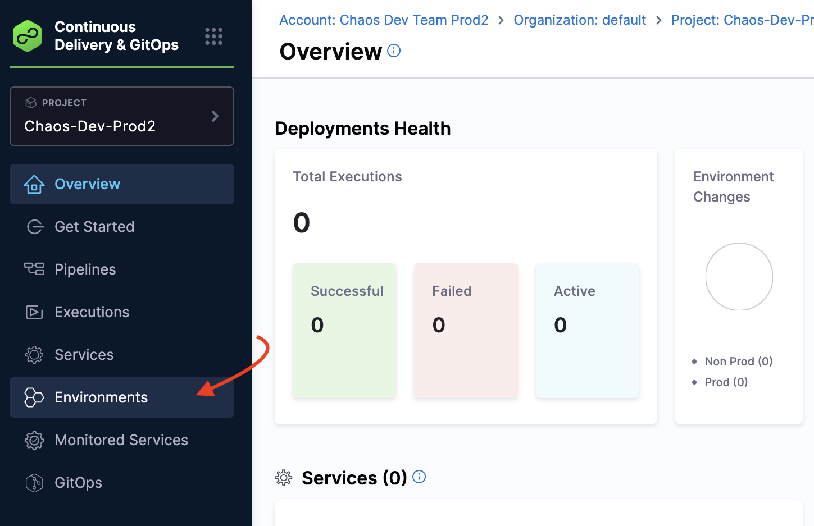
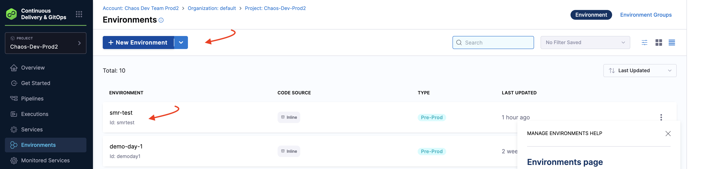
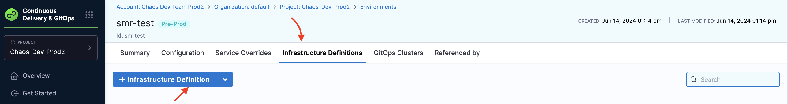
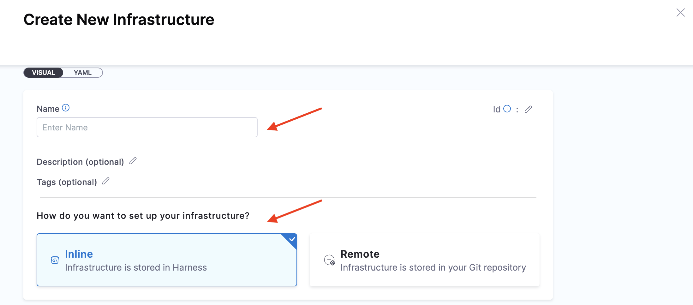
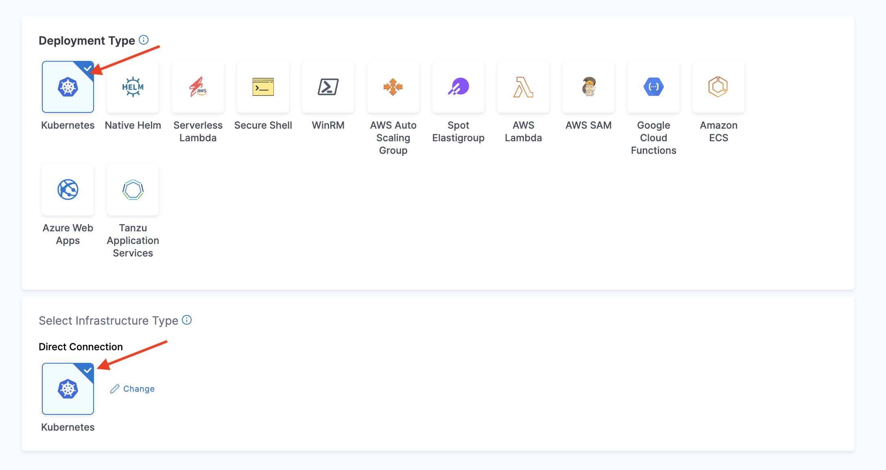
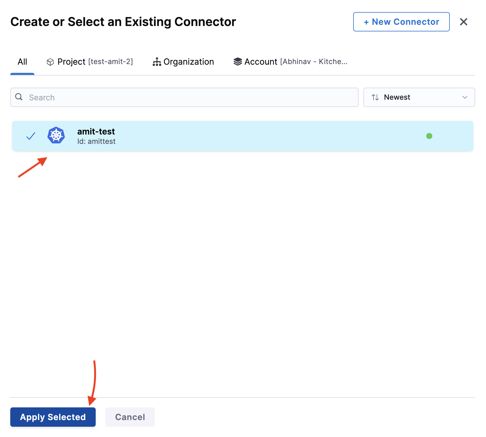
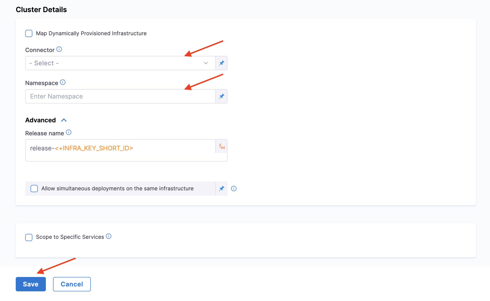

This topic describes the typical steps to execute a chaos experiment, and delves into how you can deploy the HCE application in two different modes, that is, [automated onboarding](/docs/chaos-engineering/onboarding/single-click-onboarding) and [guided onboarding](/docs/chaos-engineering/onboarding/guided-onboarding).

## Before you begin

* [What is chaos engineering?](/docs/chaos-engineering/get-started/overview)
* [Harness Delegate](/docs/chaos-engineering/features/chaos-infrastructure/harness-infra/)
* [Key concepts](/docs/chaos-engineering/architecture-and-security/architecture/components)

:::tip
Currently, this feature is behind the feature flag `CHAOS_V2_ENABLED`. Contact [Harness support](mailto:support@harness.io) to enable the feature.
:::

## Automated and guided onboarding

You can execute chaos experiments without explicitly installing the environment or infrastructure or creating an experiment by specifying tunables.

1. To get hands-on experience, navigate to the **Chaos** module and select **Overview**. Select **Select a cluster**, where you can choose between [automated](/docs/chaos-engineering/onboarding/single-click-onboarding.md) and [guided](/docs/chaos-engineering/onboarding/guided-onboarding.md) onboarding.

2. If you choose **Yes, in a single step!**, go to [automated onboarding](/docs/chaos-engineering/onboarding/single-click-onboarding.md), and if you choose **No, I will choose**, go to [guided onboarding](/docs/chaos-engineering/onboarding/guided-onboarding.md).

:::tip
- Previously, HCE provided a dedicated chaos infrastructure to execute chaos experiments. With the current updates, the `chaos-runner` is transient and you can execute chaos experiments by installing **Harness delegate**, thereby eliminating the need to install Harness chaos infrastructure and other additional components.
- Once you have installed Harness delegate, you can reuse it to execute experiments, [discover services](/docs/chaos-engineering/features/service-discovery/intro-service-discovery), [create application maps](/docs/chaos-engineering/features/app-maps/intro-app-map) and so on.
:::

## Prerequisites to automated and guided onboarding

HCE requires that you install a chaos infrastructure in your environment before using one of the onboarding methods (guided or automated). While using one of the onboarding methods, you can simply select the infrastructure (you installed earlier) for use by the chaos experiment.

:::tip
Once you use a chaos infrastructure for one of the onboarding methods, you need to create a new infrastructure for the second onboarding method. You can't use the same infrastructure more than once. The UI shows whether the infrastructure is already in use, if so, create a new one.
:::

### Steps to create an infrastructure for onboarding

1. Navigate to **Continuous Delivery & GitOps** module.

    

2. Select **Environments**.

    

3. Select one of the environments you created earlier or create a new environment. In this section, you will understand how to use a previously created environment. Go to [create a new environment](/docs/chaos-engineering/get-started/tutorials/first-chaos-engineering#step-2-create-an-environment) to create a new environment.

    

4. Select **Infrastructure Definitions** tab and select **Infrastructure Definition**. This opens the modal to create a new infrastructure.

    

5. Provide a name, method to set up infrastructure, deployment type, infrastructure type, and cluster details such as connector and namespace. Other fields are not mandatory so you can skip specifying values for those. Select **Save**.

    
    
    
    

This creates a new infrastructure in the environment you specify.

## Next steps

* [Automated onboarding](/docs/chaos-engineering/onboarding/single-click-onboarding)
* [Guided onboarding](/docs/chaos-engineering/onboarding/guided-onboarding)
