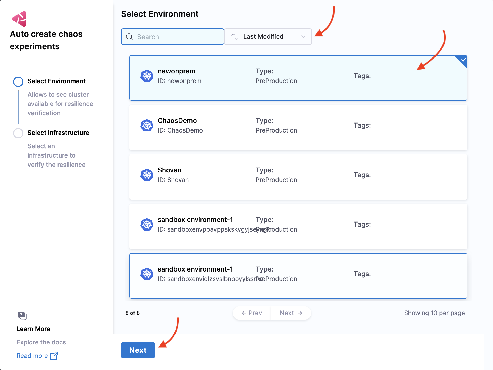
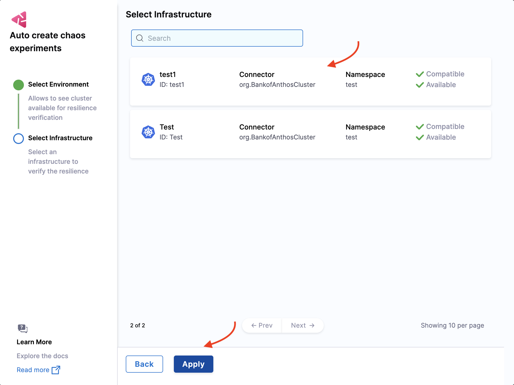
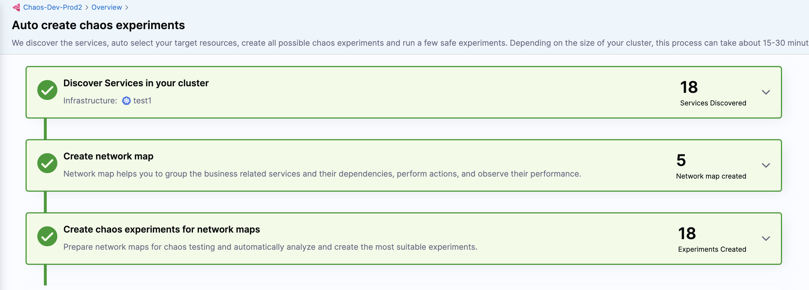
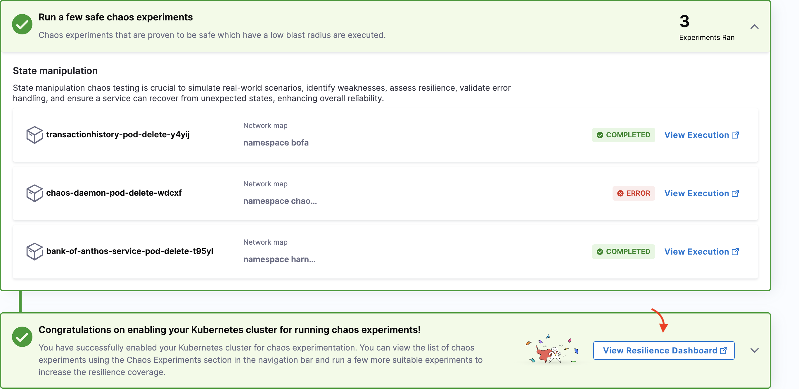
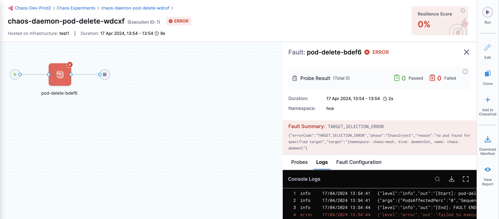
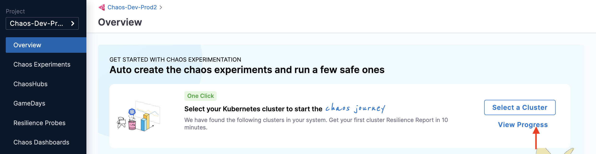
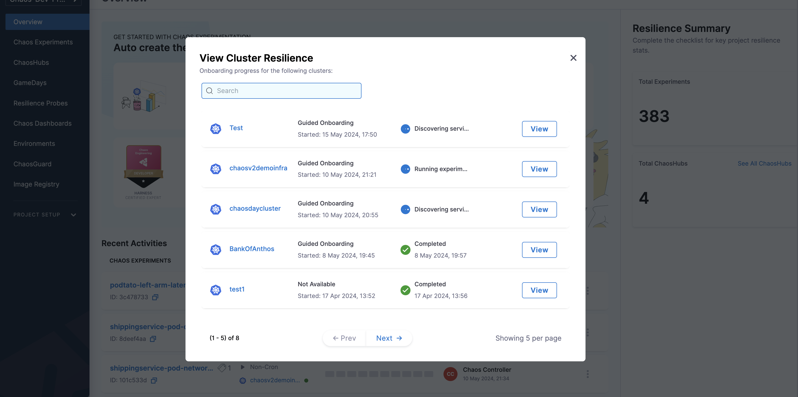

This topic describes the following operations:

1. [Set up environment with a click.](/docs/chaos-engineering/onboarding/single-click-onboarding#select-an-environment)
2. [Set up the chaos infrastructure with a click.](/docs/chaos-engineering/onboarding/single-click-onboarding#select-an-infrastructure)
3. [Discover services automatically.](/docs/chaos-engineering/onboarding/single-click-onboarding#automatically-discover-services)
3. [Create and execute chaos experiments automatically.](/docs/chaos-engineering/onboarding/single-click-onboarding#automatically-create-experiments)

## Before you begin

* [Overview of HCE onboarding](/docs/chaos-engineering/onboarding/hce-onboarding.md)
* [Harness Delegate](/docs/chaos-engineering/features/chaos-infrastructure/harness-infra/)
* [Create infrastructure before onboarding](/docs/chaos-engineering/onboarding/hce-onboarding#prerequisites-to-automated-and-guided-onboarding)

### What is automated onboarding?
Automated onboarding, as the name suggests, automates the entire process of creating and executing a chaos experiment. You can click a button and HCE creates an environment, uses an infrastructure, and other components in the background, executes the experiment, and displays the resilience score for the sample application.

### Why choose automated onboarding?
- If you want to quickly start with executing chaos experiments and expect HCE to perform most (or all) steps in the background, this is the guide for you.
- It takes minimal time to execute.
- Select an environment and infrastructure, and you are done. HCE discovers the services, creates the experiments, chooses the experiments with less blast radius to execute, and displays experiment progress and resilience score.

### How to onboard automatically?

If you chose to onboard automatically, that is, selected **Yes, in a single step** [here](/docs/chaos-engineering/onboarding/hce-onboarding#automated-and-guided-onboarding), follow the steps below.

### Select an environment

1. Select an environment from the list and select **Next**.

    

### Select an infrastructure

2. Select the target infrastructure on which you want to execute the chaos experiments. Select **Apply**. As you can see, the infrastructure listed are **Available**, this means you can use one of them.

    

### Automatically discover services

3. Based on your inputs earlier, HCE discovers services in your cluster (that is, **service discovery**) to create chaos experiments.

    

### Automatically create experiments

4. HCE automatically creates chaos experiments and selects a few experiments to execute.

    

5. HCE chooses to execute safe chaos experiments, that is, experiments that have a low blast radius.

    

### View logs and resilience dashboard

6. You can see the status of the chaos experiment execution, as well as view the experiment execution. You can also see the resilience score of the experiment if you select **View Resilience Dashboard**.

    

7. To view the experiment execution logs, select **View Execution** which opens on a new page. Here, you can see the logs of the experiment.

    

### View the progress of an experiment

1. You can view the progress of a chaos experiment you created earlier. Select **View Progress**.

    

2. Select **View** on the infrastructure where you executed the chaos experiment.

    

## Conclusion
Congratulations! You completed the automated HCE onboarding. Now you are all set to [explore the chaos faults](/docs/chaos-engineering/chaos-faults/) and build resilient applications.
