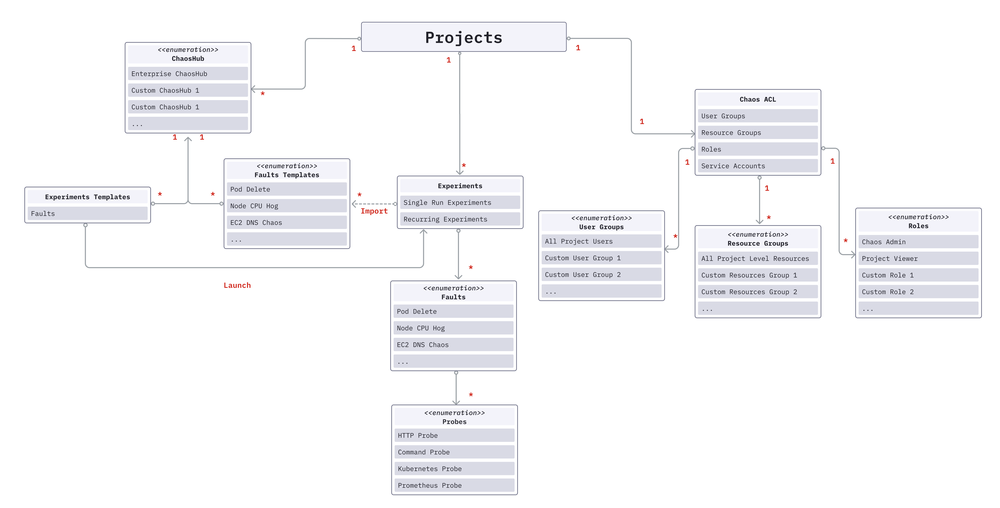
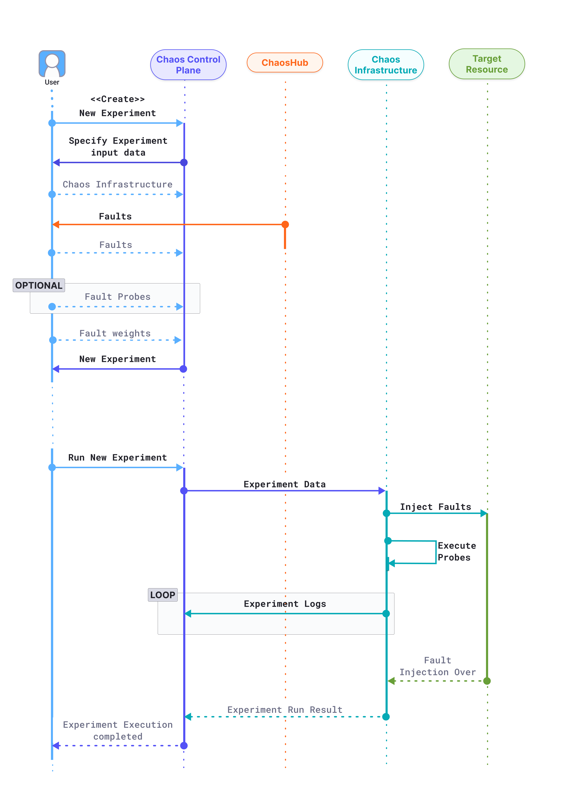

- **Chaos Experiment:** A chaos experiment, simply referred as experiment, injects one or more chaos faults into a specified chaos infrastructure and summarizes the result of the chaos execution. The experiment can be defined using the Chaos Studio via the guided UI or by uploading the Workflow CR manifest.
- **Chaos Fault:** A chaos fault, or simply fault, refers to the failures injected into the chaos infrastructure as part of a chaos experiment. Every fault is scoped to a particular target resource and can be customized using the fault tunables, which are defined as part of the ChaosExperiment CR and ChaosEngine CR. Optionally, one or more probes can be defined as part of a chaos fault.
- **ChaosHub:** ChaosHub is a collection of experiment templates (defined as Workflow CRs) and faults (defined as ChaosExperiment CR and ChaosEngine CR) that helps create and execute new chaos experiments against your target resources. Apart from the Enterprise ChaosHub, which is present by default, custom ChaosHubs can be added for the management and distribution of custom experiment templates and faults.
- **Chaos Infrastructure:** Chaos infrastructures represent the individual components of a deployment environment. It is a service that runs within your target environment to aid HCE in accessing the target resources and injecting chaos at a cloud-native scale. Multiple chaos infrastructures may be added as part of an Environment.
- **Environment:** A Harness environment represents your deployment environment such as Dev, QA, Staging, Production, etc. Each Environment may contain multiple Chaos Infrastructures. It helps isolate the various environments that your engineering, product owners, QA, and automation teams use under a single Harness project. This allows for better segregation of mission-critical infrastructures with several attached dependencies from dev and staging infrastructures for their safety.
- **Chaos Studio / ChaosCentre:** Chaos Studio is used for the creation of new chaos experiments using varied chaos faults and templates from the ChaosHub, probes, and custom action steps. New experiments can be created using the guided UI or using the experiment manifest represented by the Workflow CR.
- **Resilience Score:** The resiliency Score is a quantitative measure of how resilient is the target environment when the respective chaos experiment is performed on it. It is calculated on the basis of the weightage provided for the constituent faults and the Probe Success Percentage of the faults, in case the probes are defined.
- **Probe:** Chaos probes automate the chaos hypothesis validation performed during a fault execution. They are declarative checks that determine the outcome of a fault. Probes are scoped to the faults and you can define as many probes as required as part of each fault.
- **Tunables:** A fault execution can be customized by changing the various tunables or parameters that it accepts. While some of them are common across all the faults, such as the Chaos Duration, every fault has its own set of tunables. Wherever applicable, default tunables have been provided which may need to be updated. Otherwise, mandatory tunables always need to be provided.
- **Chaos Interval:** Chaos Interval is a tunable which specifies the duration between successive iterations of chaos, while the elapsed experiment time is less than the chaos duration.
- **Sequence:** The Sequence parameter defines the manner in which chaos shall be injected into the target instances of a fault. It may be configured as Serial to inject chaos in only one target in a single chaos iteration or Parallel to inject chaos in all targets in a single chaos iteration.
- **Chaos Duration:** Chaos Duration refers to the total duration through which chaos execution shall take place. This excludes the duration of Pre-Chaos injection and Post-Chaos injection execution time.
- **Probe Success Percentage:** Probe success percentage refers to the percentage of probes that have been successfully evaluated out of the total number of probes.
- **Experiment Templates:** Experiment templates are stored as part of the ChaosHub, which can be used for creating new chaos experiments. They can be edited by making changes to the existing fault configuration or by adding new faults. New experiments can also be stored in ChaosHub as templates.
- **Result Fail Step:** When an experiment fails, Fail Step specifies the exact cause of failure for the experiment run. It contains an error code for the classification of the error, a phase for specifying the execution phase during which the error occurred, and finally the reason which is a user-friendly description of the error.
- **Result Phase:** Phase determines the status of the overall experiment execution. It may be any one of Awaited, Running, Completed, and Aborted, depending on the experiment outcome.
- **ChaosEngine CR:** The ChaosEngine CR is the user-facing chaos Kubernetes CR which connects a target resource instance with a chaos fault to orchestrate the steps of chaos execution. It allows one to specify run-level details such as overriding fault defaults, provide new environment variables and volumes, options to delete or retain experiment pods, and define probes among others. It is also patched to update the status of the fault execution.
- **ChaosExperiment CR:** ChaosExperiment CR contains the low-level execution information for the execution of a Chaos Fault. The CR holds granular details of a fault such as the container image, library, necessary permissions, and chaos parameters among others. Most of the ChaosExperiment CR parameters are tunables that can be overridden from the ChaosEngine CR.
- **Workflow CR:** A Workflow CR is used to define a number of “operations” which are coupled together in a specific sequence to achieve a desired chaos impact. These operations are either chaos faults or any other custom action related to the experiment, such as load generation.

## Experiment Execution



1. The user attempts to create a new chaos experiment in the Chaos Control Plane.
2. The Control plane prompts the user to input the required information for the creation a new experiment, such as

   1. **Chaos Infrastructure:** Which chaos infrastructure will be targeted as part of the experiment.
   2. **Fault and Fault Tunables:** The fault templates can be fetched from any connected ChaosHubs, where the tunables can be modified wherever necessary. Multiple faults can be added in any desired order.
   3. **Fault Probes:** Optionally, additional probes can be defined on top of the default “Healthcheck” probe for a fault, to validate custom hypothesis conditions as part of the experiment.
   4. **Fault Weights:** Fault weights define the importance of a fault with respect to other faults present in an experiment. More formally, it is used for calculating the experiment’s resiliency score, a quantitative measure of the target environment’s resiliency when the respective experiment is performed.

   The experiment is now created and ready to be executed.

3. When the user attempts to run the experiment, the control plane relays the experiment data to the target chaos infrastructure, which undertakes four distinct responsibilities during the experiment execution:

   1. **Inject Faults:** Faults received as part of the experiment are interpreted and injected into the target resource. Depending on the experiment, multiple faults might be injected simultaneously.
   2. **Execute Probes:** Respective fault probes are executed as and when the faults execute and their result is stored.
   3. **Stream Logs:** Experiment execution logs are streamed and accessible in real-time in the chaos control plane.
   4. **Send Result:** Finally, the experiment execution result, including the probe execution result, is sent back to the chaos control plane.

   The chaos experiment execution is now concluded.

## Chaos Hubs

Chaos Hub is a collection of experiment templates and faults that helps create new chaos experiments.

- In essence, Chaos Hub is a collection of manifests and charts, which represent the experiments and faults that exist as part of the hub.
- You can add Chaos Hub using a Git service provider such as GitHub, where Chaos Hub exists as a repository. This allows native version control and management of the faults and experiment artifacts.
- Apart from an Enterprise Chaos Hub (out of the box), you can also add custom Chaos Hubs to maintain and distribute private faults and experiments within your organization.

Experiments are templates to create new chaos experiments, which contain a collect of chaos faults and certain custom actions ordered in a specific sequence. Faults refer to the failures injected as part of an experiment.

Both experiments and faults are stored as manifests in an appropriate directory structure. Hence, you can add new experiment templates and faults directly to the repository as files. In addition, you can derive the experiment templates from the existing experiments and save them to the Chaos Hub from the UI.

## What is Resiliency Score?

**Resiliency Score** is a quantitative measure of how resilient is the target environment when the respective chaos experiment is performed on it.

While creating a chaos experiment, certain weights are assigned to all the constituent faults. These weights signify the priority/importance of the respective fault. The higher the weight, the more significant is the fault.

The weight priority is generally divided into three sections:

- `0-3`: Low Priority
- `4-6`: Medium Priority
- `7-10`: High Priority

Once a weight has been assigned to the fault, we look for the Probe Success Percentage (a ratio of successful checks v/s total probes) for that experiment itself post the chaos and calculate the total resilience result for that experiment as a multiplication of the weight given and the probe success percentage returned after the Chaos Run.

```
Fault Resilience = (Fault Weight * Probe Success Percentage)
Overall Resilience Score = Cumulative Fault Resilience / Sum of the assigned weights of the experiments
```
