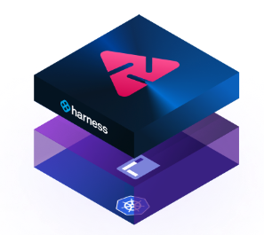

# Harness Chaos Engineering Powered by LitmusChaos

The chaos engineering module in the Harness platform is powered by the open source CNCF chaos engineering project [LitmusChaos](https://github.com/litmuschaos/litmus). Harness module adds additional features to make the practice of chaos engineering for enterprises easy.

## Common capabilities with LitmusChaos
Following are the common features between Litmus and Harness Chaos Engineering

1. Scalable Platform
2. Declarative chaos fault archtecture
3. Kubernetes Chaos Faults
4. Chaos Faults as CRDs
5. Chaos Metrics
6. Chaos Hubs
7. Chaos infrastructure architecture
8. Chaos Experiments structure
9. Scheduling of chaos experiments
10. Resilience Probes

## Additional capabilities

Harness chaos engineering module adds the following additional capabilities 

1. Kubelet Density Chaos Fault
2. VMware Chaos Faults
3. AWS Chaos Faults
4. GCP Chaos Faults
5. AZure Chaos Faults
6. Teaming around Chaos Hubs
7. Additional Resilience Probes

## Integrations

In addition to the above features, the chaos engineering module has the following integrations in the Harness platform

- Harness Continuous Delivery (CD)

