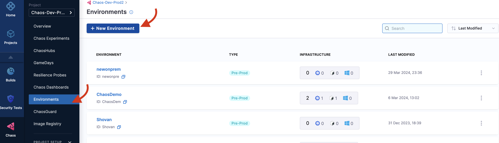
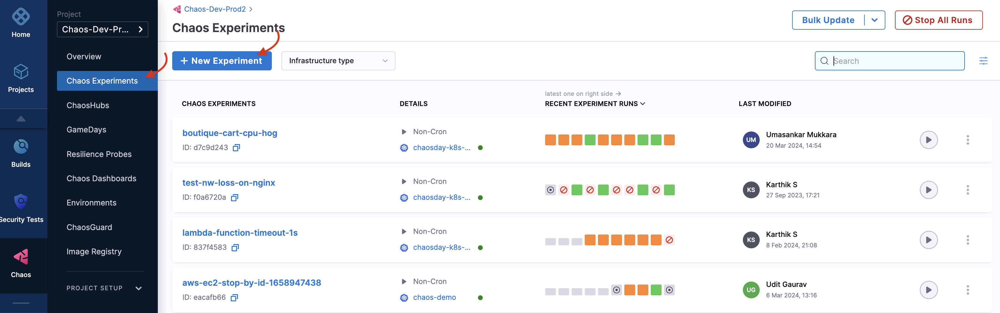

import Tabs from '@theme/Tabs';
import TabItem from '@theme/TabItem';

# Get Started

Welcome to Harness Chaos Engineering! This guide will help you set up your first chaos experiment and execute it on your target infrastructure in just a few minutes.

## Prerequisites

- **Harness Account with Chaos Engineering access**: [Sign up for free](https://app.harness.io/auth/#/signup) if you don't have one and ensure you have access to the Chaos Engineering module
- **Target Infrastructure**: Kubernetes cluster with kubectl access, or Linux machine with admin privileges
- **Basic Permissions**: Admin access to your target infrastructure for installing chaos agents

## Create your first chaos experiment

<Tabs>
<TabItem value="Interactive Guide">
<DocVideo src="https://app.tango.us/app/embed/994a11cbb73941fcbead538ced3f307e?skipCover=false&defaultListView=false&skipBranding=false&makeViewOnly=false&hideAuthorAndDetails=true" title="Create your first Chaos Experiment"/>
</TabItem>
<TabItem value="Step-by-step">

### Access Harness Chaos Engineering

1. [Sign up](https://app.harness.io) or log in to your Harness account
2. Navigate to the **Chaos Engineering** module from the left sidebar
3. Create a new project or ask your administrator to add you to an existing project

### Create an Environment

A chaos experiment is executed in an infrastructure that is associated with an **environment**.

1. Navigate to the **Environments** page and select **New Environment**
2. Specify the environment name, description (optional), and tags (optional)
3. Select the environment type: **Production** or **Non-Production**
4. Select **Create** to add the new environment



:::tip
You can also select one of the existing environments from the list if available.
:::

### Set Up Chaos Infrastructure

After creating an environment, add an infrastructure to it:

#### For Kubernetes (Recommended for First Experiment)

1. Select **+New Infrastructure** in your environment
2. Choose **Kubernetes** as the infrastructure type
3. Select installation mode:
   - **Cluster-wide access**: Target resources across all namespaces
   - **Specific namespace access**: Restrict chaos injection to specific namespace
4. Copy and run the provided installation command in your cluster:

```bash
# Example installation command (use the one provided in UI)
kubectl apply -f https://app.harness.io/chaos/delegate/manifest/...
```

5. Wait for the infrastructure to show **CONNECTED** status

#### For Linux

1. Select **+New Infrastructure** and choose **Linux**
2. Download and install the chaos agent:

```bash
# Download the agent
curl -O https://app.harness.io/chaos/linux-agent
chmod +x linux-agent

# Install with your infrastructure ID and access key
sudo ./linux-agent --install --infra-id=<YOUR_INFRA_ID> --access-key=<YOUR_ACCESS_KEY>
```

### Create Your First Chaos Experiment

Now let's create and run your first chaos experiment. We recommend starting with **Pod Delete** as it has a small blast radius and is safe for most applications.

#### Identify Your Target

1. Identify the microservice in your application that you will target
2. For Kubernetes, we'll delete a pod from your application
3. [Pod delete](/docs/chaos-engineering/faults/chaos-faults/kubernetes/pod/pod-delete) is the simplest chaos experiment recommended as the first step


#### Create the Experiment

1. Navigate to **Chaos Experiments** and select **New Experiment**
2. Choose **Blank Canvas** to create from scratch, or select a **Template**
3. Configure your experiment:
   - **Name**: "My First Pod Delete Experiment"
   - **Description**: "Testing pod resilience"
   - **Tags**: Add relevant tags for organization

#### Add Chaos Fault

1. In the experiment builder, select **Add Fault**
2. Choose **Kubernetes** → **Pod** → **Pod Delete**
3. Configure the fault:
   - **Target Pods**: Select specific pods or use label selectors
   - **Chaos Duration**: Start with 30 seconds
   - **Force**: Keep as false for graceful deletion

#### Add Resilience Probes (Recommended)

Probes validate your hypothesis during the experiment:

1. Select **Add Probe** in your experiment
2. Choose **HTTP Probe** to monitor application availability:
   - **URL**: Your application endpoint
   - **Method**: GET
   - **Success Criteria**: Response code 200
   - **Run Properties**: Execute during chaos

### Run Your First Experiment

1. **Review** your experiment configuration
2. **Save** the experiment
3. **Run** the experiment by clicking the **Run** button
4. **Monitor** the experiment execution in real-time:
   - Watch the experiment timeline
   - Observe probe results
   - Check system metrics and logs



### Analyze Results

After the experiment completes:

1. **Review the Resilience Score**: Overall system resilience rating based on probe results
2. **Check Probe Results**: Success/failure of health checks during chaos
3. **Examine Timeline**: Detailed view of experiment execution phases
4. **View Logs**: Detailed execution logs for troubleshooting


#### Understanding Results

- **Passed Probes**: Your application handled the chaos well
- **Failed Probes**: Areas that need improvement
- **Resilience Score**: Higher scores indicate better resilience

</TabItem>
</Tabs>

---

## Next Steps
Congratulations! You've successfully run your first chaos experiment. Here's what to explore next:

* [Explore more chaos faults](./faults/chaos-faults) for different failure scenarios.
* Set up [advanced probes](/docs/chaos-engineering/guides/probes) for comprehensive monitoring.
* Organize [GameDays](/docs/chaos-engineering/guides/gamedays) for team chaos engineering events.
* [Integrate with CI/CD](./integrations/cicd/jenkins) to automate chaos testing in your pipelines.
