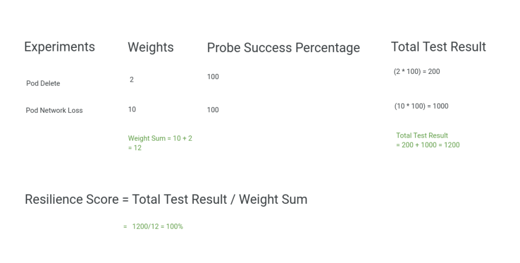
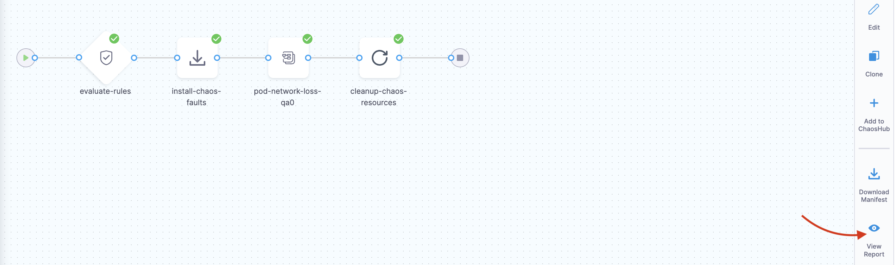
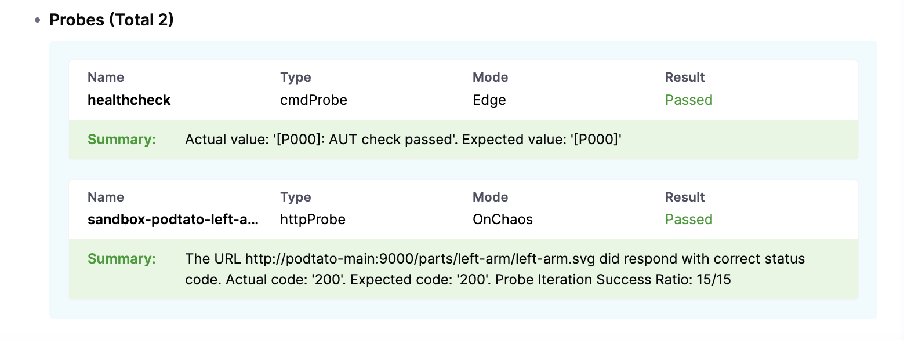
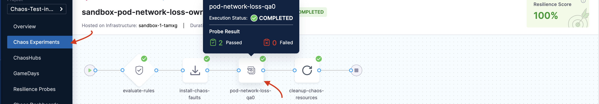
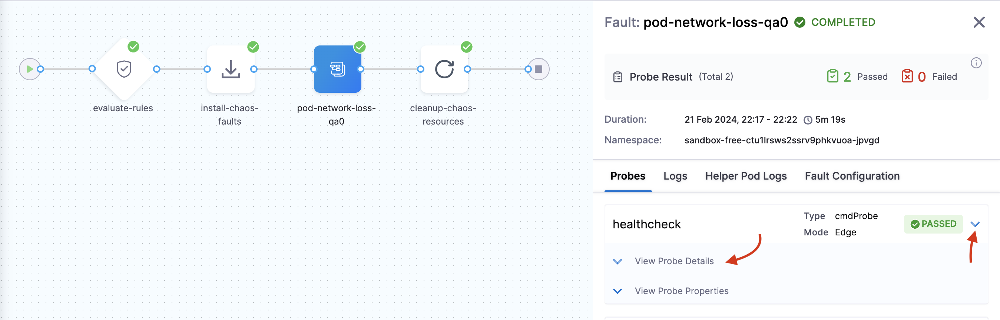

## General

For an overview of Harness support for platforms, methodologies, and related technologies, go to [Supported platforms and technologies](/docs/platform/platform-whats-supported).

<details>
<summary><strong>How do I get the Instance ID or license ID with Harness SMP?</strong></summary>

Login using Admin privilege, and then navigate to **License** to find the **License ID**.
</details>

<details>
<summary><strong>Can I run both serial and parallel faults while using Linux infrastructure?</strong></summary>

Currently, parallel fault experiments aren't supported for Linux.
</details>

<details>
<summary><strong>How to add and manage a custom chaos hub?</strong></summary>

You can navigate to chaos hubs in the chaos module and select `+ New ChaosHub`, and fill in the details regarding your public or private hub. Ensure that you have chaos hub read or write permission enabled and a GitHub connector configured for the repository you are about to connect.
</details>

<details>
<summary><strong>How do I connect to a private chaos hub?</strong></summary>

To connect to a private chaos hub repository, connect to a Harness GitHub connector through a Harness Delegate, or GitHub directly by providing your GitHub SSH key or Personal Access Token (PAT). Once this is done, you can select the connector when adding a chaos hub.
</details>

<details>
<summary><strong>How are faults different from experiments?</strong></summary>

Faults refer to the failures that are injected into the target resource as part of an experiment. Whereas a chaos experiment is a set of different faults coupled together to achieve a desired chaos impact.
</details>

<details>
<summary><strong>What are the possible reasons I can't see tunables in Tune Fault UI?</strong></summary>

Since the tuning of a chaos experiment is highly declarative, sometimes it may cause parsing issues, these may be the possible reasons:

- The step name of the fault and the template name might have been changed due to custom editing.
- The step name has been removed completely.
- The template definition has been erased.
</details>

<details>
<summary><strong>How are probes useful in an experiment?</strong></summary>

A probe can help understand the underlying patterns and laws that govern the behavior of your systems, and you can use that understanding to predict or control their behavior. Probes can be used to test scenarios such as network partitioning, pod failures, and node failures, by adding additional checks, it can also be used to test the behavior of applications during such scenarios.
</details>

<details>
<summary><strong>How is resilience score affected if a few of my probes fail?</strong></summary>

The weighted average of probe success percentage of each of the probe determines the value of the overall resilience score of the experiment. The value depends on the successful outcome of the probe criteria based on the type and mode selected. There are two possible values of probe success percentage for each of the probe criteria, either 0(if the criteria assertion fails) or 100(if the criteria assertion passes).

```vim
Total Resilience for one single experiment = (Weight Given to that experiment * Probe Success Percentage)
```


</details>

<details>
<summary><strong>I have trouble creating an experiment YAML from scratch, can I generate one?</strong></summary>

Yes, you can generate a YAML file by choosing the normal flow of creating an experiment (blank canvas or through a template), in the YAML/Visual toggle you can see a generated YAML based on the inputs provided by you. A generated YAML can also be downloaded after navigating to `Chaos Experiments` and clicking on `Download Experiments`.

Additionally you can also leverage Harness [Go SDK repository](https://github.com/harness/harness-go-sdk) and generate a template.
</details>

<details>
<summary><strong>My issue is not mentioned here, how can I report it?</strong></summary>

To report an issue which is not mentioned here, head over to **Help** in Harness SaaS and click **Submit a ticket** and provide your feedback.
</details>

---

## Features and capabilities

<details>
<summary><strong>How do you inject chaos on managed cloud services?</strong></summary>

You can obtain the required permissions to inject chaos on respective cloud-services like [AWS permissions](https://developer.harness.io/docs/chaos-engineering/faults/chaos-faults/aws/permissions), [Cloud foundry](https://developer.harness.io/docs/chaos-engineering/faults/chaos-faults/cloud-foundry/permissions), and [GCP](https://developer.harness.io/docs/chaos-engineering/faults/chaos-faults/gcp/security-configurations/prepare-secret-for-gcp).
</details>

<details>
<summary><strong>Do you support chaos on [X] [AWS/GCP/Azure] service?</strong></summary>

Yes. For more information, go to [AWS chaos](https://developer.harness.io/docs/chaos-engineering/faults/chaos-faults/aws/), [GCP chaos](https://developer.harness.io/docs/chaos-engineering/faults/chaos-faults/gcp/), and [Azure chaos](https://developer.harness.io/docs/chaos-engineering/faults/chaos-faults/azure/).
</details>

<details>
<summary><strong>Can you simulate a Zone, Region Failover in [AWS/GCP/Azure]?</strong></summary>

Yes. For more information, go to [ALB zone down](https://developer.harness.io/docs/chaos-engineering/faults/chaos-faults/aws/alb-az-down), [CLB zone down](https://developer.harness.io/docs/chaos-engineering/faults/chaos-faults/aws/clb-az-down), and so on.
</details>

<details>
<summary><strong>Do you support staggered or staged increase of CPU/Memory resources within a Pod/Machine?</strong></summary>

Yes. For more information, go to [pod memory hog](https://developer.harness.io/docs/chaos-engineering/faults/chaos-faults/kubernetes/pod/pod-memory-hog) and [pod CPU hog](/docs/chaos-engineering/faults/chaos-faults/kubernetes/pod/pod-cpu-hog).
</details>

<details>
<summary><strong>Do you support load-based chaos/can you generate load during chaos execution?</strong></summary>

Yes. For more information, go to [locust loadgen](https://developer.harness.io/docs/chaos-engineering/faults/chaos-faults/load/locust-loadgen).
</details>

<details>
<summary><strong>Do you support chaos on DataCenter infrastructure resources such as Switches, Loadbalancers, Hardware Encryption Devices etc.,?</strong></summary>

Yes, you can use [SSH chaos](/docs/chaos-engineering/faults/chaos-faults/ssh/ssh-chaos) to inject chaos on switches, load balancers, and so on.
</details>

<details>
<summary><strong>Does the tool provide recommendations to fix weaknesses identified by Chaos Experimentation?</strong></summary>

No, Harness CE helps identify the failures in your application by injecting failures intentionally. This way, you can identify the failures and use other methods to address the issues identified using Harness CE.
</details>

<details>
<summary><strong>What kind of Reporting is provided by the tool?</strong></summary>

Once you execute your chaos experiments, you can download the reports that describe the experiment details such as runs, infrastructure, resilience score, and so on. For more information, go to [resilience probes](/docs/chaos-engineering/guides/probes/), [alerts](/docs/chaos-engineering/guides/chaos-experiments/alert-integration) and [chaos dashboard](/docs/chaos-engineering/guides/dashboards/).
</details>

<details>
<summary><strong>Can I deploy chaos infrastructure on an Openshift Cluster?</strong></summary>

Yes, you can deploy chaos infrastructure on OpenShift clusters and run chaos experiments using the SCCs that we provide.
</details>

<details>
<summary><strong>Can we disrupt connection/network between any service in a cluster and an external service only & keep other connections intact without actually disrupting external service?</strong></summary>

Yes, you can use set the `DESTINATION_IPS` or `DESTINATION_HOSTS` tunables in all network level chaos experiments.
For example, to execute the network loss fault,
- Between the target app and cloud SQL, you can specify `DESTINATION_HOSTS` as **sqladmin.googleapis.com**.
- Between the target app and storage/GCS, you can specify `DESTINATION_HOSTS` as **storage.googleapis.com**.
- Between the target app and composer, you can specify `DESTINATION_HOSTS` as **composer.googleapis.com**.
</details>

---


## Harness Delegate

:::tip
The FAQs below are based on Harness CE entities using [Harness Delegate](/docs/chaos-engineering/guides/infrastructures/types/ddcr).
:::

<details>
<summary><strong>Do you support On-Premise Harness Control Plane?</strong></summary>

Yes, Harness CE supports the self-managed enterprise edition (SME, also known as self-managed platform or SMP). Depending on the version of Harness CE (SaaS or Self-Managed Platform), the control plane is hosted by Harness (for SaaS) or within your domain (for example, harness.your-domain.io). Go to [SMP](/docs/chaos-engineering/guides/on-premises-smp/) for more information.
</details>

<details>
<summary><strong>Does chaos use the Harness Delegate or does it need a separate agent?</strong></summary>

Harness CE uses the Harness Delegate to execute chaos experiments, which you can leverage to:
- Auto-create chaos experiments.
- Improve execution speed of chaos experiments (up to 5 times).
- Better control over chaos experiments by facilitating advanced tunables.
- Gain insights into application-level resilience scores.

Go to [Harness Delegate](/docs/chaos-engineering/guides/infrastructures/types/ddcr) for more information.
</details>

<details>
<summary><strong>What ports are necessary to be opened in the org's firewall rules to access the Harness Control Plane from the user environment?</strong></summary>

You can access the Harness control plane from the user environment with outbound connectivity over HTTPS using port 443.
Go to [permissions and ports](https://developer.harness.io/docs/platform/references/permissions-and-ports-for-harness-connections) for more details.
</details>

<details>
<summary><strong>What permissions are necessary to run the Chaos Agent on users' Kubernetes clusters / Linux / Windows Machines?</strong></summary>

Permissions required to execute chaos faults are different for different platforms. Go to:
- [Kubernetes permissions](https://developer.harness.io/docs/chaos-engineering/faults/chaos-faults/kubernetes/tkgi/Requirements);
- [AWS permissions](https://developer.harness.io/docs/chaos-engineering/faults/chaos-faults/aws/permissions); and
- [Linux permissions](https://developer.harness.io/docs/chaos-engineering/faults/chaos-faults/linux/permissions), respectively.
</details>

<details>
<summary><strong>What user data is sent to and stored on the Harness platform, and for how long?</strong></summary>

Harness CE doesn't store any user data with respect to the chaos experiments. The details associated with the user's cluster such as the target application details (kind, labels and namespace) are limited to be used within the chaos experiment you selected/created/executed.
</details>

<details>
<summary><strong>Can the chaos pods be mapped to/assume a specific IAM role on the cloud account for fault injection?</strong></summary>

Yes, with cloud-based faults, chaos pods can be mapped to specific IAM roles. You have to create the IAM role on the cloud account and map it to the appropriate policy. The user's credentials should be embedded in a K8s secret before executing the faults.
You can also create [a superset AWS policy](https://developer.harness.io/docs/chaos-engineering/faults/chaos-faults/aws/security-configurations/policy-for-all-aws-faults) to allow executing all fault types.
For more information, go to [AWS switch profile](https://developer.harness.io/docs/chaos-engineering/faults/chaos-faults/aws/security-configurations/aws-switch-profile) and [workload identity setup for GCP](/docs/chaos-engineering/faults/chaos-faults/gcp/security-configurations/gcp-iam-integration).
</details>

---

## Deployment model

<details>
<summary><strong>Do you support execution of chaos across clusters from a single agent?</strong></summary>

Yes. With Harness Delegate, we support executing chaos across clusters from a single agent. You need to deploy your delegate in one cluster and then you can create connectors by providing master URL and access token of the other cluster and assign the same delegate to inject chaos.
</details>

<details>
<summary><strong>Do you have dedicated agents across target types (Linux, Windows, Kubernetes, Cloud)?</strong></summary>

Yes, Harness CE has dedicated agents for different target types such as Linux, Windows, Kubernetes, and Cloud platforms (AWS, Azure, GCP, Cloud Foundry).
The agents are:
- Deployed centrally on Kubernetes to inject faults on K8s microservices;
- Native agents for VMware using system service inside target machine;
- Remote chaos agents to execute targets outside clusters for cloud resources.
</details>

---

## Operations

<details>
<summary><strong>What are the prerequisites to setup/onboard Harness Chaos Engineering?</strong></summary>

Go to [prerequisites](/docs/chaos-engineering/on-premise-vs-saas) to fulfill the requirements before onboarding. Once all the prerequisites are fulfilled, you can explore [sandbox](/docs/chaos-engineering/tutorials) or execute [your first chaos experiment](/docs/chaos-engineering/on-premise-vs-saas).

**OR**

If you want a head start to your journey with Harness CE, you can onboard Harness CE in two ways:
- [Automated onboarding](/docs/chaos-engineering/quickstart); and
- [Guided onboarding](/docs/chaos-engineering/quickstart).
</details>

<details>
<summary><strong>Can all the Chaos Operations be managed via APIs (agent, experiment life cycles etc.,)?</strong></summary>

Yes, all chaos operations can be managed using APIs. For more information, go to [Harness CE API documentation](https://apidocs.harness.io/chaos.html).
</details>

<details>
<summary><strong>Are there any tutorials to get started with Chaos?</strong></summary>

Yes, you can start executing chaos engineering experiments in the following ways:
- [Run chaos experiments](/docs/chaos-engineering/on-premise-vs-saas)
- [Execute experiments using API](/docs/chaos-engineering/guides/chaos-experiments/create-experiments)
</details>

<details>
<summary><strong>Do you provide a Sandbox environment for us to play with the tool?</strong></summary>

Yes, you can execute experiments in a sandbox environment. Go to [sandbox environment](/docs/chaos-engineering/tutorials) to play around with Harness CE.
</details>

<details>
<summary><strong>Can I schedule the execution of a Chaos Experiment?</strong></summary>

Yes, you can [schedule](/docs/chaos-engineering/guides/chaos-experiments/create-experiments) chaos experiments.
</details>

---

## Kubernetes experiment flow optimization

:::tip
- With the release 1.38.0 of harness-chaos, the experiment execution flow for Kubernetes experiments has been optimized by eliminating the install step of experiment CRs (custom resource) and leveraging all the environment variables with the chaos engine.
- The `litmus-checker` and `chaos-k8s` that were responsible for installing the chaos experiment CR and performing cleanup steps respectively, have been removed.
- With this, the time taken to complete a chaos experiment and the manifest length has been reduced, thereby making it easy to maintain the manifest.
:::

<details>
<summary><strong>Will the existing chaos experiments execute as usual without any changes?</strong></summary>

Yes, you can execute all the existing chaos experiments even if no changes are made to the manifest and even if chaos infrastructure is not upgraded.
</details>

<details>
<summary><strong>Will the existing Kubernetes chaos infrastructure (< 1.38.0) have to be mandatorily upgraded?</strong></summary>

No, the existing infrastructures will continue to function as usual, but Harness CE recommends you upgrade to version 1.38.0 or the latest version for optimized performance.
</details>

<details>
<summary><strong>I can't see older infrastructures (< 1.38.0) while constructing a new experiment?</strong></summary>

- Due to the recent optimization changes, Harness CE has removed the experiment CR and its installation from the experiment manifest. Now, all the environment variables, experiment image, imagePullPolicy, arguments, and commands will be passed directly into the chaos engine.
- However, older infrastructures that use older components (operator, chaos-runner) rely on the experiment CR to execute experiments successfully. As a result, new experiments will not be able to run on the older infrastructures.
</details>

<details>
<summary><strong>Can a new Kubernetes experiment run on old Kubernetes infrastructure?</strong></summary>

No, since new experiments have changes in the chaos engine, the old chaos runner can't read all the environment variables from the chaos engine.
</details>

<details>
<summary><strong>Can the old Kubernetes experiment run on new Kubernetes infrastructure?</strong></summary>

Yes, the changes are backward-compatible and all the older components (`chaos-k8s`, `litmus-checker`) are still present (which will not be maintained henceforth). The image of these components will not go beyond version 1.37.0 since they will be not updated after this. In addition, `chaos-runner` and `chaos-operator` are designed to be backward-compatible.
</details>

<details>
<summary><strong>Why does the experiment pod take time to show up in the running status?</strong></summary>

The initial execution by Argo may take some time since it needs to pull the images for the `go-runner` for the first time. Subsequent executions will not take as much time.
</details>

<details>
<summary><strong>Why are litmus-checker and chaos-k8s not displaying beyond on 1.37.0?</strong></summary>

If the experiment format is old, you may see `litmus-checker` and `chaos-k8s` images in the YAML. Since version 1.37.0 is the last supported version of these components, the `litmus-checker` and `chaos-k8s` are displayed with version 1.37.0. For the new experiment format, you will only see a `go-runner` image.
</details>

<details>
<summary><strong>Why can't I create a new experiment from the UI?</strong></summary>

To create a new experiment, you need to have at least one infrastructure in version 1.38.x or higher. Hence, you can either [connect a new infrastructure](/docs/chaos-engineering/guides/infrastructures/types) or [upgrade an existing one](/docs/chaos-engineering/guides/infrastructures/upgrade-infra).
</details>

<details>
<summary><strong>Is there a way to upgrade the older experiment to the new format?</strong></summary>

Yes, you can manually edit the experiment manifest or create a new experiment from the UI. Older experiments will continue to work because of backward compatibility.
</details>

---

## Application Maps

<details>
<summary><strong>How to manually associate experiments as a part of Application Map?</strong></summary>

To manually associate the experiment as a part of an application map, list the experiment as a part of an [application map](/docs/chaos-engineering/guides/application-maps), specify the tag `applicationmap=<application map identity>` while creating the experiment.
</details>

---

## Security

<details>
<summary><strong>What are the identity providers supported by Harness Chaos for user authentication?</strong></summary>

The Harness platform is fully integrated with several public OAuth providers, with support for two-factor authentication and domain whitelisting.
To learn more, go to [authentication overview](/docs/platform/authentication/authentication-overview).
</details>

<details>
<summary><strong>How does the chaos infrastructure connect to the Harness SaaS control plane? Which ports should be opened in the users' environments?</strong></summary>

The chaos infrastructure connects to the Harness control plane through outbound connectivity over HTTP(s) using port 443. To learn more, go to [chaos infrastructures](/docs/chaos-engineering/faults/chaos-faults/cloud-foundry/permissions/).
</details>

<details>
<summary><strong>What are the permissions and privileges required to deploy and run the chaos infrastructure?</strong></summary>

The chaos infrastructure setup involves the creation of CRDs and RBAC resources. This setup typically needs cluster-admin intervention. To learn more, go to [Kubernetes roles for the chaos infrastructure](/docs/chaos-engineering/security/#kubernetes-roles-for-chaos-infrastructure).
</details>

<details>
<summary><strong>Can you run multiple cluster-scoped chaos infrastructures on same clusters?</strong></summary>

It is recommended that you **don't** run multiple cluster-scoped chaos infrastructures on the same cluster since this would result in the chaos infrastructures overwriting each other's cluster-level resources.
</details>

<details>
<summary><strong>Chaos infrastructure is inactive, how to execute my experiment?</strong></summary>

A chaos infrastructure could be inactive due to a variety of reasons. When you try to execute an experiment but the chaos infrastructure is inactive, you can switch over to a different infrastructure that is active (represented with a green circle at the right side of the infrastructure name) and execute your experiment or create a new chaos infrastructure (provided you have the necessary privileges to create one) and execute your experiment on it.
</details>

<details>
<summary><strong>How do I control user actions in a given environment in Harness Chaos?</strong></summary>

The scope of a user's access to chaos resources added to a given Harness account or project can be controlled by assigning them a predefined or custom role. To learn more, go to [chaos access control](/docs/chaos-engineering/guides/governance/rbac).
</details>

<details>
<summary><strong>How do I control the security blast radius in terms of access to application microservices and infrastructure resources in a user environment?</strong></summary>

The chaos infrastructure can be installed in a cluster-wide scope (with the ability to discover and inject chaos on microservices across namespaces and infrastructure components such as nodes and volumes) as well as in a namespace-specific scope (where discovery and chaos injection are limited to resources within a specific namespace).

In addition, users can provide a custom service account to carry out experiments, thereby limiting the fault types in the user environment. To learn more, go to [blast radius control using permissions](/docs/chaos-engineering/security/#blast-radius-control-using-permissions).
</details>

<details>
<summary><strong>How does Harness Chaos access cloud resources in the users' environment?</strong></summary>

Harness Chaos experiment pods consume Kubernetes secrets that contain access credentials, which are leveraged to make provider-specific API calls to the cloud platform to inject chaos. To learn more, go to [Secrets management](/docs/chaos-engineering/security/#secrets-management).
</details>

<details>
<summary><strong>Can cloud service accounts be used instead of user credentials to access cloud resources?</strong></summary>

When the chaos infrastructure is deployed on EKS clusters, the experiments can leverage the IAM service account (IRSA) instead of consuming secrets with user account access details. To learn more, go to [IAM integration for AWS authentication](/docs/chaos-engineering/faults/chaos-faults/aws/security-configurations/aws-iam-integration).
</details>

<details>
<summary><strong>How does Harness Chaos access APM platforms to perform hypothesis validation?</strong></summary>

Harness Chaos experiments can consume K8s secrets containing authentication information for the desired APM and use it within the command-probe pods that leverage this information to make the right provider-specific API calls to retrieve metrics and other pertinent data. To learn more, go to [command probes](/docs/chaos-engineering/guides/probes/command-probes).
</details>

<details>
<summary><strong>What are the details about the user and the user's environment accessed and stored by Harness?</strong></summary>

The following user information is stored in the Harness database and object store:

- FQDNs or URLs or IPs of microservices in user clusters.
- Chaos experiment execution logs, with process information and results.

The information is purged on a policy basis, with defaults set at "x" days.
</details>

<details>
<summary><strong>How can I track the actions of a user on the Harness platform?</strong></summary>

Harness provides an audit log to the account admin where user actions on the chaos resources are logged with timestamps. To learn more, go to [audit trail](/docs/platform/governance/audit-trail).
</details>

<details>
<summary><strong>Can Harness perform security chaos tests in the users' environments?</strong></summary>

Harness Chaos supports experiments that simulate DoS attacks on services. You can achieve this by simulating very high loads that render the system slow (if the correct rate limits are in place) or non-functional (if rate limiting is not implemented). To learn more, go to [generic locust fault](/docs/chaos-engineering/faults/chaos-faults/load/locust-loadgen/).
</details>

<details>
<summary><strong>How can I avoid image override in the manifest?</strong></summary>

When you edit an experiment that has multiple repositories, a pop up asks if you want to override the images or not. Select **NO** to avoid overriding the image repository in the manifest.
</details>

<details>
<summary><strong>Where can I find my chaos experiment report?</strong></summary>

* To find details about your chaos experiment such as resilience score, total runs, infrastructure used, schedule details, probe details, run history, and so on, navigate to your experiment. Click **View report**.



* Below is a sample screen of probe details in the report.



* To view the details of a **specific chaos step**, click the chaos step.



* Click **v** arrow and click **View probe details**.



:::tip
* You can download the chaos experiment report.
* The probe result summary can be seen in the experiment logs too.
:::
</details>

<details>
<summary><strong>How can I pass secrets in the source mode of command probe without specifying an image so as to execute the probe by passing username and password?</strong></summary>

* To pass secrets as environment variables in the source mode of the command probe, specify the environment variable or the environment variable file on the target VM and reference this file in the script where you are executing the probe.
* If you want to execute the probe on a server other than the target, disable the security context in the advanced fault settings.
</details>

<details>
<summary><strong>How is the chaos Agent authenticated by the Harness control plane?</strong></summary>

A unique Id, named cluster ID and a dedicated key (named access-key) are generated when you install the chaos agent. These two identifiers are used to authenticate the Harness control plane. Every API request made to the control plane includes these identifiers for authentication. Go to [security](/docs/chaos-engineering/security/) for more details.

This is applicable on Harness CE entities that use a dedicated infrastructure rather than the Harness Delegate, because in the case of Harness Delegate, the Delegate itself is the agent.
</details>

---

## Integration

<details>
<summary><strong>Can Harness Chaos Agents be installed via Helm Charts?</strong></summary>

Yes, [chaos dedicated infrastructure](/docs/chaos-engineering/guides/infrastructures/types/legacy-infra/) as well as [Harness Delegate](https://www.harness.io/blog/delegate-installation-via-helm) can be installed using Helm charts.
</details>

<details>
<summary><strong>Can chaos experiments be triggered from [X] pipeline (Harness, Jenkins, Gitlab, Azure DevOps)?</strong></summary>

Yes, Harness CE provides integration with many tools, such as [Gitlab pipelines](https://developer.harness.io/docs/chaos-engineering/integrations/experiment-as-gitlab-pipeline), [Jenkins pipelines](https://developer.harness.io/docs/chaos-engineering/integrations/experiment-as-jenkins-pipeline), with [Harness CD](https://developer.harness.io/docs/category/integrate-hce-with-harness-cd), [Harness Feature Flags](https://developer.harness.io/docs/chaos-engineering/integrations/chaos-ff), and [SRM](https://developer.harness.io/docs/chaos-engineering/integrations/use-chaos-with-srm).
</details>

<details>
<summary><strong>Does Harness Chaos provide Resilience Probes for [X] APM (Prometheus, Dynatrace, Datadog, NewRelic, Splunk)?</strong></summary>

Yes, you can use resilience probes with [Prometheus](/docs/chaos-engineering/guides/probes/prometheus-probes), [Dynatrace](/docs/chaos-engineering/guides/probes/apm-probes), [DataDog](/docs/chaos-engineering/guides/probes/apm-probes), and [NewRelic](/docs/chaos-engineering/guides/probes/command-probes).
</details>

---

## License

<details>
<summary><strong>How is licensing counted for services across different environments in Harness Chaos Engineering?</strong></summary>

Licensing is counted separately for each service in different environments. For example, if chaos experimentation is conducted on a Kubernetes service named "login-service" in both QA and Production environments within the same 30-day cycle, it will consume two chaos service licenses.
</details>

<details>
<summary><strong>Does using the same service in multiple environments increase license usage?</strong></summary>

Yes, each unique environment where a service undergoes chaos experimentation counts individually towards license utilization, allowing separate tracking for services across environments.
</details>

<details>
<summary><strong>How is the license utilization measured in Harness Chaos Engineering?</strong></summary>

License utilization is measured over a 30-day cycle. Each cycle allows license services to be rolled over to a different set of target services, enabling flexible use across various teams, applications, and environments.
</details>

<details>
<summary><strong>Can I change the target services for my license in Harness Chaos Engineering?</strong></summary>

Yes, at the end of each 30-day cycle, license services can be re-assigned to a different set of target services, thereby optimizing the resource utilization.
</details>

---

## Use cases

<details>
<summary><strong>How can we leverage Harness Chaos to test Disaster Recovery (DR)?</strong></summary>

We can leverage Harness Chaos Engineering to test Disaster Recovery in the following ways:
- Implement node network loss: Specify `NODE_LABEL` tunable with the label of the target zone.
- Implement node drain: Specify `NODE_LABEL` tunable with the label of the target zone.
- Implement BYOC for Cloud SQL Instance failover.
- Implement BYOC for GCP Composer Database failover.
</details>
