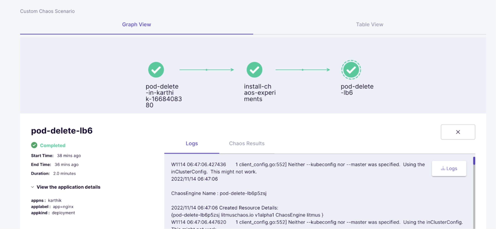

# Namespace Considerations

Learn how to implement namespace-level security controls to restrict chaos experiments to specific namespaces, reducing blast radius and improving security isolation in your Kubernetes environment.

## Overview

Kubernetes clusters are complex, multi-layered environments where a simple misconfiguration or vulnerability can pose significant threats. By restricting chaos experiments to specific namespaces, you can:

- **Limit Exposure**: Reduce the attack surface by isolating chaos activities
- **Improve Security**: Prevent access to business-critical and sensitive workflows
- **Enable Debugging**: Quickly identify which cluster, namespace, and services failed
- **Meet Compliance**: Satisfy regulatory requirements for environment isolation

## Security Benefits

### Threat Mitigation
Namespace isolation helps protect against:
- **Information Gathering**: Prevents unauthorized access to sensitive application data
- **Backdoor Access**: Limits potential entry points for malicious activities
- **Privilege Escalation**: Restricts the ability to steal secrets or escalate permissions
- **Lateral Movement**: Contains potential security breaches within specific boundaries

### Operational Benefits
- **Blast Radius Control**: Limit the impact of chaos experiments
- **Team Boundaries**: Align security controls with organizational structure
- **Environment Separation**: Isolate development, staging, and production workloads
- **Compliance Requirements**: Meet regulatory isolation mandates

---

## Implementation Guide

### Step 1: Install Chaos Engineering in Cluster Mode

First, install the chaos infrastructure in cluster mode using the standard installation manifest:

```bash
kubectl apply -f https://hub.litmuschaos.io/api/chaos/master?file=charts/generic/chaos-infrastructure/chaos-infrastructure.yaml
```

This creates the necessary deployments with cluster-wide permissions initially.

### Step 2: Remove Cluster-Wide Permissions

Once the chaos infrastructure is running, remove the default cluster-wide permissions:

**Delete ClusterRole:**
```bash
kubectl delete clusterrole hce
```

**Expected Output:**
```
clusterrole.rbac.authorization.k8s.io "hce" deleted
```

**Delete ClusterRoleBinding:**
```bash
kubectl delete clusterrolebinding hce
```

**Expected Output:**
```
clusterrolebinding.rbac.authorization.k8s.io "hce" deleted
```

### Step 3: Create Namespace-Specific Permissions

Create Role and RoleBinding resources for each target namespace where you want to allow chaos experiments.

#### Example: Namespace A Permissions

Create `namespaceA-role.yaml`:

```yaml
apiVersion: rbac.authorization.k8s.io/v1
kind: Role
metadata:
  name: namespaceA-chaos
  namespace: namespaceA
  labels:
    name: namespaceA-chaos
    app.kubernetes.io/part-of: litmus
rules:
  # Create and monitor the experiment & helper pods
  - apiGroups: [""]
    resources: ["pods"]
    verbs: ["create","delete","get","list","patch","update", "deletecollection"]
  # Performs CRUD operations on the events inside chaos engine and chaos result
  - apiGroups: [""]
    resources: ["events"]
    verbs: ["create","get","list","patch","update"]
  # Fetch configmaps details and mount it to the experiment pod (if specified)
  - apiGroups: [""]
    resources: ["configmaps"]
    verbs: ["get","list"]
  # Track and get the runner, experiment, and helper pods log
  - apiGroups: [""]
    resources: ["pods/log"]
    verbs: ["get","list","watch"]
  # for creating and monitoring liveness services or monitoring target app services during chaos injection
  - apiGroups: [""]
    resources: ["services"]
    verbs: ["create", "get", "list"]
  # for creating and managing to execute commands inside target container
  - apiGroups: [""]
    resources: ["pods/exec", "pods/eviction", "replicationcontrollers"]
    verbs: ["get", "list", "create"]
  # for checking the app parent resources as deployments or sts and are eligible chaos candidates
  - apiGroups: ["apps"]
    resources: ["deployments", "statefulsets"]
    verbs: ["list", "get", "patch", "update"]
  # deriving the parent/owner details of the pod(if parent is deploymentConfig)
  - apiGroups: ["apps.openshift.io"]
    resources: ["deploymentconfigs"]
    verbs: ["list","get"]
  # deriving the parent/owner details of the pod(if parent is deploymentConfig)
  - apiGroups: [""]
    resources: ["replicationcontrollers"]
    verbs: ["get","list"]
  # deriving the parent/owner details of the pod(if parent is argo-rollouts)
  - apiGroups: ["argoproj.io"]
    resources: ["rollouts"]
    verbs: ["list","get"]
  # for configuring and monitor the experiment job by the chaos-runner pod
  - apiGroups: ["batch"]
    resources: ["jobs"]
    verbs: ["create","list","get","delete","deletecollection"]
  # for creation, status polling and deletion of litmus chaos resources used within a chaos workflow
  - apiGroups: ["litmuschaos.io"]
    resources: ["chaosengines","chaosexperiments","chaosresults"]
    verbs: ["create","list","get","patch","update","delete"]
  # for checking the app parent resources as replicasets and are eligible chaos candidates
  - apiGroups: ["apps"]
    resources: ["replicasets"]
    verbs: ["list", "get"]
  # performs CRUD operations on the network policies
  - apiGroups: ["networking.k8s.io"]
    resources: ["networkpolicies"]
    verbs: ["create","delete","list","get"]
---
apiVersion: rbac.authorization.k8s.io/v1
kind: RoleBinding
metadata:
  name: namespaceA-chaos
  namespace: namespaceA
  labels:
    name: namespaceA-chaos
    app.kubernetes.io/part-of: litmus
roleRef:
  apiGroup: rbac.authorization.k8s.io
  kind: Role
  name: namespaceA-chaos
subjects:
- kind: ServiceAccount
  name: litmus-admin
  namespace: litmus
```

#### Example: Namespace B Permissions

Create `namespaceB-role.yaml`:

```yaml
apiVersion: rbac.authorization.k8s.io/v1
kind: Role
metadata:
  name: namespaceB-chaos
  namespace: namespaceB
  labels:
    name: namespaceB-chaos
    app.kubernetes.io/part-of: litmus
rules:
  # Create and monitor the experiment & helper pods
  - apiGroups: [""]
    resources: ["pods"]
    verbs: ["create","delete","get","list","patch","update", "deletecollection"]
  # Performs CRUD operations on the events inside chaos engine and chaos result
  - apiGroups: [""]
    resources: ["events"]
    verbs: ["create","get","list","patch","update"]
  # Fetch configmaps details and mount it to the experiment pod (if specified)
  - apiGroups: [""]
    resources: ["configmaps"]
    verbs: ["get","list"]
  # Track and get the runner, experiment, and helper pods log
  - apiGroups: [""]
    resources: ["pods/log"]
    verbs: ["get","list","watch"]
  # for creating and monitoring liveness services or monitoring target app services during chaos injection
  - apiGroups: [""]
    resources: ["services"]
    verbs: ["create", "get", "list"]
  # for creating and managing to execute commands inside target container
  - apiGroups: [""]
    resources: ["pods/exec", "pods/eviction", "replicationcontrollers"]
    verbs: ["get", "list", "create"]
  # for checking the app parent resources as deployments or sts and are eligible chaos candidates
  - apiGroups: ["apps"]
    resources: ["deployments", "statefulsets"]
    verbs: ["list", "get", "patch", "update"]
  # deriving the parent/owner details of the pod(if parent is deploymentConfig)
  - apiGroups: ["apps.openshift.io"]
    resources: ["deploymentconfigs"]
    verbs: ["list","get"]
  # deriving the parent/owner details of the pod(if parent is deploymentConfig)
  - apiGroups: [""]
    resources: ["replicationcontrollers"]
    verbs: ["get","list"]
  # deriving the parent/owner details of the pod(if parent is argo-rollouts)
  - apiGroups: ["argoproj.io"]
    resources: ["rollouts"]
    verbs: ["list","get"]
  # for configuring and monitor the experiment job by the chaos-runner pod
  - apiGroups: ["batch"]
    resources: ["jobs"]
    verbs: ["create","list","get","delete","deletecollection"]
  # for creation, status polling and deletion of litmus chaos resources used within a chaos workflow
  - apiGroups: ["litmuschaos.io"]
    resources: ["chaosengines","chaosexperiments","chaosresults"]
    verbs: ["create","list","get","patch","update","delete"]
  # for checking the app parent resources as replicasets and are eligible chaos candidates
  - apiGroups: ["apps"]
    resources: ["replicasets"]
    verbs: ["list", "get"]
  # performs CRUD operations on the network policies
  - apiGroups: ["networking.k8s.io"]
    resources: ["networkpolicies"]
    verbs: ["create","delete","list","get"]
---
apiVersion: rbac.authorization.k8s.io/v1
kind: RoleBinding
metadata:
  name: namespaceB-chaos
  namespace: namespaceB
  labels:
    name: namespaceB-chaos
    app.kubernetes.io/part-of: litmus
roleRef:
  apiGroup: rbac.authorization.k8s.io
  kind: Role
  name: namespaceB-chaos
subjects:
- kind: ServiceAccount
  name: litmus-admin
  namespace: litmus
```

:::info Service Account Reference
The RoleBinding subjects point to the `litmus-admin` service account in the chaos infrastructure namespace (typically `litmus`). This allows the chaos infrastructure to operate within the specified target namespaces.
:::

### Step 4: Apply the Namespace Permissions

Apply the role configurations for each target namespace:

**Apply Namespace A permissions:**
```bash
kubectl apply -f namespaceA-role.yaml
```

**Expected Output:**
```
role.rbac.authorization.k8s.io/namespaceA-chaos created
rolebinding.rbac.authorization.k8s.io/namespaceA-chaos created
```

**Apply Namespace B permissions:**
```bash
kubectl apply -f namespaceB-role.yaml
```

**Expected Output:**
```
role.rbac.authorization.k8s.io/namespaceB-chaos created
rolebinding.rbac.authorization.k8s.io/namespaceB-chaos created
```

### Step 5: Create Chaos Infrastructure Namespace Permissions

Create a Role and RoleBinding in the chaos infrastructure namespace to allow the chaos runner pod to launch experiments:

```yaml
apiVersion: rbac.authorization.k8s.io/v1
kind: Role
metadata:
  name: chaos-infrastructure-role
  namespace: litmus
  labels:
    name: chaos-infrastructure-role
    app.kubernetes.io/part-of: litmus
rules:
  # for managing the chaos infrastructure components
  - apiGroups: [""]
    resources: ["pods", "services", "configmaps", "secrets"]
    verbs: ["create", "delete", "get", "list", "patch", "update"]
  # for chaos experiment execution
  - apiGroups: ["batch"]
    resources: ["jobs"]
    verbs: ["create", "list", "get", "delete", "deletecollection"]
  # for chaos resource management
  - apiGroups: ["litmuschaos.io"]
    resources: ["chaosengines", "chaosexperiments", "chaosresults"]
    verbs: ["create", "list", "get", "patch", "update", "delete"]
---
apiVersion: rbac.authorization.k8s.io/v1
kind: RoleBinding
metadata:
  name: chaos-infrastructure-binding
  namespace: litmus
  labels:
    name: chaos-infrastructure-binding
    app.kubernetes.io/part-of: litmus
roleRef:
  apiGroup: rbac.authorization.k8s.io
  kind: Role
  name: chaos-infrastructure-role
subjects:
- kind: ServiceAccount
  name: litmus-admin
  namespace: litmus
```

---

## Verification and Testing

### Step 6: Verify Namespace Isolation

Test chaos experiments in the allowed namespaces to verify proper configuration:

#### Test Namespace A

Run a pod-delete experiment targeting applications in `namespaceA`:



**Expected Result:** Experiment executes successfully with proper permissions.

#### Test Namespace B

Run a pod-delete experiment targeting applications in `namespaceB`:


**Expected Result:** Experiment executes successfully with proper permissions.

#### Test Restricted Namespace

Attempt to run an experiment in a namespace without permissions (e.g., `test` namespace):

**Expected Failure:** The experiment should fail with permission errors.

**Sample Error Log:**
```
time="2024-01-15T06:47:47Z" level=info msg="Experiment Name: pod-delete"
time="2024-01-15T06:47:47Z" level=info msg="[PreReq]: Getting the ENV for the pod-delete experiment"
time="2024-01-15T06:47:49Z" level=info msg="[PreReq]: Updating the chaos result of pod-delete experiment (SOT)"
time="2024-01-15T06:47:51Z" level=info msg="The application information is as follows" Namespace=test Label="app=nginx" Chaos Duration=30
time="2024-01-15T06:47:51Z" level=info msg="[Status]: Verify that the AUT (Application Under Test) is running (pre-chaos)"
time="2024-01-15T06:47:51Z" level=info msg="[Status]: Checking whether application containers are in ready state"
time="2024-01-15T06:50:53Z" level=error msg="Application status check failed, err: Unable to find the pods with matching labels, err: pods is forbidden: User \"system:serviceaccount:litmus:litmus-admin\" cannot list resource \"pods\" in API group \"\" in the namespace \"test\""
```

This error confirms that namespace isolation is working correctly.

---

## Permission Customization

### Minimal Permissions

For environments requiring stricter security, you can reduce permissions further:

```yaml
# Minimal permissions for basic pod chaos experiments
rules:
  # Essential pod operations
  - apiGroups: [""]
    resources: ["pods"]
    verbs: ["get", "list", "delete"]
  # Basic event logging
  - apiGroups: [""]
    resources: ["events"]
    verbs: ["create", "get", "list"]
  # Read deployment information
  - apiGroups: ["apps"]
    resources: ["deployments"]
    verbs: ["get", "list"]
```

### Extended Permissions

For comprehensive chaos testing, you might need additional permissions:

```yaml
# Extended permissions for advanced chaos experiments
rules:
  # All basic permissions (from above examples)
  # Plus additional permissions for:
  
  # Persistent volume operations
  - apiGroups: [""]
    resources: ["persistentvolumes", "persistentvolumeclaims"]
    verbs: ["get", "list", "patch"]
  
  # Custom resource definitions
  - apiGroups: ["apiextensions.k8s.io"]
    resources: ["customresourcedefinitions"]
    verbs: ["get", "list"]
  
  # Ingress and service mesh operations
  - apiGroups: ["networking.k8s.io"]
    resources: ["ingresses"]
    verbs: ["get", "list", "patch"]
```

---

## Best Practices

### Security Considerations

**Regular Audits:**
- Periodically review namespace permissions
- Remove unused or overly broad permissions
- Monitor experiment execution logs for security events
- Implement automated permission compliance checks

**Principle of Least Privilege:**
- Grant only the minimum permissions required
- Use specific resource names when possible
- Implement time-bound permissions for temporary access
- Regular cleanup of unused roles and bindings

### Operational Excellence

**Documentation:**
- Maintain clear documentation of namespace boundaries
- Document the purpose and scope of each namespace
- Keep permission matrices up to date
- Record security decisions and rationale

**Monitoring and Alerting:**
- Monitor cross-namespace access attempts
- Alert on permission escalation attempts
- Track experiment execution patterns
- Implement anomaly detection for unusual activities

### Automation

**GitOps Integration:**
```yaml
# Example GitOps workflow for namespace permissions
apiVersion: argoproj.io/v1alpha1
kind: Application
metadata:
  name: chaos-namespace-permissions
spec:
  source:
    repoURL: https://github.com/your-org/chaos-permissions
    path: namespaces/
    targetRevision: main
  destination:
    server: https://kubernetes.default.svc
  syncPolicy:
    automated:
      prune: true
      selfHeal: true
```

**Terraform Management:**
```hcl
# Terraform resource for namespace permissions
resource "kubernetes_role" "chaos_namespace" {
  for_each = var.chaos_namespaces
  
  metadata {
    namespace = each.key
    name      = "${each.key}-chaos"
  }
  
  rule {
    api_groups = [""]
    resources  = ["pods"]
    verbs      = ["create", "delete", "get", "list", "patch", "update"]
  }
  
  # Additional rules...
}
```

---

## Troubleshooting

### Common Issues

#### Permission Denied Errors
**Symptom:** Experiments fail with "forbidden" errors
**Solution:** 
- Verify Role and RoleBinding are created in the target namespace
- Check that the service account name matches in the RoleBinding
- Ensure the chaos infrastructure namespace is correct

#### Experiments Not Starting
**Symptom:** Experiments remain in pending state
**Solution:**
- Check chaos infrastructure pod logs
- Verify network connectivity between namespaces
- Ensure resource quotas allow experiment pod creation

#### Partial Functionality
**Symptom:** Some experiment features don't work
**Solution:**
- Review the specific permissions required for the fault type
- Add missing permissions to the Role definition
- Test with minimal permissions and gradually add more

### Debugging Commands

**Check Role Permissions:**
```bash
kubectl describe role <role-name> -n <namespace>
```

**Verify RoleBinding:**
```bash
kubectl describe rolebinding <rolebinding-name> -n <namespace>
```

**Test Service Account Permissions:**
```bash
kubectl auth can-i <verb> <resource> --as=system:serviceaccount:<namespace>:<service-account>
```

**View Experiment Logs:**
```bash
kubectl logs -n <chaos-namespace> <experiment-pod-name>
```

---

## Advanced Configurations

### Multi-Tenant Environments

For multi-tenant Kubernetes clusters:

```yaml
# Tenant-specific namespace permissions
apiVersion: rbac.authorization.k8s.io/v1
kind: Role
metadata:
  name: tenant-a-chaos
  namespace: tenant-a-prod
  labels:
    tenant: tenant-a
    environment: production
rules:
  # Restricted permissions for production tenant
  - apiGroups: [""]
    resources: ["pods"]
    verbs: ["get", "list"]  # Read-only for production
  - apiGroups: [""]
    resources: ["events"]
    verbs: ["create", "get", "list"]
```

### Environment-Specific Permissions

Different permission sets for different environments:

```yaml
# Development environment - permissive
apiVersion: rbac.authorization.k8s.io/v1
kind: Role
metadata:
  name: dev-chaos-permissive
  namespace: development
rules:
  # Full permissions for development testing
  - apiGroups: ["*"]
    resources: ["*"]
    verbs: ["*"]

---
# Production environment - restrictive
apiVersion: rbac.authorization.k8s.io/v1
kind: Role
metadata:
  name: prod-chaos-restrictive
  namespace: production
rules:
  # Minimal permissions for production
  - apiGroups: [""]
    resources: ["pods"]
    verbs: ["get", "list"]
  - apiGroups: ["apps"]
    resources: ["deployments"]
    verbs: ["get", "list"]
```

## Conclusion

Implementing namespace-level security controls for chaos engineering provides:

- **Enhanced Security**: Reduced attack surface and blast radius
- **Operational Safety**: Clear boundaries for chaos experiment execution
- **Compliance Alignment**: Meeting regulatory and organizational requirements
- **Debugging Efficiency**: Faster identification of issues and their scope

By following this guide, you have successfully restricted chaos engineering to specific namespaces, improving the security posture of your Kubernetes environment while maintaining the ability to conduct effective resilience testing.

## Next Steps

1. **[Security Templates](./security-templates)** - Implement additional security policies
2. **[Pod Security Policies](./security-templates/psp)** - Add pod-level security controls
3. **[OpenShift Security](./security-templates/openshift-scc)** - OpenShift-specific configurations
4. **[Monitoring and Auditing](../integrations/cicd/jenkins)** - Implement comprehensive monitoring

Regular review and updates of namespace permissions ensure your chaos engineering practices remain secure and aligned with your evolving security requirements.
