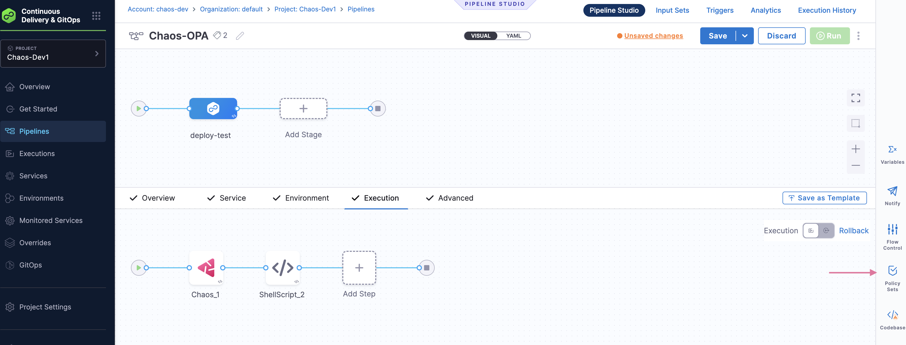

This topic describes how you can use OPA when executing experiments in a pipeline.

To know more about how to execute chaos experiments in a pipeline, go to [Experiments in Pipeline](/docs/chaos-engineering/use-harness-ce/experiments/create-experiments#create-experiment-as-a-pipeline).

## Why is OPA required with HCE pipelines?
In the context of Harness Chaos Engineering, [Open Policy Agent (OPA)](https://www.openpolicyagent.org/docs/latest/) can be integrated within pipelines to ensure that you can enforce specific rules and compliance checks during chaos experiments. It allows fine-grained control over policies within cloud-native applications.

:::warning
Currently, OPA policies may not work seamlessly with multiple layers of nesting inside a pipeline.
:::

## Prerequisites to OPA
OPA policy for chaos requires the following:
- Have relevant tags.
- Implement at least one failure strategy for successful policy evaluation.
- Presence of a chaos step in the pipeline.
- Resilience score condition.

You can provide the necessary parameters to an OPA template and use it in your experiment. For example, which experiments can be run, how often, what failure mechanisms it would use, and so on. This way, you can ensure that the pipeline adheres to security, compliance, and operational standards.

### Implement failure strategy

1. The OPA template contains a failure strategy field which is mandatory, that is,  To apply a failure strategy in the template, go to **Continuous Integration** module, select your pipeline and the step where **chaos** is used. Go to **Advanced** modal. Click **Failure Strategy** and select the strategy. Click **Apply Changes**.

    

2. To apply an OPA policy to your pipeline, go to **Chaos** module -> **Project Settings**. Under **Security and Governance**, select **Policies**.

    

### Create new policy

3. To create a new policy, select **+New Policy**. Provide a name for the policy, select **inline**, and select **Apply**.

    

4. In the **Sample Policies** field, search for **chaos** and select the **Pipeline- enforce chaos** option. Select **Use This Sample**. The template provides fields such as **experimentRef** (takes the experiment ID), **expectedResilienceScore**, **failureStrategies**, and so on. Provide the relevant values for these fields. Click **Save**.

    

:::info note
- You can evaluate the policy by using **Test** option on the **Testing Terminal**.

    
:::

### Create new policy set

5. To create a policy set, go to **Policy Sets**, and select **+New Policy Set**. Provide a name, entity type, and the event on which the policy set is to be evaluated. Select **Continue**.

    

:::info note
- When creating a policy set, you can choose from a variety of options for entity type (for example, pipeline, connector, secret, custom, and so on).
- When creating a policy set, you can choose from between **On Run** and **On Save** for event. Based on your choice, policy is valuated when you click **Run** or **Save** after creating the pipeline.
- After you create a policy set, you will see the policy set listed on the **Policy Sets** page. You can toggle the button against your policy set to enforce it.
:::

### Verification

6. You can verify that the policy has been applied to your pipeline at the specific level (such as account, organization, or project level). Go to **Continuous Integration** module, and select your pipeline. Select **Policy Sets** and you will find the level where the policy was implemented.

    

## Conclusion

Integrating OPA with Harness Chaos Engineering pipelines allows you to enforce custom policies when executing chaos experiments. This ensures that only experiments whose associated policy was successful is executed, thereby enforcing compliance and security.