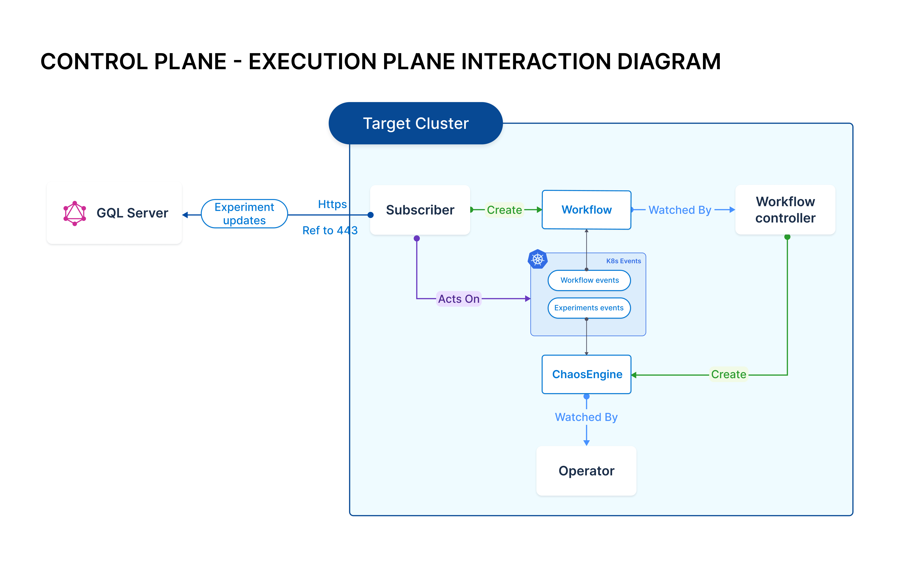

Harness provides several controls to ensure the safe execution of chaos experiments on your infrastructure. This section explains security considerations and associated features across administrative and runtime environments, including:

- [Connectivity from target clusters and request authentication](#connectivity-from-target-clusters-and-authentication-of-requests)
- [Kubernetes roles for the chaos infrastructure](#kubernetes-roles-for-chaos-infrastructure)
- [User authentication to the Harness Chaos Engineering module](#user-authentication)
- [Access control and permissions for chaos actions](#user-authorization-and-role-based-access-control )
- [Secrets management](#secrets-management)
- [Blast radius control using permissions](#blast-radius-control-using-permissions)

Further sections provide a quick summary of the internal security controls and processes for the chaos module to help you gain insights into how security is baked into the build process. The processes include:

- Base images
- Vulnerability scanning
- Pen testing

### Connectivity from target clusters and authentication of requests

You must connect your Kubernetes infrastructure (clusters or namespaces) to HCE (Harness Chaos Engineering) to discover the microservices and execute chaos experiments on them. The connection between your Kubernetes infrastructure and HCE is enabled by a set of deployments on the Kubernetes cluster. The deployments comprise a relay (subscriber) that communicates with the HCE control plane and custom controllers, which carry out the chaos experiment business logic.

This group of deployments (known as the execution plane) is referred to as the [chaos infrastructure](/docs/chaos-engineering/use-harness-ce/infrastructures/enable-disable).

The chaos infrastructure connects to the control plane by making outbound requests over HTTPS (port number 443) to claim and perform chaos tasks. The connections don't require you to create rules for inbound traffic. A unique ID, named cluster ID, is assigned to the chaos infrastructure. The chaos infrastructure shares a dedicated key, named access-key, with the control plane. Both cluster ID and access key are generated during installation. Every API request made to the control plane includes these identifiers for authentication purposes.

:::info
Harness can leverage the same cluster (or namespace) to inject chaos into infrastructure targets (such as VMs, cloud resources etc.) within the user environment, provided that the cluster can access them. For more information on Cloud Secrets, refer to the above diagram.
:::

### Kubernetes roles for chaos infrastructure

You can install the deployments that make up the chaos infrastructure with cluster-wide scope or namespace-only scope. These deployments are mapped to a dedicated service account that can execute all supported chaos experiments for that scope. To learn more about connecting to a chaos infrastructure in cluster or namespace mode, refer to [connect chaos infrastructures](/docs/chaos-engineering/use-harness-ce/infrastructures/enable-disable). Mapping deployments to dedicated service accounts is considered as the first level of blast radius control.

The permissions are listed below for reference.

:::note
The permissions listed an be tuned for further minimization based on environments connected, type of experiments needed etc. Refer to [blast radius control using permissions](#blast-radius-control-using-permissions) to learn more.
:::

| Resource                                                                              | Permissions                                                       | Uses                                                                                                                          |
|---------------------------------------------------------------------------------------|-------------------------------------------------------------------|-------------------------------------------------------------------------------------------------------------------------------|
| deployments, replicationcontrollers, daemonsets, replicasets, statefulsets            | get, list                                                         | For asset discovery of available resources on the cluster so that you can target them with chaos experiments.                 |
| secrets, configmaps                                                                   | get, list                                                         | To read authentication information (cluster-id and access-keys), configuration tunables.                                      |
| jobs                                                                                  | create, get, list, delete, deletecollection                       | Chaos experiments are launched as Kubernetes jobs.                                                                            |
| pods, events                                                                          | get, create, update, patch, delete, list, watch, deletecollectio  | <ul><li>Manage transient pods created to perform chaos.</li> <li>Generate and manage chaos events.</li></ul>                  |
| pod/logs                                                                              | get, list, watch                                                  | <ul><li>Track execution logs.</li> <li>Leverage to validate resource behavior/chaos impact.</li></ul>                         |
| nodes                                                                                 | patch, get, list, update                                          | <ul><li>Filter or isolate chaos targets to specific nodes.</li> <li>Subject nodes to chaos (only in cluster-scope).</li></ul> |
| network policies                                                                      | create, delete, list, get                                         | Cause chaos through network partitions.                                                                                       |
| services                                                                              | create, update, get, list, watch, delete, deletecollection        | <ul><li>Generate chaos metrics.</li> <li>Watch or probe application service metrics for health.</li></ul>                     |
| custom resource definitions, chaosengines, finalizers, chaosexperiments, chaosresults | get, create, update, patch, delete, list, watch, deletecollection | Lifecycle management of chaos custom resources in CE.                                                                        |
| leases (CRDs)                                                                         | get, create, list, update, delete                                 | Enable high availability of chaos custom controllers via leader elections.                                                    |

### Secrets management

HCE leverages secrets for administrative or management purposes as well as at runtime (during execution of chaos experiments). The former involves users leveraging the Harness Secret Manager on the control plane, while the latter is purely managed by the users themselves in their respective Kubernetes clusters.

### Secrets to access chaos artifact (Git) repositories

HCE allows you to add one or more [ChaosHubs](/docs/chaos-engineering/use-harness-ce/chaoshubs/) to enable users to select stored chaos artifacts such as fault and experiment templates. Setting up a chaos hub involves connecting to the respective canonical source, Git repository by using Personal Access Tokens (PAT) or SSH keys. The module also supports committing artifacts into the repository, so you must ensure that the keys have the right scope and permissions in the Git organization.

The chaos module leverages the native Git Connectors provided by the Harness platform to achieve this connectivity, which in turn leverages the Harness Secret Manager to store the PAT or SSH keys.

### Secrets to access and inject chaos on public and on-prem cloud resources

HCE supports fault injection into non-Kubernetes resources such as on-premises VMs, bare-metal machines, cloud infrastructure resources (compute, storage, and network), and cloud-managed services. It leverages provider-specific APIs to inject chaos.

Additionally, HCE supports custom validation tasks such as retrieving metrics from an APM, making API calls for health status, and running background processes for data integrity.

Both of the aforementioned actions require specific access to the infrastructure or service in question. This information is expected to be fed as Kubernetes secrets to the transient chaos pod resources that are launched during experiment execution. To learn more about how experiments are executed, go to [chaos architecture](/docs/chaos-engineering/concepts/explore-architecture).

:::info
The experiment artifact that is stored in a chaos hub or supplied when you create an experiment only references the names of secrets. You can fully manage the life cycle of the secrets within their clusters.
:::

[Here](/docs/chaos-engineering/use-harness-ce/chaos-faults/aws/ec2-cpu-hog#prerequisites) is an example of AWS access information being fed to the experiment pods through a Kubernetes secret.

### Blast radius control using permissions

You can fine-tune permissions to suit specific infrastructures and experiments if you want to reduce the blast radius and impact from a security perspective. This applies to both Kubernetes-based and non-Kubernetes chaos.

In the case of the Kubernetes chaos, a lower blast radius is achieved through [service accounts](/docs/chaos-engineering/security/namespace-considerations) mapped to custom roles instead of the default service accounts mentioned in the [Kubernetes roles for chaos infrastructure](#kubernetes-roles-for-chaos-infrastructure). For non-Kubernetes chaos, a lower blast radius is achieved through cloud-specific role definitions (for example, IAM) mapped to the user account.

Every fault in the Enterprise chaos hub publishes the permissions that you need to execute the fault. You can tune your roles. Common permission templates that work as subsets or supersets for a specific category of experiments are also available. For example, [AWS resource faults](docs/chaos-engineering/use-harness-ce/chaos-faults/aws/security-configurations/policy-for-all-aws-faults.md).

## Next steps

* [Namespace considerations](/docs/chaos-engineering/security/namespace-considerations)
* [Openshift security policies](/docs/chaos-engineering/security/security-templates/openshift-scc)
* [Pod security policy](/docs/chaos-engineering/security/security-templates/psp)
* [Kyverno policy](/docs/chaos-engineering/security/security-templates/kyverno-policies)
