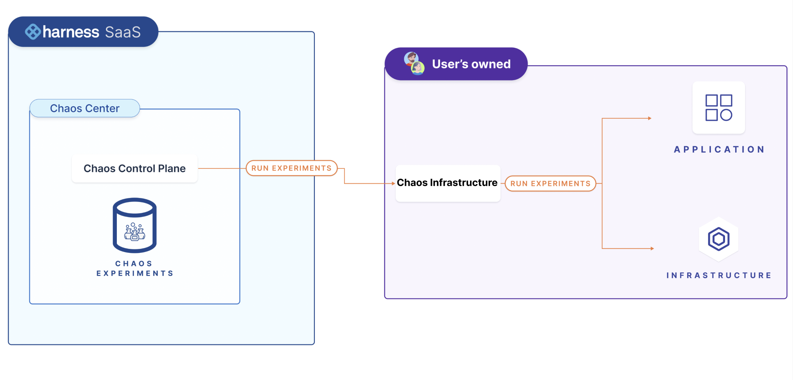
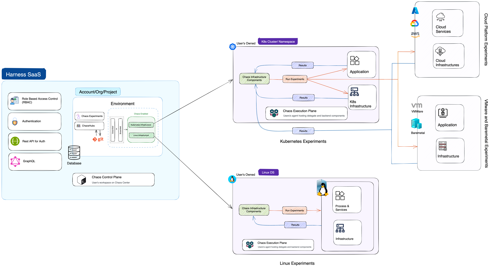

Below is an overview of the HCE architecture.

Harness Chaos Engineering is split into two parts:

1. **Harness Control Plane**
2. **Chaos Infrastructures**

The diagram below gives a peek into the HCE architecture.

**Harness control plane** is the single source to collaboratively create, schedule, and monitor chaos experiments. It comes with a set of chaos faults that are defined in a sequence, which helps achieve a desired chaos impact on the target resources. You can log in to the Harness platform and leverage the interactive chaos center to define your chaos experiments and target the infrastructure. You can also monitor the experiments during their execution.

**Harness Execution Plane** contains the components responsible for orchestrating the chaos injection in the target resources. They get installed in the Chaos Infrastructure containing the control plane. It consists of Chaos Delegate Infrastructure components like Workflow controller, subscriber, event tracker, etc and Litmus Backend Execution Infrastructure components like ChaosExperiment CR, ChaosEngine CR, etc.

### Chaos Infrastructure

**Chaos infrastructure** is a service that runs within your target environment to aid HCE in accessing the target resources and injecting chaos at cloud-native scale. It can be setup with a cluster-wide access or with a single namespace scope. It maintains an active connection with the control plane and exchanges information such as the experiment logs and results, service health status, etc. Upon running an experiment from the control plane, chaos infrastructure executes it within the target environment. The experiment execution is the execution of individual faults and any other custom operations defined as part of the experiment. Multiple chaos infrastructures can exist as part of a single deployment environment, to target all the different resources present in an environment.
