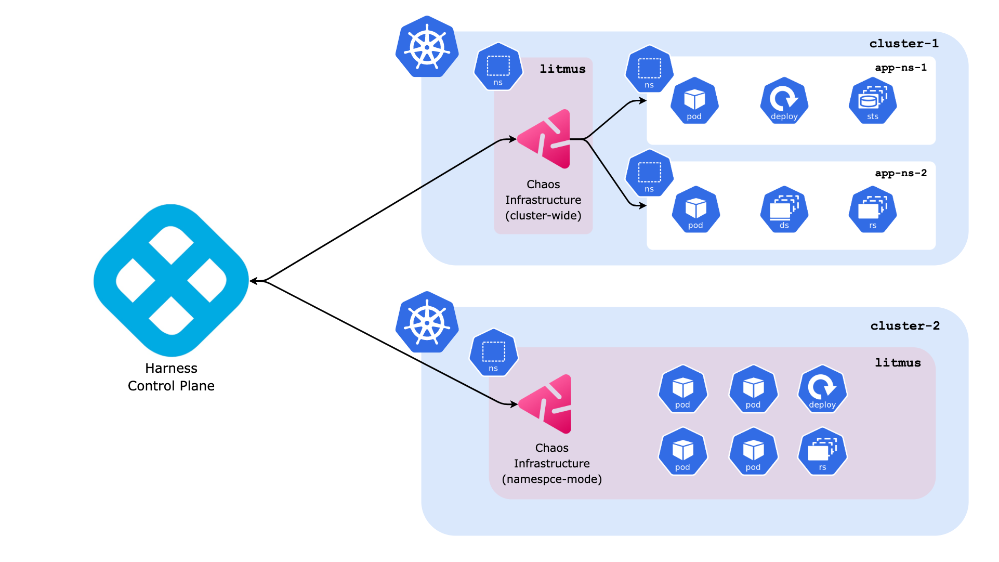

At large, Harness Chaos Engineering is split into two parts, the **Harness Control Plane** and **Chaos Infrastructures**.

Harness control plane is the single source for collaboratively creating, scheduling, and monitoring Chaos Experiments, a set of Chaos Faults defined in a definite sequence to achieve a desired chaos impact on the target resources upon execution. Users can log in to the Harness platform and leverage the interactive Chaos Studio to define their chaos experiments and target various aspects of their infrastructure. The experiments can be actively monitored for their status and logs as they execute, and upon conclusion the result of the experiment run can also be observed.

Chaos infrastructure is a service that runs within your target environment to aid HCE in accessing the target resources and injecting chaos at cloud-native scale. It can be either setup with a cluster-wide access or with a single namespace scope only. It maintains an active connection with the control plane and exchanges information such as the experiment logs and results, service health status, etc. Upon running an experiment from the control plane, chaos infrastructure executes it within the target environment. The execution of an experiment can be understood as the execution of individual faults and any other custom operations defined as part of the experiment. Multiple chaos infrastructures can exist as part of a single deployment environment, to target all the different resources present in an environment.
