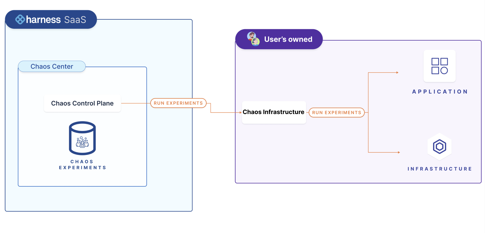
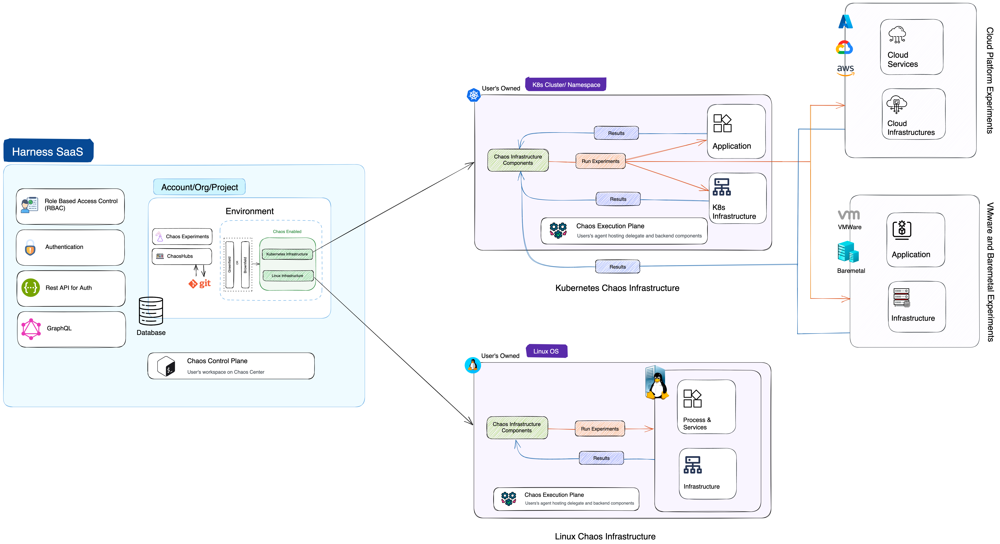

This section describes the Harness Chaos Engineering (CE) architecture along with the components.

Below is an overview of the CE architecture.

CE comprises two parts:

1. **Harness control plane**
2. **Chaos infrastructure**

The diagram below gives a peek into the CE architecture.

## Harness control plane

**Harness control plane** is used for collaboratively create, schedule, and monitor chaos experiments. It comes with a set of chaos faults that are defined in a sequence, which helps achieve the desired chaos impact on the target resources. You can sign in to the Harness platform and leverage the interactive UI dashboard to enable chaos in your infrastructure, define your chaos experiments and target the infrastructure. You can also monitor the experiments during their execution.

### Control plane components

The control plane in CE contains many components, which are described below.

#### Chaos infrastructure

**Chaos infrastructure** is a service that runs within your target environment to help CE access the target resources and inject chaos at cloud-native scale. It can be set up with cluster-wide access or with a single namespace scope.

- There are different types of chaos infrastructures for different environments, such as Kubernetes, Linux VMs, AWS cloud, VMware, etc.
- Based on the target environments, chaos infrastructures can be installed as a Kubernetes service, a Linux daemon, and so on.

All the chaos infrastructure services adhere to the principle of least privilege, where the services execute with the minimum number of permissions. You can add multiple chaos infrastructures to a single environment and subject it to a chaos experiment as an entity.

#### Enterprise hub

Enterprise chaos hub comes out of the box with CE and provides many faults and experiment templates. Enterprise hub is a prebuilt chaos hub, a collection of manifests and charts that represent the existing experiments and faults. You can use faults from multiple categories to create chaos experiments in the Enterprise chaos hub.

#### Chaos manager

Chaos manager is a GraphQL-based Golang microservice that serves the requests received from the chaos infrastructure either by querying the database for relevant information or fetching information from the execution plane.

#### Database

This is a NoSQL MongoDB database microservice accountable for storing users' information, past chaos experiments, saved chaos experiment templates, user projects, chaos hubs, and GitOps details, among other information.

## Harness execution plane

**Harness Execution Plane** contains the components responsible for orchestrating the chaos injection into the target resources. These components are installed through the chaos infrastructure. The Kubernetes execution plane consists of chaos infrastructure components like workflow controllers, subscribers, event trackers, etc., and backend execution infrastructure components like ChaosExperiment CR, ChaosEngine CR, etc.

## Chaos infrastructure

Chaos infrastructure components help facilitate the chaos fault injection and hypothesis validation, and enable chaos automation for target resources.

:::info
- The [Kubernetes execution plane](./kubernetes) consists of chaos infrastructure components like workflow controllers, subscribers, event trackers, etc., and backend execution infrastructure components like ChaosExperiment CR, ChaosEngine CR, etc.
- The [Linux execution plane](./linux) consists of only the Linux chaos infrastructure daemon service.
:::