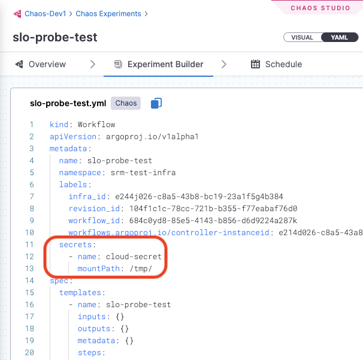

## Authentication methods

There are two methods available for Harness CE to authenticate itself with AWS and obtain the necessary permissions that are specific to the targeted services:

* **Recommended: IAM Roles for Service Accounts (IRSA)** 

  IRSA leverages an OpenID Connect (OIDC) provider for authentication. This method is applicable when the execution plane is installed on an Amazon EKS cluster. With IRSA, you have these benefits:

    - **Least privilege:** Using IRSA avoids extending permissions for the pods on the node, such as restricting the node IAM role for pods from making an AWS API call. You can scope IAM permissions to a service account, and then only pods that use that service account have access to those permissions.

    - **Credential isolation:** An experiment can only retrieve credentials for the IAM role associated with a particular service account. This experiment does not have access to credentials for other experiments belonging to other pods.

  This topic focuses on this authentication method.

* **Kubernetes Secret** 

  This approach involves providing the necessary credentials through Kubernetes secrets. The advantage of this method is its compatibility with any cluster and platform. It is explained in the Notes section of the experiment docs.

## Account terminology and summary of steps for IAM integration

### Terminology for accounts

In this topic, we refer to three types of accounts:

* **The experiment service account:** A Kubernetes service account created when you install a chaos infrastructure on your EKS cluster. This is the account that executes and controls chaos experiments. Its default name is `litmus-admin`, however you can use a different name.

* **The AWS source account:** This AWS account also resides where you install a chaos infrastructure, and serves as the host for the EKS cluster. This account enables Harness CE to access resources across multiple target accounts.

* **Target accounts:** These are AWS accounts where you'll run experiments against resources and services to intentionally disrupt them. You can have many target accounts.

### Summary of steps for IAM integration

To use IRSA for AWS authentication, you:

1. [Enable the experiment service account to access AWS resources](#enable-the-experiment-service-account-to-access-aws-resources). This enables the Kubernetes service account used to control experiments to access resources across multiple AWS target accounts.

1. [Set up your target AWS accounts for IRSA](#set-up-your-target-accounts-for-irsa). The target accounts are the ones where you will run your chaos experiments.

1. [Establish a trust relationship](#establish-trust-between-the-aws-source-account-and-target-accounts) between the AWS source account and target accounts.

1. [Remove any references to secrets](#remove-all-secret-references-from-experiment-definitions) in chaos experiments.

## Enable the experiment service account to access AWS resources

Chaos experiments are initiated and controlled through this service account (usually named `litmus-admin`). You must enable this account to access AWS resources. 

Follow the steps below to enable the experiment service account to access AWS resources.

### Step 1: Create an OIDC provider for your EKS cluster

You must create an IAM OpenID Connect (OIDC) identity provider for your cluster with `eksctl`. You only need to do this once for a cluster. For more information, go to [AWS documentation to set up an OIDC provider](https://docs.aws.amazon.com/eks/latest/userguide/enable-iam-roles-for-service-accounts.html).

To create an OIDC provider for your EKS cluster:

1. Run the following command to check if your cluster has an existing IAM OIDC provider.

  ```bash
  aws eks describe-cluster --name <your-cluster-name> --query "cluster.identity.oidc.issuer" --output text
  ```

  **Example output:**

  ```bash
  https://oidc.eks.us-west-1.amazonaws.com/id/D054E55B6947B1A7B3F200297789662C
  ```

  In the above example `us-west-1` is the region, and `D054E55B6947B1A7B3F200297789662C` is the OIDC provider ID.

1. Run the following command to list the IAM OIDC providers available to this account. 

  ```bash
  aws iam list-open-id-connect-providers | grep <Provider_ID>
  ```

  Where: `Provider_ID` is the value returned from the output of the previous command. In our example, this value is `D054E55B6947B1A7B3F200297789662C`.

1. If no IAM OIDC identity provider is available for this account, create one for your cluster using the following command.

  ```bash
  eksctl utils associate-iam-oidc-provider --cluster <your-cluster-name> --approve
  ```

  **Example output:**

  ```
  2021-09-07 14:54:01 [ℹ]  eksctl version 0.52.0
  2021-09-07 14:54:01 [ℹ]  using region us-west-1
  2021-09-07 14:54:04 [ℹ]  will create IAM Open ID Connect provider for cluster "udit-cluster-11" in "us-west-1"
  2021-09-07 14:54:05 [✔]  created IAM Open ID Connect provider for cluster "litmus-demo" in "us-west-1"
  ```

### Step 2: Create an IAM role and policy for your experiment service account 

The experiment service account is usually named `litmus-admin`. You must create an IAM role and policy for this account with the permissions that you would like chaos experiments to have. 

To create the IAM role and policy: 

1. Create a permission policy for the role, and note the policy's Amazon Resource Name (ARN). 

  There are several ways to create a new IAM permission policy. For more information, go to [AWS IAM documentation](https://docs.aws.amazon.com/transfer/latest/userguide/requirements-roles.html). 

  Make a note of the **policy's ARN** for the next step.

1. To create the role and attach the policy you just created, use the `eksctl` command. For example:

  ```bash
  eksctl create iamserviceaccount \
  --name <experiment_service_account_name> \
  --namespace <service_account_namespace> \
  --cluster <cluster_name> \
  --attach-policy-arn <IAM_policy_ARN> \
  --approve \
  --override-existing-serviceaccounts
  ```

  Where:

    * `experiment_service_account_name` is the name of the experiment service account, usually `litmus-admin`.
    * `service_account_namespace` is namespace where you installed the execution plane.
    * `IAM_policy_ARN` is ARN for the policy you created in the previous step.

### Step 3: Associate the IAM role with the experiment service account

Associate the IAM role you created in the previous step by annotating the experiment service account (usually `litmus-admin`). This will give it the required access to AWS resources.

To associate the IAM role to the experiment service account, run this command:

```bash
kubectl annotate serviceaccount -n <experiment_service_account_namespace> <experiment_service_account_name> \
eks.amazonaws.com/role-arn=arn:aws:iam::<account_ID>:role/<IAM_role_name>
```

:::note   
1. The default name for the experiment service account is `litmus-admin` and the namespace for chaos infrastructure is `HCE`, however, you can use different names. 
2. For the cluster autoscaler experiment, annotate the experiment service account in the `kube-system` namespace.
:::

### Step 4: Verify the association of the IAM role with the experiment service account

To verify the association between the experiment service account (`litmus-admin`) and the IAM role: 

1. Run an experiment and describe one of the pods. 

1. Verify whether the `AWS_WEB_IDENTITY_TOKEN_FILE` and `AWS_ROLE_ARN` environment variables exist. For example:

  ```bash
  kubectl exec -n litmus <ec2-terminate-by-id-z4zdf> env | grep AWS
  ```
  **Example output:**
  ```
  AWS_VPC_K8S_CNI_LOGLEVEL=DEBUG
  AWS_ROLE_ARN=arn:aws:iam::<ACCOUNT_ID>:role/<IAM_ROLE_NAME>
  AWS_WEB_IDENTITY_TOKEN_FILE=/var/run/secrets/eks.amazonaws.com/serviceaccount/token
  ```

## Set up your target accounts for IRSA

Whereas chaos experiments are initiated and controlled through the experiment service account, **target accounts** are the accounts you'll subject to chaos experiments, so you can intentionally disrupt and manipulate their services.

In this section, you create an IAM role and set up an OIDC provider in each target account.

### Step 1: Create an IAM role and policy in each AWS target account

This step lets you grant permissions for Harness CE to inject chaos targeting various AWS services in the target account. 

Create an IAM role and policy in each target account to provide the required permissions to access the desired resources in that account. You have the flexibility to define the level of permissions you wish to assign to Harness CE. For instructions, go to [Create an IAM role and policy](https://docs.aws.amazon.com/transfer/latest/userguide/requirements-roles.html) in the AWS documentation.

### Step 2: Set up the OIDC provider in all target accounts

Follow this procedure for each one of your target accounts.

To add the OIDC provider to each target account:

1. Determine your OIDC URL.

    1. Open the AWS Management Console and navigate to the Amazon EKS service.
    1. Select the EKS cluster that corresponds to the OIDC provider.
    1. Select the **Configuration** tab.
    1. Under the **OpenID Connect (OIDC)** section, locate the **Issuer URL**.
    
      An example Issuer URL looks like this:

      ```
      https://oidc.eks.us-east-2.amazonaws.com/id/FOSBW293U0Q92423BR43290RU
      ```
1. Navigate to the target account.
1. In the IAM dashboard, select **Identity Providers**, and then select **Add Provider**.
1. In the **Add an Identity provider** screen, for **Provider type**, select **OpenID Connect**. 
1. Provide these required details of the OIDC provider: 
    
    * **Provider URL:** Use the URL you retrieved in Step 1. 
    * **Audience:** Specify `sts.amazonaws.com`.

1. Select **Add provider**.
1. Repeat these steps for each target account.

## Establish trust between the AWS source account and target accounts

The AWS source account enables Harness CE to access resources across multiple target accounts.

### Step 1: Configure trust between target accounts and the AWS source account

You must configure a trust relationship for each IAM role you created in a target account in [Step 1](#step-1-create-an-iam-role-and-policy-in-each-aws-target-account) in the previous section. This authorizes the AWS source account's OIDC provider to assume that IAM role on the target account. To do this, you update the trust policy of the AWS source account, and the policy of the IAM role you created on each target account. 

Follow this procedure for each target account to configure the IAM role and policy on both the AWS source account and the target account.

To configure trust between the AWS source account OIDC provider and a target account:

1. **In the AWS source account:** Edit the trust relationship in the IAM role as shown in the example below.

  You can find the JSON for the trust relationship in **AWS IAM > *ROLE_NAME* > Trust relationship** tab.

  In this example `2222222222` is the target account ID, and `1111111111` is the AWS source account ID:

  ```
  {
      "Version": "2012-10-17",
      "Statement": [
          {
              "Effect": "Allow",
              "Principal": {
                  "AWS": "arn:aws:iam::2222222222:role/chaos-role"
              },
              "Action": [
                  "sts:AssumeRole"
              ]
          },
          {
              "Effect": "Allow",
              "Principal": {
                  "Federated": "arn:aws:iam::1111111111:oidc-provider/oidc.eks.us-east-2.amazonaws.com/id/AAAAA11111111C9909AEC6992AEFNWQO0"
              },
              "Action": "sts:AssumeRoleWithWebIdentity"
          }
      ]
  }
  ```

2. **In each target account:** Edit the trust relationship for the IAM role you [created on the target account](#step-1-create-an-iam-role-and-policy-in-each-aws-target-account) as shown in the example below.

  You can find the JSON for the trust relationship in **AWS IAM > *ROLE_NAME* > Trust relationship** tab.
  
  In this example `2222222222` is the target account ID, and `1111111111` is the experiment service account ID:

  ```
  {
      "Version": "2012-10-17",
      "Statement": [
          {
              "Effect": "Allow",
              "Principal": {
                  "AWS": "arn:aws:iam::1111111111:role/chaos-role"
              },
              "Action": "sts:AssumeRole"
          },
          {
              "Effect": "Allow",
              "Principal": {
                  "Federated": "arn:aws:iam::2222222222:oidc-provider/oidc.eks.us-east-2.amazonaws.com/id/AAAAA11111111C9909AEC6992AEFNWQO0"
              },
              "Action": "sts:AssumeRoleWithWebIdentity"
          }
      ]
  }
  ```

### Step 2: Enable the experiment service account to switch between target accounts

This procedure enables the experiment service account (`litmus-admin`) to seamlessly switch between target accounts when running experiments. To do this, you must annotate the experiment service account with the corresponding chaos role in each target account. 

For example, if the target account has a role named `chaos-role`, you must annotate the litmus-admin service account with the unique ARN of that role. This enables seamless switching between target accounts for running experiments.

**To annotate the experiment service account with the role ARN:**

1. Run the following command:

  `kubectl annotate serviceaccount -n <chaos-namespace> <experiment-service-account-name> eks.amazonaws.com/role-arn=<role-arn>`

    Where:

    * `<chaos-namespace>` is the namespace where the chaos infrastructure is installed (usually `HCE`).
    * `<experiment-service-account-name>` is the name of your experiment service account (usually `litmus-admin`.
    * `<role-arn>` is the ARN of the role in the target account.

1. Repeat the above step for the chaos role in each target account.

## Remove all secret references from experiment definitions

If you've already configured some experiments with secret references, or if you use chaos experiment templates, you must remove references to secret mounts, since IAM integration does not rely on secrets. To do so, remove references to secret mounts from the experiment definition YAML files. 

For example, remove the highlighted lines in this experiment configuration:


