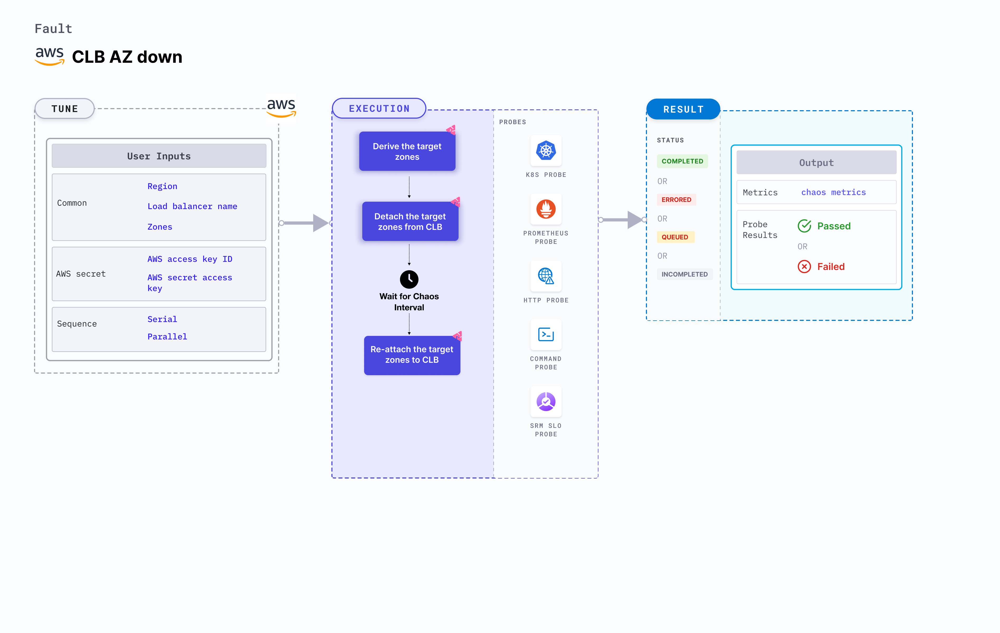

## Introduction

CLB (Classic Load Balancer) AZ (Availability Zones) down takes down the AZ on a target CLB for a specific duration. This fault restricts access to certain availability zones for a specific duration.



## Use cases

CLB AZ down:
- Breaks the connectivity of a CLB with the given zones and impacts their delivery. 
- Detaches the AZ from the classic load balancer thereby disrupting the dependent application's performance. 
- Tests the application sanity, availability, and recovery workflows of the application pod attached to the load balancer.

:::info note
- Kubernetes version 1.17 or later is required to execute this fault.
- Appropriate AWS access to attach or detach an AZ from CLB.
- A minimum of one AZ attached to the CLB after injecting chaos; otherwise, the fault fails to detach the given AZ.
- The CLB should be attached to the given availability zones.
- The Kubernetes secret should have AWS access configuration (key) in the `CHAOS_NAMESPACE`. Below is a sample secret file.
  ```yaml
  apiVersion: v1
  kind: Secret
  metadata:
    name: cloud-secret
  type: Opaque
  stringData:
    cloud_config.yml: |-
      # Add the cloud AWS credentials respectively
      [default]
      aws_access_key_id = XXXXXXXXXXXXXXXXXXX
      aws_secret_access_key = XXXXXXXXXXXXXXX
  ```
- We recommend that you use the same secret name, that is, `cloud-secret`. Otherwise, you will need to update the `AWS_SHARED_CREDENTIALS_FILE` environment variable in the fault template with the new secret name and you won't be able to use the default health check probes. 
- Go to [AWS named profile for chaos](./security-configurations/aws-switch-profile) to use a different profile for AWS faults and [superset permission or policy](./security-configurations/policy-for-all-aws-faults) to execute all AWS faults.
:::

Below is an example AWS policy to execute the fault.

```json
{
    "Version": "2012-10-17",
    "Statement": [
        {
            "Effect": "Allow",
            "Action": [
                "ec2:DescribeInstanceStatus",
                "ec2:DescribeInstances",
                "ec2:DescribeSubnets",
                "elasticloadbalancing:DetachLoadBalancerFromSubnets",
                "elasticloadbalancing:AttachLoadBalancerToSubnets",
                "elasticloadbalancing:DescribeLoadBalancers"
            ],
            "Resource": "*"
        }
    ]
}
```

## Fault tunables

   <h3>Mandatory tunables</h3>
    <table>
      <tr>
        <th> Tunable </th>
        <th> Description </th>
        <th> Notes </th>
      </tr>
      <tr>
        <td> LOAD_BALANCER_NAME </td>
        <td> Name of the load balancer whose AZ has to be detached. </td>
        <td> For example, <code>clb-name</code>. </td>
      </tr>
      <tr>
        <td> ZONES </td>
        <td> Target zones that have to be detached from the CLB. </td>
        <td> For example, <code>us-east-1a</code>. </td>
      </tr>
      <tr>
        <td> REGION </td>
        <td> Region name for the target volumes. </td>
        <td> For example, <code>us-east-1</code>. </td>
      </tr>
    </table>
    <h3>Optional tunables</h3>
    <table>
      <tr>
        <th> Tunable </th>
        <th> Description </th>
        <th> Notes </th>
      </tr>
      <tr>
        <td> TOTAL_CHAOS_DURATION </td>
        <td> Duration to insert chaos (in seconds). </td>
        <td> Default: 30 s. For more information, go to <a href="https://developer.harness.io/docs/chaos-engineering/chaos-faults/common-tunables-for-all-faults#duration-of-the-chaos"> duration of the chaos.</a></td>
      </tr>
      <tr>
        <td> CHAOS_INTERVAL </td>
        <td> Duration between the attachment and detachment of the volumes (in seconds). </td>
        <td> Default: 30 s. For more information, go to <a href="https://developer.harness.io/docs/chaos-engineering/chaos-faults/common-tunables-for-all-faults#chaos-interval"> chaos interval.</a></td>
      </tr>
      <tr>
        <td> SEQUENCE </td>
        <td> Sequence of chaos execution for multiple volumes. </td>
        <td> Default: parallel. Supports serial and parallel. For more information, go to <a href="https://developer.harness.io/docs/chaos-engineering/chaos-faults/common-tunables-for-all-faults#sequence-of-chaos-execution"> sequence of chaos execution.</a> </td>
      </tr>
      <tr>
        <td> RAMP_TIME </td>
        <td> Period to wait before and after injecting chaos (in seconds). </td>
        <td> For example, 30 s. For more information, go to <a href="https://developer.harness.io/docs/chaos-engineering/chaos-faults/common-tunables-for-all-faults#ramp-time"> ramp time.</a></td>
      </tr>
    </table>

### Target zones

Comma-separated list of the target zones. Tune it by using the `ZONES` environment variable.

The following YAML snippet illustrates the use of this environment variable:

[embedmd]:# (./static/manifests/clb-az-down/target-zones.yaml yaml)
```yaml
# contains clb az down for given zones
apiVersion: litmuschaos.io/v1alpha1
kind: ChaosEngine
metadata:
  name: engine-nginx
spec:
  engineState: "active"
  chaosServiceAccount: litmus-admin
  experiments:
  - name: clb-az-down
    spec:
      components:
        env:
        # load balancer name for chaos
        - name: LOAD_BALANCER_NAME
          value: 'tes-clb'
        # target zones for the chaos
        - name: ZONES
          value: 'us-east-1a,us-east-1b'
        # region for chaos
        - name: REGION
          value: 'us-east-1'
```
