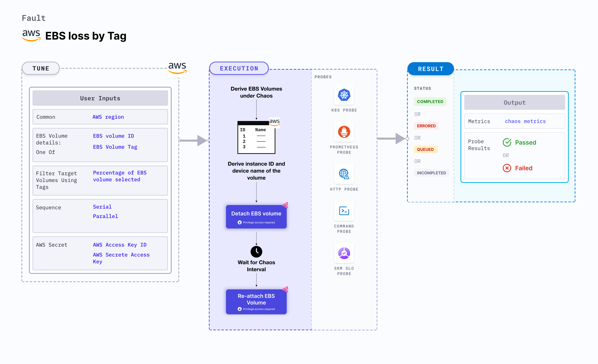

## Introduction

EBS (Elastic Block Store) loss by tag disrupts the state of EBS volume by detaching it from the node (or EC2) instance using volume ID for a certain duration. In case of EBS persistent volumes, the volumes can self-attach, and the re-attachment step can be skipped.





## Use cases
EBS loss by tag tests the deployment sanity (replica availability and uninterrupted service) and recovery workflows of the application pod.

:::info note
- Kubernetes version 1.17 or later is required to execute this fault.
- EBS volume is attached to the instance.
- Appropriate AWS access to attach or detach an EBS volume for the instance. 
- The Kubernetes secret should have AWS access configuration (key) in the `CHAOS_NAMESPACE`. A sample secret file looks like:
  ```yaml
  apiVersion: v1
  kind: Secret
  metadata:
    name: cloud-secret
  type: Opaque
  stringData:
    cloud_config.yml: |-
      # Add the cloud AWS credentials respectively
      [default]
      aws_access_key_id = XXXXXXXXXXXXXXXXXXX
      aws_secret_access_key = XXXXXXXXXXXXXXX
  ```
- We recommend that you use the same secret name, that is, `cloud-secret`. Otherwise, you will need to update the `AWS_SHARED_CREDENTIALS_FILE` environment variable in the fault template and you won't be able to use the default health check probes. 
- Go to [AWS named profile for chaos](./security-configurations/aws-switch-profile) to use a different profile for AWS faults and [superset permission or policy](./security-configurations/policy-for-all-aws-faults) to execute all AWS faults.
- Go to the [common tunables](../common-tunables-for-all-faults) and [AWS-specific tunables](./aws-fault-tunables) to tune the common tunables for all faults and AWS-specific tunables.
:::

Below is an example AWS policy to execute the fault.

```json
{
    "Version": "2012-10-17",
    "Statement": [
        {
            "Effect": "Allow",
            "Action": [
                "ec2:AttachVolume",
                "ec2:DetachVolume"
            ],
            "Resource": "*"
        },
        {
            "Effect": "Allow",
            "Action": "ec2:DescribeVolumes",
            "Resource": "*"
        },
        {
            "Effect": "Allow",
            "Action": [
                "ec2:DescribeInstanceStatus",
                "ec2:DescribeInstances"
            ],
            "Resource": "*"
        }
    ]
}
```

## Fault tunables

   <h3>Mandatory tunables</h3>
    <table>
      <tr>
        <th> Tunable </th>
        <th> Description </th>
        <th> Notes </th>
      </tr>
      <tr>
        <td> EBS_VOLUME_TAG </td>
        <td> Common tag for target volumes. It'll be in form of <code>key:value</code> (Ex: 'team:devops')</td>
        <td> </td>
      </tr>
      <tr>
        <td> REGION </td>
        <td> Region name for the target volumes</td>
        <td> For example, <code>us-east-1</code>. </td>
      </tr>
    </table>
    <h3>Optional tunables</h3>
    <table>
      <tr>
        <th> Tunable </th>
        <th> Description </th>
        <th> Notes </th>
      </tr>
       <tr>
        <td> VOLUME_AFFECTED_PERC </td>
        <td> Percentage of total EBS volumes to target </td>
        <td> Default: 0 (corresponds to 1 volume), provide numeric value only </td>
      </tr>
      <tr>
        <td> TOTAL_CHAOS_DURATION </td>
        <td> Time duration for chaos insertion (sec) </td>
        <td> Default: 30 s </td>
      </tr>
      <tr>
        <td> CHAOS_INTERVAL </td>
        <td> The time duration between the attachment and detachment of the volumes (sec) </td>
        <td> Default: 30 s </td>
      </tr>
      <tr>
        <td> SEQUENCE </td>
        <td> Sequence of chaos execution for multiple volumes</td>
        <td> Default value: parallel. Supported: serial, parallel </td>
      </tr>
      <tr>
        <td> RAMP_TIME </td>
        <td> Period to wait before and after injection of chaos in sec </td>
        <td> For example, 30 </td>
      </tr>
    </table>

### Target single volume

Random EBS volume that is detached from the node, based on the given `EBS_VOLUME_TAG` tag and `REGION` region.

The following YAML snippet illustrates the use of this environment variable:

[embedmd]:# (./static/manifests/ebs-loss-by-tag/ebs-volume-tag.yaml yaml)
```yaml
# contains the tags for the EBS volumes 
apiVersion: litmuschaos.io/v1alpha1
kind: ChaosEngine
metadata:
  name: engine-nginx
spec:
  engineState: "active"
  chaosServiceAccount: litmus-admin
  experiments:
  - name: ebs-loss-by-tag
    spec:
      components:
        env:
        # tag of the EBS volume
        - name: EBS_VOLUME_TAG
          value: 'key:value'
        # region for the EBS volume
        - name: REGION
          value: 'us-east-1'
        - name: TOTAL_CHAOS_DURATION
          VALUE: '60'
```

### Target percent of volumes

Percentage of EBS volumes that are detached from the node, based on `EBS_VOLUME_TAG` tag and `REGION` region. Tune it by using the `VOLUME_AFFECTED_PERC` environment variable.

The following YAML snippet illustrates the use of this environment variable:

[embedmd]:# (./static/manifests/ebs-loss-by-tag/volume-affected-percentage.yaml yaml)
```yaml
# target percentage of the EBS volumes with the provided tag
apiVersion: litmuschaos.io/v1alpha1
kind: ChaosEngine
metadata:
  name: engine-nginx
spec:
  engineState: "active"
  chaosServiceAccount: litmus-admin
  experiments:
  - name: ebs-loss-by-tag
    spec:
      components:
        env:
        # percentage of EBS volumes filter by tag
        - name: VOLUME_AFFECTED_PERC
          value: '100'
        # tag of the EBS volume
        - name: EBS_VOLUME_TAG
          value: 'key:value'
        # region for the EBS volume
        - name: REGION
          value: 'us-east-1'
        - name: TOTAL_CHAOS_DURATION
          VALUE: '60'
```
