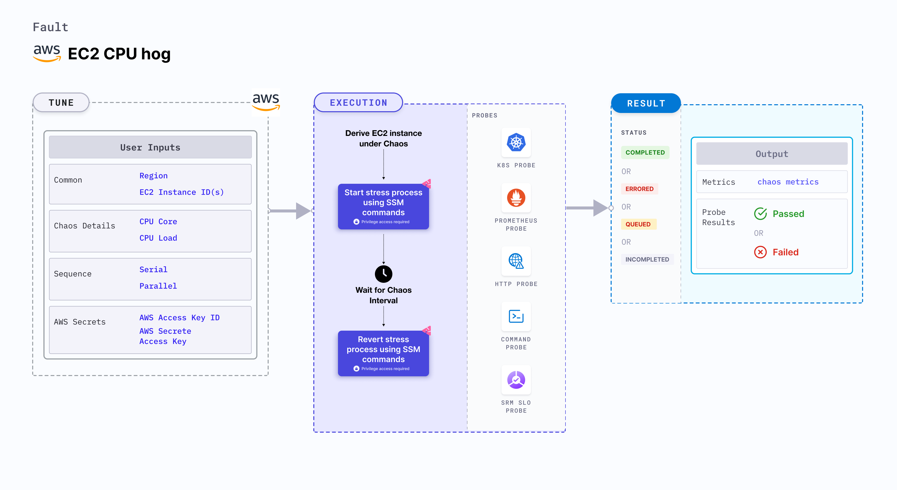

## Introduction

EC2 CPU hog induces stress on the AWS EC2 instances using the Amazon SSM Run command. The SSM Run command is executed using SSM documentation that is built into the fault. This fault causes CPU chaos on the target EC2 instances using the `EC2_INSTANCE_ID` environment variable for a specific duration.



## Use cases

EC2 CPU hog:
- Induces CPU stress on the target AWS EC2 instance(s). 
- Simulates a lack of CPU for processes running on the application, which degrades their performance. 
- Simulates slow application traffic or exhaustion of the resources, leading to degradation in the performance of processes on the instance.

:::info note
- Kubernetes version 1.17 or later is required to execute this fault.
- The EC2 instance should be in a healthy state.
- SSM agent should be installed and running on the target EC2 instance.
- SSM IAM role should be attached to the target EC2 instance(s).
- The Kubernetes secret should have the AWS Access Key ID and Secret Access Key credentials in the `CHAOS_NAMESPACE`. Below is a sample secret file:
  ```yaml
  apiVersion: v1
  kind: Secret
  metadata:
    name: cloud-secret
  type: Opaque
  stringData:
    cloud_config.yml: |-
      # Add the cloud AWS credentials respectively
      [default]
      aws_access_key_id = XXXXXXXXXXXXXXXXXXX
      aws_secret_access_key = XXXXXXXXXXXXXXXXXXXXXXXXXXXXXXXXXXXX
  ```
- We recommend that you use the same secret name, that is, `cloud-secret`. Otherwise, you will need to update the `AWS_SHARED_CREDENTIALS_FILE` environment variable in the fault template and you won't be able to use the default health check probes.
- Go to [AWS named profile for chaos](./security-configurations/aws-switch-profile) to use a different profile for AWS faults and [superset permission or policy](./security-configurations/policy-for-all-aws-faults) to execute all AWS faults.
:::

Below is an example AWS policy to execute the fault.

```json
{
    "Version": "2012-10-17",
    "Statement": [
        {
            "Effect": "Allow",
            "Action": [
                "ssm:GetDocument",
                "ssm:DescribeDocument",
                "ssm:GetParameter",
                "ssm:GetParameters",
                "ssm:SendCommand",
                "ssm:CancelCommand",
                "ssm:CreateDocument",
                "ssm:DeleteDocument",
                "ssm:GetCommandInvocation",          
                "ssm:UpdateInstanceInformation",
                "ssm:DescribeInstanceInformation"
            ],
            "Resource": "*"
        },
        {
            "Effect": "Allow",
            "Action": [
                "ec2messages:AcknowledgeMessage",
                "ec2messages:DeleteMessage",
                "ec2messages:FailMessage",
                "ec2messages:GetEndpoint",
                "ec2messages:GetMessages",
                "ec2messages:SendReply"
            ],
            "Resource": "*"
        },
        {
            "Effect": "Allow",
            "Action": [
                "ec2:DescribeInstanceStatus",
                "ec2:DescribeInstances"
            ],
            "Resource": [
                "*"
            ]
        }
    ]
}
```

## Fault tunables

  <h3>Mandatory tunables</h3>
    <table>
        <tr>
            <th> Tunable </th>
            <th> Description </th>
            <th> Notes </th>
        </tr>
        <tr>
            <td> EC2_INSTANCE_ID </td>
            <td> ID of the target EC2 instance. </td>
            <td> For example: <code>i-044d3cb4b03b8af1f</code>. </td>
        </tr>
        <tr>
            <td> REGION </td>
            <td> The AWS region ID where the EC2 instance has been created. </td>
            <td> For example: <code>us-east-1</code>. </td>
        </tr>
    </table>
    <h3>Optional tunables</h3>
    <table>
        <tr>
            <th> Tunable </th>
            <th> Description </th>
            <th> Notes </th>
        </tr>
        <tr>
            <td> TOTAL_CHAOS_DURATION </td>
            <td> Duration to insert chaos (in seconds). </td>
            <td> Default: 30 s. </td>
        </tr>
        <tr>
            <td> CHAOS_INTERVAL </td>
            <td> Interval between successive chaos injection (in seconds). </td>
            <td> Default: 60 s. </td>
        </tr>
        <tr>
            <td> AWS_SHARED_CREDENTIALS_FILE </td>
            <td> Path to the AWS secret credentials. </td>
            <td> Default: <code>/tmp/cloud_config.yml</code>. </td>
        </tr>
        <tr>
            <td> INSTALL_DEPENDENCIES </td>
            <td> Install dependencies to run CPU chaos. It can be 'True' or 'False'.</td>
            <td> Default: True. </td>
        </tr>
        <tr>
            <td> CPU_CORE </td>
            <td> Number of CPU cores to consume. </td>
            <td> Default: 0. </td>
        </tr>
        <tr>
            <td> CPU_LOAD </td>
            <td> Percentage of single CPU core that is consumed. </td>
            <td> Defaults to 100. </td>
        </tr>
        <tr>
            <td> SEQUENCE </td>
            <td> Sequence of chaos execution for multiple instances. </td>
            <td> Default: parallel. Supports serial and parallel. </td>
        </tr>
        <tr>
            <td> RAMP_TIME </td>
            <td> Period to wait before and after injecting chaos (in seconds). </td>
            <td> For example, 30 s. </td>
        </tr>
    </table>


### CPU core

CPU core value utilized on the EC2 instance. Tune it by using the `CPU_CORE` environment variable.

The following YAML snippet illustrates the use of this environment variable:

[embedmd]:# (./static/manifests/ec2-cpu-hog/cpu-core.yaml yaml)
```yaml
# CPU cores to utilize
apiVersion: litmuschaos.io/v1alpha1
kind: ChaosEngine
metadata:
  name: engine-nginx
spec:
  engineState: "active"
  chaosServiceAccount: litmus-admin
  experiments:
  - name: ec2-cpu-hog
    spec:
      components:
        env:
        - name: CPU_CORE
          value: '2'
        # ID of the EC2 instance
        - name: EC2_INSTANCE_ID
          value: 'instance-1'
        # region for the EC2 instance
        - name: REGION
          value: 'us-east-1'
```

### CPU percentage

CPU percentage value utilized on the EC2 instance. Tune it by using the `CPU_LOAD` environment variable.

The following YAML snippet illustrates the use of this environment variable:

[embedmd]:# (./static/manifests/ec2-cpu-hog/cpu-percentage.yaml yaml)
```yaml
# CPU percentage to utilize
apiVersion: litmuschaos.io/v1alpha1
kind: ChaosEngine
metadata:
  name: engine-nginx
spec:
  engineState: "active"
  chaosServiceAccount: litmus-admin
  experiments:
  - name: ec2-cpu-hog
    spec:
      components:
        env:
        - name: CPU_LOAD
          value: '50'
        # ID of the EC2 instance
        - name: EC2_INSTANCE_ID
          value: 'instance-1'
        # region for the EC2 instance
        - name: REGION
          value: 'us-east-1'
```

### Multiple EC2 instances

Multiple EC2 instances that are targeted in one chaos run. Tune it by using the `EC2_INSTANCE_ID` environment variable.

The following YAML snippet illustrates the use of this environment variable:

[embedmd]:# (./static/manifests/ec2-cpu-hog/multiple-instances.yaml yaml)
```yaml
# mutilple instance targets
apiVersion: litmuschaos.io/v1alpha1
kind: ChaosEngine
metadata:
  name: engine-nginx
spec:
  engineState: "active"
  chaosServiceAccount: litmus-admin
  experiments:
  - name: ec2-cpu-hog
    spec:
      components:
        env:
        # ids of the EC2 instances
        - name: EC2_INSTANCE_ID
          value: 'instance-1,instance-2,instance-3'
        # region for the EC2 instance
        - name: REGION
          value: 'us-east-1'
```

### CPU core with percentage consumption

Number of CPU cores (in terms of percentage) utilized on the EC2 instance. Tune it by using the `CPU_CORE` and `CPU_LOAD` environment variables, respectively.

The following YAML snippet illustrates the use of this environment variable:

[embedmd]:# (./static/manifests/ec2-cpu-hog/cpu-core-with-percentage.yaml yaml)
```yaml
# CPU core with percentage to utilize
apiVersion: litmuschaos.io/v1alpha1
kind: ChaosEngine
metadata:
  name: engine-nginx
spec:
  engineState: "active"
  chaosServiceAccount: litmus-admin
  experiments:
  - name: ec2-cpu-hog
    spec:
      components:
        env:
        - name: CPU_CORE
          value: '2'
        - name: CPU_LOAD
          value: '50'
        # ID of the EC2 instance
        - name: EC2_INSTANCE_ID
          value: 'instance-1'
        # region for the EC2 instance
        - name: REGION
          value: 'us-east-1'
```