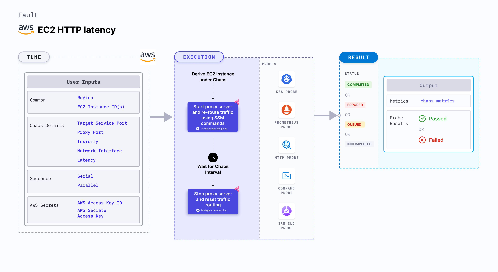

## Introduction

EC2 HTTP latency disrupts the state of infrastructure resources. This fault induces HTTP chaos on an AWS EC2 instance using the Amazon SSM Run command, carried out using SSM Docs that is in-built in the fault.
- It injects HTTP response latency to the service whose port is specified using `TARGET_SERVICE_PORT` environment variable by starting the proxy server and redirecting the traffic through the proxy server.
- It introduces HTTP latency chaos on the EC2 instance using an SSM doc for a certain duration.




## Use cases
EC2 HTTP latency:
- Delays the network connectivity from the VM to the target hosts.
- Simulates latency to specific API services for (or from) a given microservice.
- Simulates a slow response on specific third party (or dependent) components (or services). 


:::info note
- Kubernetes version 1.17 or later is required to execute this fault.
- SSM agent is installed and running on the target EC2 instance.
- You can pass the VM credentials as secrets or as a `ChaosEngine` environment variable.
- The EC2 instance should be in a healthy state.
- The Kubernetes secret should have the AWS Access Key ID and Secret Access Key credentials in the `CHAOS_NAMESPACE`. Below is the sample secret file:
  ```yaml
  apiVersion: v1
  kind: Secret
  metadata:
    name: cloud-secret
  type: Opaque
  stringData:
    cloud_config.yml: |-
      # Add the cloud AWS credentials respectively
      [default]
      aws_access_key_id = XXXXXXXXXXXXXXXXXXX
      aws_secret_access_key = XXXXXXXXXXXXXXXXXXXXXXXXXXXXXXXXXXXX
  ```
- We recommend that you use the same secret name, that is, `cloud-secret`. Otherwise, you will need to update the `AWS_SHARED_CREDENTIALS_FILE` environment variable in the fault template and you won't be able to use the default health check probes. 
- Go to [AWS named profile for chaos](./security-configurations/aws-switch-profile) to use a different profile for AWS faults and [superset permission or policy](./security-configurations/policy-for-all-aws-faults) to execute all AWS faults.
- Go to the [common tunables](../common-tunables-for-all-faults) to tune the common tunables for all the faults.
:::


Below is an example AWS policy to execute the fault.

```json
{
    "Version": "2012-10-17",
    "Statement": [
        {
            "Effect": "Allow",
            "Action": [
                "ssm:GetDocument",
                "ssm:DescribeDocument",
                "ssm:GetParameter",
                "ssm:GetParameters",
                "ssm:SendCommand",
                "ssm:CancelCommand",
                "ssm:CreateDocument",
                "ssm:DeleteDocument",
                "ssm:GetCommandInvocation",          
                "ssm:UpdateInstanceInformation",
                "ssm:DescribeInstanceInformation"
            ],
            "Resource": "*"
        },
        {
            "Effect": "Allow",
            "Action": [
                "ec2messages:AcknowledgeMessage",
                "ec2messages:DeleteMessage",
                "ec2messages:FailMessage",
                "ec2messages:GetEndpoint",
                "ec2messages:GetMessages",
                "ec2messages:SendReply"
            ],
            "Resource": "*"
        },
        {
            "Effect": "Allow",
            "Action": [
                "ec2:DescribeInstanceStatus",
                "ec2:DescribeInstances"
            ],
            "Resource": [
                "*"
            ]
        }
    ]
}
```
## Fault tunables

   <h3>Mandatory tunables</h3>
    <table>
        <tr>
            <th> Tunable </th>
            <th> Description </th>
            <th> Notes </th>
        </tr>
        <tr>
          <td> EC2_INSTANCE_ID </td>
          <td> ID of the target EC2 instance </td>
          <td> For example, <code>i-044d3cb4b03b8af1f</code>. </td>
        </tr>
        <tr>
          <td> REGION </td>
          <td> The AWS region ID where the EC2 instance has been created. </td>
          <td> For example, <code>us-east-1</code>. </td>
        </tr>
        <tr>
            <td> LATENCY </td>
            <td> Provide latency to be added to request in milliseconds.</td>
            <td> For example, 1000</td>
        </tr>
        <tr>
            <td> TARGET_SERVICE_PORT </td>
            <td> Port of the service to target </td>
            <td> Default: port 80. </td>
        </tr>
    </table>
    <h3>Optional tunables</h3>
    <table>
        <tr>
            <th> Tunable </th>
            <th> Description </th>
            <th> Notes </th>
        </tr>
        <tr>
            <td> TOTAL_CHAOS_DURATION </td>
            <td> Duration that you specify, through which chaos is injected into the target resource (in seconds). </td>
            <td> Default: 30 s. </td>
        </tr>
        <tr>
            <td> CHAOS_INTERVAL </td>
            <td> Time interval between two successive instance terminations (in seconds). </td>
            <td> Default: 30 s. </td>
        </tr>
        <tr>
            <td> AWS_SHARED_CREDENTIALS_FILE </td>
            <td> Provide the path for AWS secret credentials.</td>
            <td> Default: <code>/tmp/cloud_config.yml</code>. </td>
          </tr>
        <tr>
            <td> SEQUENCE </td>
            <td> It defines a sequence of chaos execution for multiple instances. </td>
            <td> Default: parallel. Supports serial sequence. </td>
        </tr>
        <tr>
            <td> RAMP_TIME </td>
            <td> Period to wait before and after injection of chaos (in seconds). </td>
            <td> For example, 30 s. </td>
        </tr>
        <tr>
            <td> INSTALL_DEPENDENCY </td>
            <td> Specify the dependencies to be installed to run the network chaos. If the dependency exists, it can be turned off. </td>
            <td> If the dependency already exists, you can turn it off. Default: True.</td>
        </tr>
        <tr>
            <td> PROXY_PORT  </td>
            <td> Port where the proxy listens to requests.</td>
            <td> Default: 20000. </td>
        </tr>
        <tr>
            <td> TOXICITY </td>
            <td> Percentage of HTTP requests affected. </td>
            <td> Default: 100 </td>
        </tr>
        <tr>
          <td> NETWORK_INTERFACE  </td>
          <td> Network interface used for the proxy. </td>
          <td> Default: `eth0`. </td>
        </tr>
    </table>

### Target service port

Port of the target service. Tune it by using the `TARGET_SERVICE_PORT` environment variable.

The following YAML snippet illustrates the use of this environment variable:

[embedmd]:# (./static/manifests/http-latency/target-service-port.yaml yaml)
```yaml
## provide the port of the targeted service
apiVersion: litmuschaos.io/v1alpha1
kind: ChaosEngine
metadata:
  name: engine-nginx
spec:
  engineState: "active"
  chaosServiceAccount: litmus-admin
  experiments:
  - name: ec2-http-latency
    spec:
      components:
        env:
        # provide the port of the targeted service
        - name: TARGET_SERVICE_PORT
          value: "80"
```

### Proxy port

Port where the proxy server listens to the requests. Tune it by using the `PROXY_PORT` environment variable.

The following YAML snippet illustrates the use of this environment variable:

[embedmd]:# (./static/manifests/http-latency/proxy-port.yaml yaml)
```yaml
# provide the port for proxy server
apiVersion: litmuschaos.io/v1alpha1
kind: ChaosEngine
metadata:
  name: engine-nginx
spec:
  engineState: "active"
  chaosServiceAccount: litmus-admin
  experiments:
  - name: ec2-http-latency
    spec:
      components:
        env:
        # provide the port for proxy server
        - name: PROXY_PORT
          value: '8080'
        # provide the port of the targeted service
        - name: TARGET_SERVICE_PORT
          value: "80"
```

### Latency

Delay added to the HTTP request. Tune it by using the `LATENCY` environment variable.

The following YAML snippet illustrates the use of this environment variable:

[embedmd]:# (./static/manifests/http-latency/latency.yaml yaml)
```yaml
## provide the latency value
apiVersion: litmuschaos.io/v1alpha1
kind: ChaosEngine
metadata:
  name: engine-nginx
spec:
  engineState: "active"
  chaosServiceAccount: litmus-admin
  experiments:
  - name: ec2-http-latency
    spec:
      components:
        env:
        # provide the latency value
        - name: LATENCY
          value: '2000'
        # provide the port of the targeted service
        - name: TARGET_SERVICE_PORT
          value: "80"
```

### Toxicity

Percentage of the total number of HTTP requests that are affected. Tune it by using the `TOXICITY` environment variable.

The following YAML snippet illustrates the use of this environment variable:

[embedmd]:# (./static/manifests/http-latency/toxicity.yaml yaml)
```yaml
## provide the toxicity
apiVersion: litmuschaos.io/v1alpha1
kind: ChaosEngine
metadata:
  name: engine-nginx
spec:
  engineState: "active"
  chaosServiceAccount: litmus-admin
  experiments:
  - name: ec2-http-latency
    spec:
      components:
        env:
        # toxicity is the probability of the request to be affected
        # provide the percentage value in the range of 0-100
        # 0 means no request will be affected and 100 means all request will be affected
        - name: TOXICITY
          value: "100"
        # provide the port of the targeted service
        - name: TARGET_SERVICE_PORT
          value: "80"
```

### Network interface

Network interface used for the proxy. Tune it by using the `NETWORK_INTERFACE` environment variable.

The following YAML snippet illustrates the use of this environment variable:

[embedmd]:# (./static/manifests/http-latency/network-interface.yaml yaml)
```yaml
## provide the network interface for proxy
apiVersion: litmuschaos.io/v1alpha1
kind: ChaosEngine
metadata:
  name: engine-nginx
spec:
  engineState: "active"
  chaosServiceAccount: litmus-admin
  experiments:
  - name: ec2-http-latency
    spec:
      components:
        env:
        # provide the network interface for proxy
        - name: NETWORK_INTERFACE
          value: "eth0"
        # provide the port of the targeted service
        - name: TARGET_SERVICE_PORT
          value: '80'
```