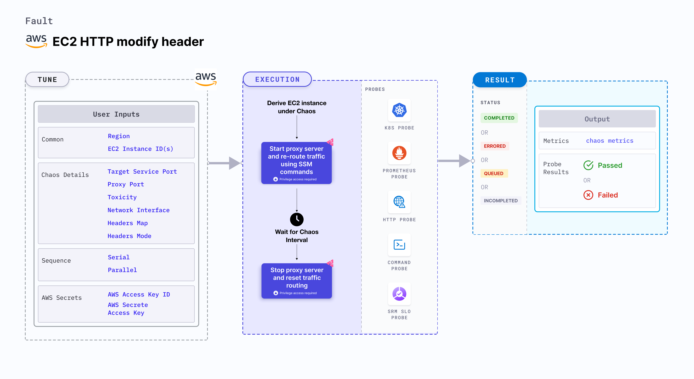

## Introduction

EC2 HTTP modify header injects HTTP chaos which affects the request (or response) by modifying the status code (or the body or the headers) by starting the proxy server and redirecting the traffic through the proxy server. This fault modifies the headers of requests and responses of the service. 



## Use cases

EC2 HTTP modify header tests the resilience of the application to incorrect or incomplete headers.

:::info note
- Kubernetes version 1.17 or later is required to execute this fault.
- You can pass the VM credentials as secrets or as a `ChaosEngine` environment variable.
- The EC2 instance should be in a healthy state.
- SSM agent is installed and running in the target EC2 instance.
- The Kubernetes secret should have the AWS Access Key ID and Secret Access Key credentials in the `CHAOS_NAMESPACE`. A secret file looks like:
  ```yaml
  apiVersion: v1
  kind: Secret
  metadata:
    name: cloud-secret
  type: Opaque
  stringData:
    cloud_config.yml: |-
      # Add the cloud AWS credentials respectively
      [default]
      aws_access_key_id = XXXXXXXXXXXXXXXXXXX
      aws_secret_access_key = XXXXXXXXXXXXXXXXXXXXXXXXXXXXXXXXXXXX
  ```
- We recommend that you use the same secret name, that is, `cloud-secret`. Otherwise, you will need to update the `AWS_SHARED_CREDENTIALS_FILE` environment variable in the fault template and you won't be able to use the default health check probes. 
- Go to [AWS named profile for chaos](./security-configurations/aws-switch-profile) to use a different profile for AWS faults and [superset permission or policy](./security-configurations/policy-for-all-aws-faults) to execute all AWS faults.
- Go to the [common attributes](../common-tunables-for-all-faults) to tune the common tunables for all the faults.
:::


Below is an example AWS policy to execute the fault.

```json
{
    "Version": "2012-10-17",
    "Statement": [
        {
            "Effect": "Allow",
            "Action": [
                "ssm:GetDocument",
                "ssm:DescribeDocument",
                "ssm:GetParameter",
                "ssm:GetParameters",
                "ssm:SendCommand",
                "ssm:CancelCommand",
                "ssm:CreateDocument",
                "ssm:DeleteDocument",
                "ssm:GetCommandInvocation",          
                "ssm:UpdateInstanceInformation",
                "ssm:DescribeInstanceInformation"
            ],
            "Resource": "*"
        },
        {
            "Effect": "Allow",
            "Action": [
                "ec2messages:AcknowledgeMessage",
                "ec2messages:DeleteMessage",
                "ec2messages:FailMessage",
                "ec2messages:GetEndpoint",
                "ec2messages:GetMessages",
                "ec2messages:SendReply"
            ],
            "Resource": "*"
        },
        {
            "Effect": "Allow",
            "Action": [
                "ec2:DescribeInstanceStatus",
                "ec2:DescribeInstances"
            ],
            "Resource": [
                "*"
            ]
        }
    ]
}
```

## Fault tunables

   <h3>Mandatory tunables</h3>
    <table>
        <tr>
            <th> Tunable </th>
            <th> Description </th>
            <th> Notes </th>
        </tr>
        <tr>
          <td> EC2_INSTANCE_ID </td>
          <td> ID of the target EC2 instance. </td>
          <td> For example, <code>i-044d3cb4b03b8af1f</code>. </td>
        </tr>
        <tr>
          <td> REGION </td>
          <td> The AWS region ID where the EC2 instance has been created. </td>
          <td> For example, <code>us-east-1</code>. </td>
        </tr>
        <tr>
            <td> TARGET_SERVICE_PORT </td>
            <td> Port of the service to target. </td>
            <td> Default: port 80. </td>
        </tr>
        <tr>
            <td> HEADERS_MAP </td>
            <td> Map of headers to modify (or add). </td>
            <td> For example, &#123;"X-Litmus-Test-Header":"X-Litmus-Test-Value"&#125;. To remove a header, just set the value to ""; For example: &#123;"X-Litmus-Test-Header": ""&#125; </td>
        </tr>
        <tr>
            <td> HEADER_MODE </td>
            <td> Whether to modify response headers or request headers. Accepted values: request, response.</td>
            <td> Default: response. </td>
        </tr>
    </table>
    <h2>Optional tunables</h2>
    <table>
        <tr>
            <th> Tunable </th>
            <th> Description </th>
            <th> Notes </th>
        </tr>
        <tr>
            <td> TOTAL_CHAOS_DURATION </td>
            <td> Duration that you specify, through which chaos is injected into the target resource (in seconds). </td>
            <td> Default: 30 s. </td>
        </tr>
        <tr>
            <td> CHAOS_INTERVAL </td>
            <td> Time interval between two successive instance terminations (in seconds). </td>
            <td> Default: 30 s. </td>
        </tr>
        <tr>
            <td> AWS_SHARED_CREDENTIALS_FILE </td>
            <td> Provide the path for aws secret credentials.</td>
            <td> Default: <code>/tmp/cloud_config.yml</code>. </td>
        </tr>
        <tr>
            <td> SEQUENCE </td>
            <td> It defines the sequence of chaos execution for multiple instances. </td>
            <td> Default: parallel. Supports serial sequence. </td>
        </tr>
        <tr>
            <td> RAMP_TIME </td>
            <td> Period to wait before and after injection of chaos (in seconds). </td>
            <td> For example, 30 s. </td>
        </tr>
        <tr>
            <td> INSTALL_DEPENDENCY </td>
            <td> Select to install dependencies used to run the network chaos. It can be either True or False. </td>
            <td> If the dependency already exists, you can turn it off. Defaults to True.</td>
        </tr>
        <tr>
            <td> PROXY_PORT </td>
            <td> Port where the proxy will be listening for requests.</td>
            <td> Default: 20000. </td>
        </tr>
        <tr>
            <td> TOXICITY </td>
            <td> Percentage of HTTP requests to be affected. </td>
            <td> Default: 100. </td>
        </tr>
        <tr>
          <td> NETWORK_INTERFACE </td>
          <td> Network interface to be used for the proxy. </td>
          <td> Default: `eth0`. </td>
        </tr>
    </table>

### Target service port

Port of the target service. Tune it by using the `TARGET_SERVICE_PORT` environment variable.

The following YAML snippet illustrates the use of this environment variable:

[embedmd]:# (./static/manifests/http-modify-header/target-service-port.yaml yaml)
```yaml
## provide the port of the targeted service
apiVersion: litmuschaos.io/v1alpha1
kind: ChaosEngine
metadata:
  name: engine-nginx
spec:
  engineState: "active"
  chaosServiceAccount: litmus-admin
  experiments:
  - name: ec2-http-modify-header
    spec:
      components:
        env:
        # provide the port of the targeted service
        - name: TARGET_SERVICE_PORT
          value: "80"
```

### Modifying the response headers

Body string to modify the response header. Tune it by using the `HEADER_MAP` environment variable. `HEADER_MODE` environment variable is used to choose between modifying the request or response headers.

:::tip
`HTTP_CHAOS_TYPE` should be provided as `header`.
:::

The following YAML snippet illustrates the use of this environment variable:

[embedmd]:# (./static/manifests/http-modify-header/response-headers.yaml yaml)
```yaml
## provide the headers as a map
apiVersion: litmuschaos.io/v1alpha1
kind: ChaosEngine
metadata:
  name: engine-nginx
spec:
  engineState: "active"
  chaosServiceAccount: litmus-admin
  experiments:
  - name: ec2-http-modify-header
    spec:
      components:
        env:
        # map of headers to modify/add; For example, {"X-Litmus-Test-Header": "X-Litmus-Test-Value"}
        # to remove a header, just set the value to ""; For example, {"X-Litmus-Test-Header": ""}
        - name: HEADERS_MAP
          value: '{"X-Litmus-Test-Header": "X-Litmus-Test-Value"}'
        # whether to modify response headers or request headers. Accepted values: request, response
        - name: HEADER_MODE
          value: 'response'
        # provide the port of the targeted service
        - name: TARGET_SERVICE_PORT
          value: "80"
```

### Modifying the request headers

Body string to modify the request header. Tune it by using the `HEADERS_MAP` environment variable. `HEADER_MODE` environment variable is used to choose between modifying the request or response headers.

:::tip
`HTTP_CHAOS_TYPE` should be provided as `header`.
:::

The following YAML snippet illustrates the use of this environment variable:

[embedmd]:# (./static/manifests/http-modify-header/response-headers.yaml yaml)
```yaml
## provide the headers as a map
apiVersion: litmuschaos.io/v1alpha1
kind: ChaosEngine
metadata:
  name: engine-nginx
spec:
  engineState: "active"
  chaosServiceAccount: litmus-admin
  experiments:
  - name: ec2-http-modify-header
    spec:
      components:
        env:
        # map of headers to modify/add; For example, {"X-Litmus-Test-Header": "X-Litmus-Test-Value"}
        # to remove a header, just set the value to ""; For example, {"X-Litmus-Test-Header": ""}
        - name: HEADERS_MAP
          value: '{"X-Litmus-Test-Header": "X-Litmus-Test-Value"}'
        # whether to modify response headers or request headers. Accepted values: request, response
        - name: HEADER_MODE
          value: 'response'
        # provide the port of the targeted service
        - name: TARGET_SERVICE_PORT
          value: "80"
```

### Proxy port

Port where the proxy server listens for requests. Tune it by using the `PROXY_PORT` environment variable.

The following YAML snippet illustrates the use of this environment variable:

[embedmd]:# (./static/manifests/http-modify-header/proxy-port.yaml yaml)
```yaml
# provide the port for proxy server
apiVersion: litmuschaos.io/v1alpha1
kind: ChaosEngine
metadata:
  name: engine-nginx
spec:
  engineState: "active"
  chaosServiceAccount: litmus-admin
  experiments:
  - name: ec2-http-modify-header
    spec:
      components:
        env:
        # provide the port for proxy server
        - name: PROXY_PORT
          value: '8080'
        # provide the port of the targeted service
        - name: TARGET_SERVICE_PORT
          value: "80"
```

### Toxicity

Percentage of the total number of HTTP requests that are affected. Tune it by using the `TOXICITY` environment variable.

The following YAML snippet illustrates the use of this environment variable:

[embedmd]:# (./static/manifests/http-modify-header/toxicity.yaml yaml)
```yaml
## provide the toxicity
apiVersion: litmuschaos.io/v1alpha1
kind: ChaosEngine
metadata:
  name: engine-nginx
spec:
  engineState: "active"
  chaosServiceAccount: litmus-admin
  experiments:
  - name: ec2-http-modify-header
    spec:
      components:
        env:
        # toxicity is the probability of the request that is affected
        # provide the percentage value in the range of 0-100
        # 0 means no request will be affected and 100 means all requests will be affected
        - name: TOXICITY
          value: "100"
        # provide the port of the targeted service
        - name: TARGET_SERVICE_PORT
          value: "80"
```

### Network interface

Network interface used for the proxy. Tune it by using the `NETWORK_INTERFACE` environment variable.

The following YAML snippet illustrates the use of this environment variable:

[embedmd]:# (./static/manifests/http-modify-header/network-interface.yaml yaml)
```yaml
## provide the network interface for proxy
apiVersion: litmuschaos.io/v1alpha1
kind: ChaosEngine
metadata:
  name: engine-nginx
spec:
  engineState: "active"
  chaosServiceAccount: litmus-admin
  experiments:
  - name: ec2-http-modify-header
    spec:
      components:
        env:
        # provide the network interface for proxy
        - name: NETWORK_INTERFACE
          value: "eth0"
        # provide the port of the targeted service
        - name: TARGET_SERVICE_PORT
          value: '80'
```