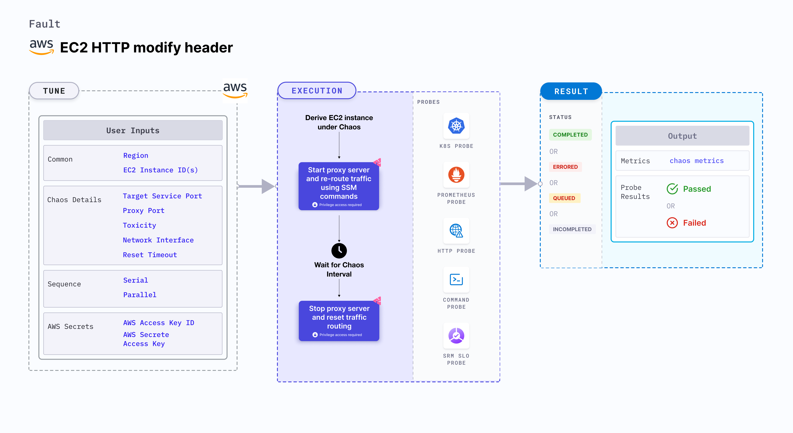

## Introduction

EC2 HTTP reset peer injects HTTP reset on the service whose port is specified using the `TARGET_SERVICE_PORT` environment variable. This fault stops the outgoing HTTP requests by resetting the TCP connection for the requests.



## Use cases
EC2 HTTP reset peer:
- Verifies connection timeout by simulating premature connection loss (firewall issues or other issues) between microservices.
- Simulates connection resets due to resource limitations on the server side like out of memory server (or process killed or overload on the server due to a high amount of traffic). 
- Determines the application's resilience to a lossy (or flaky) HTTP connection.

:::info note
- Kubernetes version 1.17 or later is required to execute this fault.
- The EC2 instance should be in a healthy state.
- SSM agent is installed and running in the target EC2 instance.
- You can pass the VM credentials as secrets or as an chaosengine environment variable.
- The Kubernetes secret should have the AWS Access Key ID and Secret Access Key credentials in the `CHAOS_NAMESPACE`. Below is the sample secret file:
  ```yaml
  apiVersion: v1
  kind: Secret
  metadata:
    name: cloud-secret
  type: Opaque
  stringData:
    cloud_config.yml: |-
      # Add the cloud AWS credentials respectively
      [default]
      aws_access_key_id = XXXXXXXXXXXXXXXXXXX
      aws_secret_access_key = XXXXXXXXXXXXXXXXXXXXXXXXXXXXXXXXXXXX
  ```
- We recommend that you use the same secret name, that is, `cloud-secret`. Otherwise, you will need to update the `AWS_SHARED_CREDENTIALS_FILE` environment variable in the fault template and you won't be able to use the default health check probes. 
- Go to [AWS named profile for chaos](./security-configurations/aws-switch-profile) to use a different profile for AWS faults and [superset permission or policy](./security-configurations/policy-for-all-aws-faults) to execute all AWS faults.
:::

Below is an example AWS policy to execute the fault.

```json
{
    "Version": "2012-10-17",
    "Statement": [
        {
            "Effect": "Allow",
            "Action": [
                "ssm:GetDocument",
                "ssm:DescribeDocument",
                "ssm:GetParameter",
                "ssm:GetParameters",
                "ssm:SendCommand",
                "ssm:CancelCommand",
                "ssm:CreateDocument",
                "ssm:DeleteDocument",
                "ssm:GetCommandInvocation",          
                "ssm:UpdateInstanceInformation",
                "ssm:DescribeInstanceInformation"
            ],
            "Resource": "*"
        },
        {
            "Effect": "Allow",
            "Action": [
                "ec2messages:AcknowledgeMessage",
                "ec2messages:DeleteMessage",
                "ec2messages:FailMessage",
                "ec2messages:GetEndpoint",
                "ec2messages:GetMessages",
                "ec2messages:SendReply"
            ],
            "Resource": "*"
        },
        {
            "Effect": "Allow",
            "Action": [
                "ec2:DescribeInstanceStatus",
                "ec2:DescribeInstances"
            ],
            "Resource": [
                "*"
            ]
        }
    ]
}
```

## Fault tunables

  <h3>Mandatory tunables</h3>
    <table>
        <tr>
            <th> Tunable </th>
            <th> Description </th>
            <th> Notes </th>
        </tr>
        <tr>
          <td> EC2_INSTANCE_ID </td>
          <td> ID of the target EC2 instance. </td>
          <td> For example, <code>i-044d3cb4b03b8af1f</code>. </td>
        </tr>
        <tr>
          <td> REGION </td>
          <td> The AWS region ID where the EC2 instance has been created. </td>
          <td> For example, <code>us-east-1</code>. </td>
        </tr>
        <tr>
            <td> RESET_TIMEOUT </td>
            <td> Duration after which the connection is reset.</td>
            <td> Default: 0. </td>
        </tr>
        <tr>
            <td> TARGET_SERVICE_PORT </td>
            <td> Port of the service to target. </td>
            <td> Default: port 80. </td>
        </tr>
    </table>
    <h3>Optional tunable</h3>
    <table>
        <tr>
            <th> Tunable </th>
            <th> Description </th>
            <th> Notes </th>
        </tr>
        <tr>
            <td> TOTAL_CHAOS_DURATION </td>
            <td> Duration that you specify, through which chaos is injected into the target resource (in seconds). </td>
            <td> Default: 30 s. </td>
        </tr>
        <tr>
            <td> CHAOS_INTERVAL </td>
            <td> Time interval between two successive instance terminations (in seconds). </td>
            <td> Default: 30 s. </td>
        </tr>
        <tr>
            <td> AWS_SHARED_CREDENTIALS_FILE </td>
            <td> Provide the path for AWS secret credentials.</td>
            <td> Default: <code>/tmp/cloud_config.yml</code>. </td>
        </tr>
        <tr>
            <td> SEQUENCE </td>
            <td> It defines the sequence of chaos execution for multiple instances. </td>
            <td> Default: parallel. Supports serial sequence. </td>
        </tr>
        <tr>
            <td> RAMP_TIME </td>
            <td> Period to wait before and after injection of chaos (in seconds). </td>
            <td> For example, 30. </td>
        </tr>
        <tr>
            <td> INSTALL_DEPENDENCY </td>
            <td> Select to install dependencies used to run the network chaos. It can be either True or False. </td>
            <td> If the dependency already exists, you can turn it off. Defaults to True.</td>
        </tr>
        <tr>
            <td> PROXY_PORT </td>
            <td> Port where the proxy will be listening to requests.</td>
            <td> Default: 20000. </td>
        </tr>
        <tr>
            <td> TOXICITY </td>
            <td> Percentage of HTTP requests to be affected. </td>
            <td> Default: 100. </td>
        </tr>
        <tr>
          <td> NETWORK_INTERFACE </td>
          <td> Network interface to be used for the proxy.</td>
          <td> Default: `eth0`. </td>
        </tr>
    </table>

### Target service port

Port of the target service. Tune it by using the `TARGET_SERVICE_PORT` environment variable.

The following YAML snippet illustrates the use of this environment variable:

[embedmd]:# (./static/manifests/http-reset-peer/target-service-port.yaml yaml)
```yaml
## provide the port of the targeted service
apiVersion: litmuschaos.io/v1alpha1
kind: ChaosEngine
metadata:
  name: engine-nginx
spec:
  engineState: "active"
  chaosServiceAccount: litmus-admin
  experiments:
  - name: ec2-http-reset-peer
    spec:
      components:
        env:
        # provide the port of the targeted service
        - name: TARGET_SERVICE_PORT
          value: "80"
```

### Proxy port

Port where the proxy server listens for requests. Tune it by using the `PROXY_PORT` environment variable.

The following YAML snippet illustrates the use of this environment variable:

[embedmd]:# (./static/manifests/http-reset-peer/proxy-port.yaml yaml)
```yaml
# provide the port for proxy server
apiVersion: litmuschaos.io/v1alpha1
kind: ChaosEngine
metadata:
  name: engine-nginx
spec:
  engineState: "active"
  chaosServiceAccount: litmus-admin
  experiments:
  - name: ec2-http-reset-peer
    spec:
      components:
        env:
        # provide the port for proxy server
        - name: PROXY_PORT
          value: '8080'
        # provide the port of the targeted service
        - name: TARGET_SERVICE_PORT
          value: "80"
```

### Reset timeout

Duration after which the connection is reset, that is, the value added to the HTTP request. Tune it by using the `RESET_TIMEOUT` environment variable.

The following YAML snippet illustrates the use of this environment variable:

[embedmd]:# (./static/manifests/http-reset-peer/reset-timeout.yaml yaml)
```yaml
## provide the reset timeout value
apiVersion: litmuschaos.io/v1alpha1
kind: ChaosEngine
metadata:
  name: engine-nginx
spec:
  engineState: "active"
  chaosServiceAccount: litmus-admin
  experiments:
  - name: ec2-http-reset-peer
    spec:
      components:
        env:
        # reset timeout specifies after how much duration to reset the connection
        - name: RESET_TIMEOUT #in ms
          value: '2000'
        # provide the port of the targeted service
        - name: TARGET_SERVICE_PORT
          value: "80"
```

### Toxicity

Percentage of the total number of HTTP requests that are affected. Tune it by using the `TOXICITY` environment variable.

The following YAML snippet illustrates the use of this environment variable:

[embedmd]:# (./static/manifests/http-reset-peer/toxicity.yaml yaml)
```yaml
## provide the toxicity
apiVersion: litmuschaos.io/v1alpha1
kind: ChaosEngine
metadata:
  name: engine-nginx
spec:
  engineState: "active"
  chaosServiceAccount: litmus-admin
  experiments:
  - name: ec2-http-reset-peer
    spec:
      components:
        env:
        # toxicity is the probability of the request that is affected
        # provide the percentage value in the range of 0-100
        # 0 means no request will be affected and 100 means all requests will be affected
        - name: TOXICITY
          value: "100"
        # provide the port of the targeted service
        - name: TARGET_SERVICE_PORT
          value: "80"
```

### Network interface

Network interface used for the proxy. Tune it by using the `NETWORK_INTERFACE` environment variable.

The following YAML snippet illustrates the use of this environment variable:

[embedmd]:# (./static/manifests/http-reset-peer/network-interface.yaml yaml)
```yaml
## provide the network interface for proxy
apiVersion: litmuschaos.io/v1alpha1
kind: ChaosEngine
metadata:
  name: engine-nginx
spec:
  engineState: "active"
  chaosServiceAccount: litmus-admin
  experiments:
  - name: ec2-http-reset-peer
    spec:
      components:
        env:
        # provide the network interface for proxy
        - name: NETWORK_INTERFACE
          value: "eth0"
        # provide the port of the targeted service
        - name: TARGET_SERVICE_PORT
          value: '80'
```