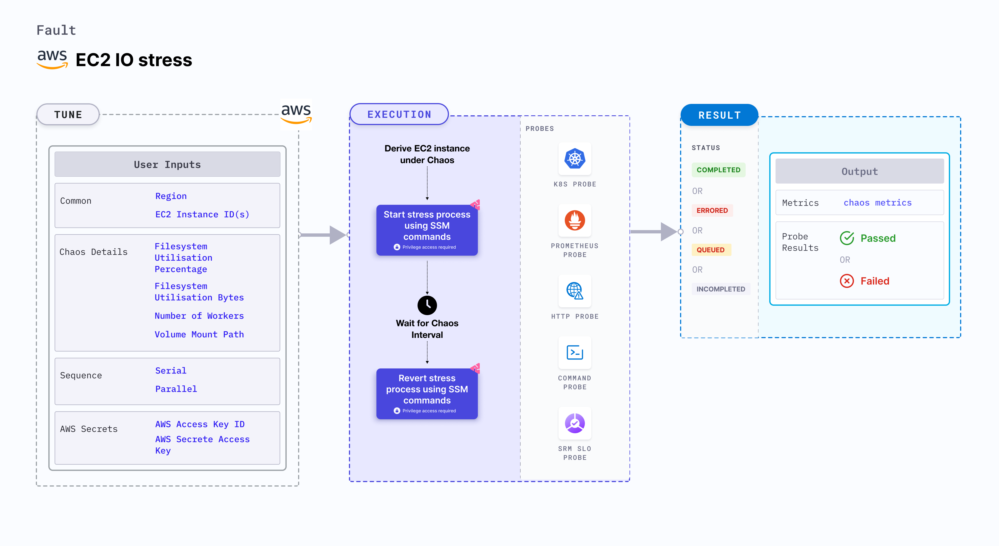

## Introduction

EC2 IO stress disrupts the state of infrastructure resources. This fault:
- Induces stress on AWS EC2 instance using Amazon SSM Run command. The SSM Run command is executed using SSM documentation that is built into the fault.
- Causes IO stress on the EC2 instance for a specific duration.



## Use cases

EC2 IO stress:
- Simulates slower disk operations by the application.
- Simulates noisy neighbour problems by hogging the disk bandwidth.
- Verifies the disk performance on increasing IO threads and varying IO block sizes.
- Checks how the application functions under high disk latency conditions, when IO traffic is high and includes large I/O blocks, and when other services monopolize the IO disks. 


:::info note
- Kubernetes version 1.17 or later is required to execute the fault.
- The EC2 instance should be in a healthy state.
- SSM agent should be installed and running on the target EC2 instance.
- The Kubernetes secret should have the AWS Access Key ID and Secret Access Key credentials in the `CHAOS_NAMESPACE`. Below is a sample secret file:
  ```yaml
  apiVersion: v1
  kind: Secret
  metadata:
    name: cloud-secret
  type: Opaque
  stringData:
    cloud_config.yml: |-
      # Add the cloud AWS credentials respectively
      [default]
      aws_access_key_id = XXXXXXXXXXXXXXXXXXX
      aws_secret_access_key = XXXXXXXXXXXXXXXXXXXXXXXXXXXXXXXXXXXX
  ```
- We recommend you use the same secret name, that is, `cloud-secret`. Otherwise, you will need to update the `AWS_SHARED_CREDENTIALS_FILE` environment variable in the fault template, and you won't be able to use the default health check probes. 
- Go to [AWS named profile for chaos](./security-configurations/aws-switch-profile) to use a different profile for AWS faults, and the [superset permission/policy](./security-configurations/policy-for-all-aws-faults) to execute all AWS faults.
:::

Below is an example AWS policy to execute the fault.

```json
{
    "Version": "2012-10-17",
    "Statement": [
        {
            "Effect": "Allow",
            "Action": [
                "ssm:GetDocument",
                "ssm:DescribeDocument",
                "ssm:GetParameter",
                "ssm:GetParameters",
                "ssm:SendCommand",
                "ssm:CancelCommand",
                "ssm:CreateDocument",
                "ssm:DeleteDocument",
                "ssm:GetCommandInvocation",          
                "ssm:UpdateInstanceInformation",
                "ssm:DescribeInstanceInformation"
            ],
            "Resource": "*"
        },
        {
            "Effect": "Allow",
            "Action": [
                "ec2messages:AcknowledgeMessage",
                "ec2messages:DeleteMessage",
                "ec2messages:FailMessage",
                "ec2messages:GetEndpoint",
                "ec2messages:GetMessages",
                "ec2messages:SendReply"
            ],
            "Resource": "*"
        },
        {
            "Effect": "Allow",
            "Action": [
                "ec2:DescribeInstanceStatus",
                "ec2:DescribeInstances"
            ],
            "Resource": [
                "*"
            ]
        }
    ]
}
```

## Fault tunables

<h3>Mandatory tunables</h3>
<table>
    <tr>
        <th> Tunable </th>
        <th> Description </th>
        <th> Notes </th>
    </tr>
    <tr>
        <td> EC2_INSTANCE_ID </td>
        <td> ID of the target EC2 instance. </td>
        <td> For example, <code>i-044d3cb4b03b8af1f</code>. </td>
    </tr>
    <tr>
        <td> REGION </td>
        <td> The AWS region ID where the EC2 instance has been created. </td>
        <td> For example, <code>us-east-1</code>. </td>
    </tr>
</table>

<h3>Optional tunables</h3>
<table>
    <tr>
        <th> Tunable </th>
        <th> Description </th>
        <th> Notes </th>
    </tr>
    <tr>
        <td> TOTAL_CHAOS_DURATION </td>
        <td> Duration to insert chaos (in seconds). </td>
        <td> Default: 30 s. </td>
    </tr>
    <tr>
        <td> CHAOS_INTERVAL </td>
        <td> Time interval between two successive instance terminations (in seconds).</td>
        <td> Default: 60 s. </td>
    </tr>
    <tr>
        <td> AWS_SHARED_CREDENTIALS_FILE </td>
        <td> Path to the AWS secret credentials.</td>
        <td> Default: <code>/tmp/cloud_config.yml</code>. </td>
    </tr>
    <tr>
        <td> INSTALL_DEPENDENCIES </td>
        <td> Install dependencies used to run IO chaos. It can be 'True' or 'False'.</td>
        <td> If the dependency already exists, you can turn it off. Defaults to True. </td>
    </tr>
    <tr>
        <td> FILESYSTEM_UTILIZATION_PERCENTAGE </td>
        <td> Specify the size as percentage of free space on the file system. </td>
        <td> Default: 0 %. Results in 1 GB utilization. </td>
    </tr>
    <tr>
        <td> FILESYSTEM_UTILIZATION_BYTES </td>
        <td> Specify the size in gigabytes(GB). <code>FILESYSTEM_UTILIZATION_PERCENTAGE</code> and <code>FILESYSTEM_UTILIZATION_BYTES</code> are mutually exclusive. If both are provided, <code>FILESYSTEM_UTILIZATION_PERCENTAGE</code> is prioritized. </td>
        <td> Default: 0 GB. Results in 1 GB Utilization. </td>
    </tr>
    <tr>
        <td> NUMBER_OF_WORKERS </td>
        <td> Number of IO workers involved in IO stress. </td>
        <td> Default: 4. </td>
    </tr>
    <tr>
        <td> VOLUME_MOUNT_PATH </td>
        <td> Fill the given volume mount path.</td>
        <td> Default: User HOME directory. </td>
    </tr>
    <tr>
        <td> SEQUENCE </td>
        <td> Sequence of chaos execution for multiple instances.</td>
        <td> Default: parallel. Supports serial and parallel. </td>
    </tr>
    <tr>
        <td> RAMP_TIME </td>
        <td> Period to wait before and after injecting chaos (in seconds). </td>
        <td> For example, 30 s. </td>
    </tr>
</table>


### File system utilization in megabytes

Amount of file system that is utilized on the EC2 instance (in megabytes). Tune it by using the `FILESYSTEM_UTILIZATION_BYTES` environment variable.

The following YAML snippet illustrates the use of this environment variable:

[embedmd]:# (./static/manifests/ec2-io-stress/filesystem-bytes.yaml yaml)
```yaml
# filesystem bytes to utilize
apiVersion: litmuschaos.io/v1alpha1
kind: ChaosEngine
metadata:
  name: engine-nginx
spec:
  engineState: "active"
  chaosServiceAccount: litmus-admin
  experiments:
  - name: ec2-io-stress
    spec:
      components:
        env:
        - name: FILESYSTEM_UTILIZATION_BYTES
          value: '1024'
        # ID of the EC2 instance
        - name: EC2_INSTANCE_ID
          value: 'instance-1'
        # region for the EC2 instance
        - name: REGION
          value: 'us-east-1'
```

### File system utilization in percentage

Amount of file system that is utilized on the EC2 instance (in percentage). Tune it by using the `FILESYSTEM_UTILIZATION_PERCENTAGE` environment variable.

The following YAML snippet illustrates the use of this environment variable:

[embedmd]:# (./static/manifests/ec2-io-stress/filesystem-percentage.yaml yaml)
```yaml
# filesystem percentage to utilize
apiVersion: litmuschaos.io/v1alpha1
kind: ChaosEngine
metadata:
  name: engine-nginx
spec:
  engineState: "active"
  chaosServiceAccount: litmus-admin
  experiments:
  - name: ec2-io-stress
    spec:
      components:
        env:
        - name: FILESYSTEM_UTILIZATION_PERCENTAGE
          value: '50'
        # ID of the EC2 instance
        - name: EC2_INSTANCE_ID
          value: 'instance-1'
        # region for the EC2 instance
        - name: REGION
          value: 'us-east-1'
```

### Multiple workers

CPU threads that need to be run to increase the file system utilization. This increases the amount of file system consumed. Tune it using the `NUMBER_OF_WORKERS` environment variable.

The following YAML snippet illustrates the use of this environment variable:

[embedmd]:# (./static/manifests/ec2-io-stress/multiple-workers.yaml yaml)
```yaml
# multiple workers to utilize resources
apiVersion: litmuschaos.io/v1alpha1
kind: ChaosEngine
metadata:
  name: engine-nginx
spec:
  engineState: "active"
  chaosServiceAccount: litmus-admin
  experiments:
  - name: ec2-io-stress
    spec:
      components:
        env:
        - name: NUMBER_OF_WORKERS
          value: '3'
        # ID of the EC2 instance
        - name: EC2_INSTANCE_ID
          value: 'instance-1'
        # region for the EC2 instance
        - name: REGION
          value: 'us-east-1'
```

### Volume mount path

Volume mount path to the target attached to the EC2 instance. Tune it by using the `VOLUME_MOUNT_PATH` environment variable.

The following YAML snippet illustrates the use of this environment variable:

[embedmd]:# (./static/manifests/ec2-io-stress/volume-path.yaml yaml)
```yaml
# volume path to be used for io stress
apiVersion: litmuschaos.io/v1alpha1
kind: ChaosEngine
metadata:
  name: engine-nginx
spec:
  engineState: "active"
  chaosServiceAccount: litmus-admin
  experiments:
  - name: ec2-io-stress
    spec:
      components:
        env:
        - name: VOLUME_MOUNT_PATH
          value: '/tmp'
        # ID of the EC2 instance
        - name: EC2_INSTANCE_ID
          value: 'instance-1'
        # region for the EC2 instance
        - name: REGION
          value: 'us-east-1'
```

### Multiple EC2 instances 

Multiple EC2 instances as comma-separated IDs that are target in one chaos run. Tune it by using the `EC2_INSTANCE_ID` environment variable.

The following YAML snippet illustrates the use of this environment variable:

[embedmd]:# (./static/manifests/ec2-io-stress/multiple-instances.yaml yaml)
```yaml
# multiple instance targets
apiVersion: litmuschaos.io/v1alpha1
kind: ChaosEngine
metadata:
  name: engine-nginx
spec:
  engineState: "active"
  chaosServiceAccount: litmus-admin
  experiments:
  - name: ec2-io-stress
    spec:
      components:
        env:
        # ids of the EC2 instances
        - name: EC2_INSTANCE_ID
          value: 'instance-1,instance-2'
        # region for the EC2 instance
        - name: REGION
          value: 'us-east-1'
```