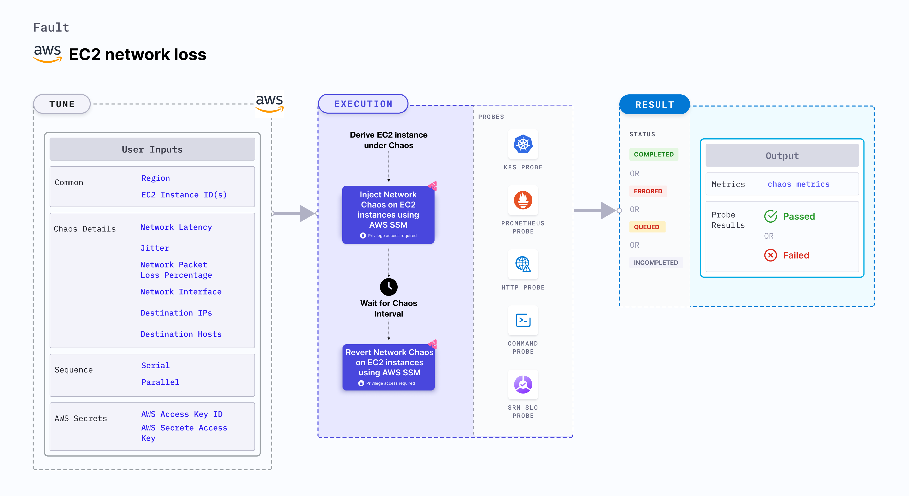

## Introduction

EC2 network loss causes flaky access to the application (or services) by injecting network packet loss to EC2 instance(s). This fault:
- Degrades the network without marking the EC2 instance as unhealthy (or unworthy) of traffic, which is resolved using a middleware that switches traffic based on SLOs (performance parameters).
- May stall the EC2 instance or get corrupted waiting endlessly for a packet. 
- Limits the impact (blast radius) to the traffic that you wish to test, by specifying the IP addresses.



## Use cases
EC2 network loss:
- Determines the performance of the application (or process) running on the EC2 instances.
- Simulates a consistently slow network connection between microservices (for example, cross-region connectivity between active-active peers of a given service or across services or poor cni-performance in the inter-pod-communication network). 
- Simulates jittery connection with transient latency spikes between microservices.
- Simulates a slow response on specific third party (or dependent) components (or services), and degraded data-plane of service-mesh infrastructure.


:::info note
- Kubernetes version 1.17 or later is required to execute the fault.
- SSM agent is installed and running on the target EC2 instance.
- The EC2 instance should be in a healthy state.
- The Kubernetes secret should have the AWS Access Key ID and Secret Access Key credentials in the `CHAOS_NAMESPACE`. Below is the sample secret file:
  ```yaml
  apiVersion: v1
  kind: Secret
  metadata:
    name: cloud-secret
  type: Opaque
  stringData:
    cloud_config.yml: |-
      # Add the cloud AWS credentials respectively
      [default]
      aws_access_key_id = XXXXXXXXXXXXXXXXXXX
      aws_secret_access_key = XXXXXXXXXXXXXXXXXXXXXXXXXXXXXXXXXXXX
  ```
- We recommend you use the same secret name, that is, `cloud-secret`. Otherwise, you will need to update the `AWS_SHARED_CREDENTIALS_FILE` environment variable in the fault template, and you won't be able to use the default health check probes. 
- Go to [AWS named profile for chaos](./security-configurations/aws-switch-profile) to use a different profile for AWS faults and the [superset permission/policy](./security-configurations/policy-for-all-aws-faults) to execute all AWS faults.
- Go to the [common tunables](../common-tunables-for-all-faults) to tune the common tunables for all the faults.
:::

Below is an example AWS policy to execute the fault.

```json
{
    "Version": "2012-10-17",
    "Statement": [
        {
            "Effect": "Allow",
            "Action": [
                "ssm:GetDocument",
                "ssm:DescribeDocument",
                "ssm:GetParameter",
                "ssm:GetParameters",
                "ssm:SendCommand",
                "ssm:CancelCommand",
                "ssm:CreateDocument",
                "ssm:DeleteDocument",
                "ssm:GetCommandInvocation",          
                "ssm:UpdateInstanceInformation",
                "ssm:DescribeInstanceInformation"
            ],
            "Resource": "*"
        },
        {
            "Effect": "Allow",
            "Action": [
                "ec2messages:AcknowledgeMessage",
                "ec2messages:DeleteMessage",
                "ec2messages:FailMessage",
                "ec2messages:GetEndpoint",
                "ec2messages:GetMessages",
                "ec2messages:SendReply"
            ],
            "Resource": "*"
        },
        {
            "Effect": "Allow",
            "Action": [
                "ec2:DescribeInstanceStatus",
                "ec2:DescribeInstances"
            ],
            "Resource": [
                "*"
            ]
        }
    ]
}
```

## Fault tunables
 <h3>Mandatory tunables</h3>
    <table>
      <tr>
        <th> Tunable </th>
        <th> Description </th>
        <th> Notes </th>
      </tr>
      <tr>
        <td> EC2_INSTANCE_ID </td>
        <td> ID of the target EC2 instance. </td>
        <td> For example, <code>i-044d3cb4b03b8af1f</code>. </td>
      </tr>
      <tr>
        <td> REGION </td>
        <td> The AWS region ID where the EC2 instance has been created. </td>
        <td> For example, <code>us-east-1</code>. </td>
      </tr>
    </table>
    <h3>Optional tunables</h3>
    <table>
        <tr>
            <th> Tunable </th>
            <th> Description </th>
            <th> Notes </th>
        </tr>
        <tr>
            <td> TOTAL_CHAOS_DURATION </td>
            <td> Duration that you specify, through which chaos is injected into the target resource (in seconds). </td>
            <td> Default: 30 s. </td>
        </tr>
        <tr>
            <td> CHAOS_INTERVAL </td>
            <td> Time interval between two successive instance terminations (in seconds). </td>
            <td> Default: 30 s. </td>
        </tr>
        <tr>
            <td> AWS_SHARED_CREDENTIALS_FILE </td>
            <td> Provide the path for aws secret credentials.</td>
            <td> Default: <code>/tmp/cloud_config.yml</code>.</td>
        </tr>
        <tr>
            <td> INSTALL_DEPENDENCY </td>
            <td> Select to install dependencies used to run the network chaos. It can be either True or False. </td>
            <td> If the dependency already exists, you can turn it off. Default: True.</td>
        </tr>
        <tr>
            <td> NETWORK_PACKET_LOSS_PERCENTAGE </td>
            <td> The packet loss in percentage. </td>
            <td> Default: 100 %. </td>
        </tr>
        <tr>
            <td> DESTINATION_IPS </td>
            <td> IP addresses of the services or the CIDR blocks(range of IPs), the accessibility to which is impacted. </td>
            <td> Comma-separated IP(S) or CIDR(S) can be provided. If not provided, the fault induces network chaos for all IPs/destinations. </td>
        </tr>
        <tr>
            <td> DESTINATION_HOSTS </td>
            <td> DNS Names of the services, the accessibility to which, is impacted. </td>
            <td> Ff not provided, the fault induces network chaos for all IPs/destinations or DESTINATION_IPS if already defined. </td>
        </tr>
        <tr>
            <td> NETWORK_INTERFACE </td>
            <td> Name of ethernet interface considered for shaping traffic. </td>
            <td> Default: `eth0`. </td>
        </tr>
        <tr>
            <td> SEQUENCE </td>
            <td> It defines sequence of chaos execution for multiple instance. </td>
            <td> Default: parallel. Supports serial sequence. </td>
        </tr>
        <tr>
            <td> RAMP_TIME </td>
            <td> Period to wait before and after injecting chaos (in seconds).  </td>
            <td> For example, 30 s </td>
        </tr>
    </table>

### Network packet loss

Network packet loss percentage that is injected on the EC2 instances. Tune it by using the `NETWORK_PACKET_LOSS_PERCENTAGE` environment variable.

The following YAML snippet illustrates the use of this environment variable:

[embedmd]:# (./static/manifests/ec2-network-loss/network-packet-loss-percentage.yaml yaml)
```yaml
# it injects the chaos into the egress traffic
apiVersion: litmuschaos.io/v1alpha1
kind: ChaosEngine
metadata:
  name: engine-nginx
spec:
  engineState: "active"
  chaosServiceAccount: litmus-admin
  experiments:
  - name: ec2-network-loss
    spec:
      components:
        env:
        # network packet loss percentage
        - name: NETWORK_PACKET_LOSS_PERCENTAGE
          value: '100'
        - name: EC2_INSTANCE_ID
          value: 'instance-1'
        - name: REGION
          value: 'us-west-2'
```

### Run with destination IPs and destination hosts

Interruption of IPs/hosts. By default, all IPs/hosts are interrupted. Tune specific IPs/hosts by using the `DESTINATION_IPS` and `DESTINATION_HOSTS` environment variables, respectively.

`DESTINATION_IPS`: It contains the IP addresses of the services or the CIDR blocks (range of IPs) whose accessibility is impacted.
`DESTINATION_HOSTS`: It contains the DNS names of the services whose accessibility is impacted.

The following YAML snippet illustrates the use of this environment variable:

[embedmd]:# (./static/manifests/ec2-network-loss/destination-host-and-ip.yaml yaml)
```yaml
# it injects the chaos into the egress traffic for specific IPs/hosts
apiVersion: litmuschaos.io/v1alpha1
kind: ChaosEngine
metadata:
  name: engine-nginx
spec:
  engineState: "active"
  chaosServiceAccount: litmus-admin
  experiments:
  - name: ec2-network-loss
    spec:
      components:
        env:
        # supports comma-separated destination ips
        - name: DESTINATION_IPS
          value: '8.8.8.8,192.168.5.6'
        # supports comma-separated destination hosts
        - name: DESTINATION_HOSTS
          value: 'google.com'
        - name: EC2_INSTANCE_ID
          value: 'instance-1'
        - name: REGION
          value: 'us-west-2'
```

###  Network interface

Name of the ethernet interface considered for shaping traffic. Tune it by using the `NETWORK_INTERFACE` environment variable. Its default value is `eth0`.

The following YAML snippet illustrates the use of this environment variable:

[embedmd]:# (./static/manifests/ec2-network-loss/network-interface.yaml yaml)
```yaml
# it injects the chaos into the egress traffic for specific network interface
apiVersion: litmuschaos.io/v1alpha1
kind: ChaosEngine
metadata:
  name: engine-nginx
spec:
  engineState: "active"
  chaosServiceAccount: litmus-admin
  experiments:
  - name: ec2-network-loss
    spec:
      components:
        env:
        # name of the network interface
        - name: NETWORK_INTERFACE
          value: 'eth0'
        - name: EC2_INSTANCE_ID
          value: 'instance-1'
        - name: REGION
          value: 'us-west-2'
```