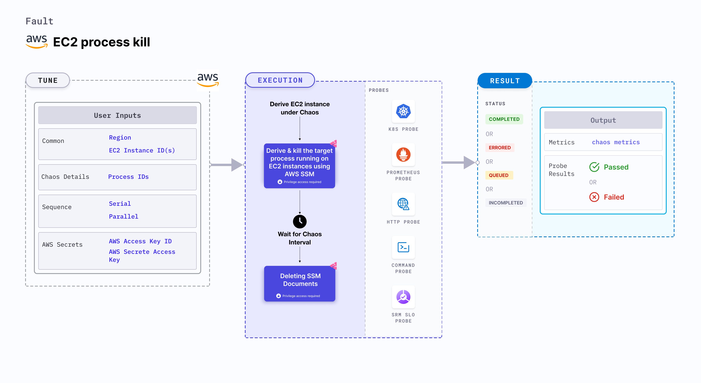

## Introduction

EC2 process kill fault kills the target processes running on an EC2 instance. This fault disrupts the application critical processes such as databases or message queues running on the EC2 instance by killing their underlying processes or threads.



## Use cases
EC2 process kill determines the resilience of applications when processes on EC2 instances are unexpectedly killed (or disrupted).


:::info note
- Kubernetes version 1.17 or later is required to execute the fault.
- The EC2 instance should be in healthy state
- The target processes should exist in the VM.
- SSM agent is installed and running in the target EC2 instance.
- The Kubernetes secret should have the AWS Access Key ID and Secret Access Key credentials in the `CHAOS_NAMESPACE`. Below is the sample secret file:
  ```yaml
  apiVersion: v1
  kind: Secret
  metadata:
    name: cloud-secret
  type: Opaque
  stringData:
    cloud_config.yml: |-
      # Add the cloud AWS credentials respectively
      [default]
      aws_access_key_id = XXXXXXXXXXXXXXXXXXX
      aws_secret_access_key = XXXXXXXXXXXXXXXXXXXXXXXXXXXXXXXXXXXX
  ```
- We recommend you use the same secret name, that is, `cloud-secret`. Otherwise, you will need to update the `AWS_SHARED_CREDENTIALS_FILE` environment variable in the fault template, and you won't be able to use the default health check probes. 
- Go to the [common tunables](../common-tunables-for-all-faults) to tune the common tunables for all the faults.
- Go to [AWS named profile for chaos](./security-configurations/aws-switch-profile) to use a different profile for AWS faults and the [superset permission/policy](./security-configurations/policy-for-all-aws-faults) to execute all AWS faults.
:::

Below is an example AWS policy to execute the fault.

```json
{
    "Version": "2012-10-17",
    "Statement": [
        {
            "Effect": "Allow",
            "Action": [
                "ssm:GetDocument",
                "ssm:DescribeDocument",
                "ssm:GetParameter",
                "ssm:GetParameters",
                "ssm:SendCommand",
                "ssm:CancelCommand",
                "ssm:CreateDocument",
                "ssm:DeleteDocument",
                "ssm:GetCommandInvocation",          
                "ssm:UpdateInstanceInformation",
                "ssm:DescribeInstanceInformation"
            ],
            "Resource": "*"
        },
        {
            "Effect": "Allow",
            "Action": [
                "ec2messages:AcknowledgeMessage",
                "ec2messages:DeleteMessage",
                "ec2messages:FailMessage",
                "ec2messages:GetEndpoint",
                "ec2messages:GetMessages",
                "ec2messages:SendReply"
            ],
            "Resource": "*"
        },
        {
            "Effect": "Allow",
            "Action": [
                "ec2:DescribeInstanceStatus",
                "ec2:DescribeInstances"
            ],
            "Resource": [
                "*"
            ]
        }
    ]
}
```

## Fault tunables
 <h3>Mandatory tunables</h3>
    <table>
      <tr>
        <th> Tunable </th>
        <th> Description </th>
        <th> Notes </th>
      </tr>
      <tr>
        <td> EC2_INSTANCE_ID </td>
        <td> ID of the target EC2 instance. </td>
        <td> For example, <code>i-044d3cb4b03b8af1f</code>. </td>
      </tr>
      <tr>
        <td> REGION </td>
        <td> The AWS region ID where the EC2 instance has been created. </td>
        <td> For example, <code>us-east-1</code>. </td>
      </tr>
      <tr>
        <td> PROCESS_IDS </td>
        <td> Process IDs of the target processes provided as comma-separated values. </td>
        <td> For example, 183,253,857. </td>
      </tr>
    </table>
    <h3>Optional tunables</h3>
    <table>
      <tr>
        <th> Tunable </th>
        <th> Description </th>
        <th> Notes </th>
      </tr>
      <tr>
        <td> TOTAL_CHAOS_DURATION </td>
        <td> Duration that you specify, through which chaos is injected into the target resource (in seconds). </td>
        <td> Defaults to 30s. </td>
      </tr>
      <tr>
        <td> RAMP_TIME </td>
        <td> Period to wait before and after injecting chaos (in seconds).  </td>
        <td> For example, 30 </td>
      </tr>
    </table>

### Process IDs
Target process IDs running on a particular EC2 instance.

The following YAML snippet illustrates the use of this environment variable:

[embedmd]:# (./static/manifests/ec2-process-kill/ec2-process-kill-processid.yaml yaml)
```yaml
# Process kill running on EC2 instance
apiVersion: litmuschaos.io/v1alpha1
kind: ChaosEngine
metadata:
  name: engine-nginx
spec:
  engineState: "active"
  chaosServiceAccount: litmus-admin
  experiments:
  - name: ec2-process-kill
    spec:
      components:
        env:
        # List of Process IDs
        - name: PROCESS_IDS
          value: '8688,4678'
        - name: EC2_INSTANCE_ID
          value: 'instance-1'
        - name: REGION
          value: 'us-west-2'
```
