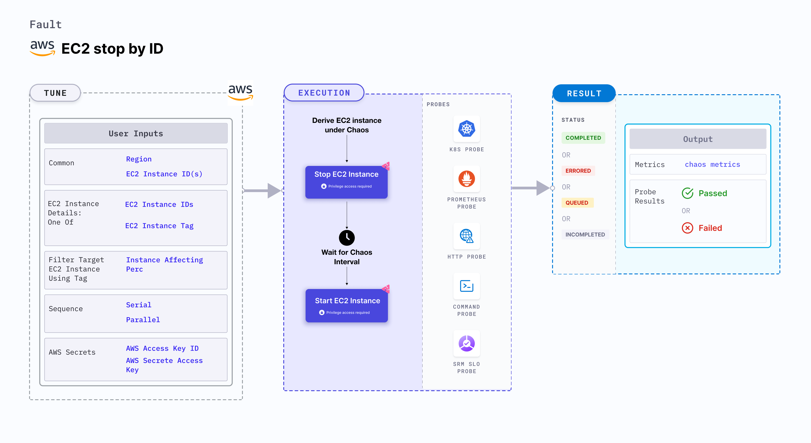

## Introduction

EC2 stop by ID stops an EC2 instance using the provided instance ID or list of instance IDs and brings back the instance after a specific duration. When the `MANAGED_NODEGROUP` environment variable is enabled, the fault will not try to start the instance after chaos. Instead, it checks for the addition of a new node instance to the cluster.



## Use cases
EC2 stop by ID:
- Determines the performance of the application (or process) running on the EC2 instance.
- Determines the resilience of an application to unexpected halts in the EC2 instance by validating its failover capabilities.


:::info note
- Kubernetes version 1.17 or later is required to execute the fault.
- Access to start and stop an EC2 instance in AWS.
- The EC2 instance should be in a healthy state.
- The Kubernetes secret should have the AWS access configuration(key) in the `CHAOS_NAMESPACE`. Below is the sample secret file.
  ```yaml
  apiVersion: v1
  kind: Secret
  metadata:
    name: cloud-secret
  type: Opaque
  stringData:
    cloud_config.yml: |-
      # Add the cloud AWS credentials respectively
      [default]
      aws_access_key_id = XXXXXXXXXXXXXXXXXXX
      aws_secret_access_key = XXXXXXXXXXXXXXX
  ```
- We recommend you use the same secret name, that is, `cloud-secret`. Otherwise, update the `AWS_SHARED_CREDENTIALS_FILE` environment variable in the fault template, and you won't be able to use the default health check probes. 
- Go to [AWS named profile for chaos](./security-configurations/aws-switch-profile) to use a different profile for AWS faults and the [superset permission/policy](./security-configurations/policy-for-all-aws-faults) to execute all AWS faults.
- Go to the [common tunables](../common-tunables-for-all-faults) and [AWS-specific tunables](./aws-fault-tunables) to tune the common tunables for all faults and AWS-specific tunables.
:::

:::warning
If the target EC2 instance is a part of a managed node group, drain the target node of any application running on it. Isolate the target node before running the fault so that the faulty pods are not scheduled on it.
:::

Below is an example AWS policy to execute the fault.

```json
{
    "Version": "2012-10-17",
    "Statement": [
        {
            "Effect": "Allow",
            "Action": [
                "ec2:StartInstances",
                "ec2:StopInstances",
                "ec2:DescribeInstanceStatus",
                "ec2:DescribeInstances"
            ],
            "Resource": "*"
        },
        {
            "Effect": "Allow",
            "Action": [
                "autoscaling:DescribeAutoScalingInstances"
            ],
            "Resource": "*"
        }
    ]
}
```

## Fault tunables

 <h3>Mandatory tunables</h3>
    <table>
      <tr>
        <th> Tunable </th>
        <th> Description </th>
        <th> Notes </th>
      </tr>
      <tr>
        <td> EC2_INSTANCE_ID </td>
        <td> Instance ID of the target EC2 instance. Multiple IDs can also be provided as a comma(,) separated values.</td>
        <td> Multiple IDs can be provided as `id1,id2`. </td>
      </tr>
      <tr>
        <td> REGION </td>
        <td> The region name of the target instance.</td>
        <td> </td>
      </tr>
    </table>
    <h3>Optional tunables</h3>
    <table>
      <tr>
        <th> Tunable </th>
        <th> Description </th>
        <th> Notes </th>
      </tr>
      <tr>
        <td> TOTAL_CHAOS_DURATION </td>
        <td> Duration that you specify, through which chaos is injected into the target resource (in seconds). </td>
        <td> Defaults to 30s. </td>
      </tr>
      <tr>
        <td> CHAOS_INTERVAL </td>
        <td> The interval (in sec) between successive instance termination.</td>
        <td> Defaults to 30s. </td>
      </tr>
      <tr>
        <td> MANAGED_NODEGROUP </td>
        <td> Set to <code>enable</code> if the target instance is the part of self-managed nodegroups. </td>
        <td> Defaults to <code>disable</code>. </td>
      </tr>
      <tr>
        <td> SEQUENCE </td>
        <td> It defines sequence of chaos execution for multiple instance.</td>
        <td> Defaults to parallel. Supports serial sequence as well. </td>
      </tr>
      <tr>
        <td> RAMP_TIME </td>
        <td> Period to wait before and after injecting chaos (in seconds).  </td>
        <td> For example, 30s. </td>
      </tr>
    </table>

### Stop Instances By ID

Comma-separated list of target instance IDs. Tune it by using the `EC2_INSTANCE_ID` environment variable.

The following YAML snippet illustrates the use of this environment variable:

[embedmd]:# (./static/manifests/ec2-stop-by-id/instance-id.yaml yaml)
```yaml
# contains the instance id, to be terminated/stopped
apiVersion: litmuschaos.io/v1alpha1
kind: ChaosEngine
metadata:
  name: engine-nginx
spec:
  engineState: "active"
  chaosServiceAccount: litmus-admin
  experiments:
  - name: ec2-terminate-by-id
    spec:
      components:
        env:
        # ID of the EC2 instance
        - name: EC2_INSTANCE_ID
          value: 'instance-1'
        # region for the EC2 instance
        - name: REGION
          value: 'us-east-1'
```
