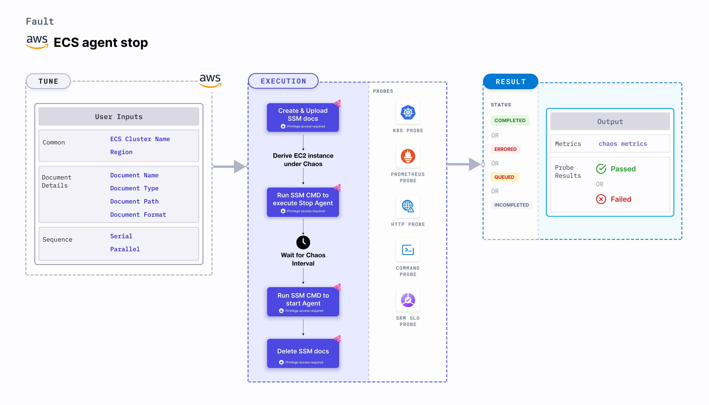

## Introduction

ECS agent stop disrupts the state of infrastructure resources. This fault:
- Induces an agent stop chaos on AWS ECS using Amazon SSM Run command, that is carried out by using SSM documentation which is in-built in the fault for the give chaos scenario.
- Causes agent container stop on ECS for a specific duration, with a given `CLUSTER_NAME` envrionment variable using SSM documentation. Killing the agent container disrupts the performance of the task containers.




## Use cases
ECS agent stop halts the agent that manages the task container on the ECS cluster, thereby impacting its delivery. 


:::info note
- Kubernetes version 1.17 or later is required to execute the fault.
- The ECS container instance should be in healthy state.
- ECS container metadata should be enabled (this feature is disabled by default). To enable it please follow the aws docs to [Enabling container metadata](https://docs.aws.amazon.com/AmazonECS/latest/developerguide/container-metadata.html). If you have your task running prior this activity you may need to restart it to get the metadata directory as mentioned in the docs.
- You and ECS cluster instances have a role with the required AWS access to do SSM and ECS operations. Go to [Systems Manager documentation](https://docs.aws.amazon.com/systems-manager/latest/userguide/setup-launch-managed-instance.html).
- The Kubernetes secret should have the AWS access configuration(key) in the `CHAOS_NAMESPACE`. A sample secret file looks like:
  ```yaml
  apiVersion: v1
  kind: Secret
  metadata:
    name: cloud-secret
  type: Opaque
  stringData:
    cloud_config.yml: |-
      # Add the cloud AWS credentials respectively
      [default]
      aws_access_key_id = XXXXXXXXXXXXXXXXXXX
      aws_secret_access_key = XXXXXXXXXXXXXXX
  ```
- We recommend you use the same secret name, that is, `cloud-secret`. Otherwise, you will need to update the `AWS_SHARED_CREDENTIALS_FILE` environment variable in the fault template, and you won't be able to use the default health check probes. 
- Go to [AWS named profile for chaos](./security-configurations/aws-switch-profile) to use a different profile for AWS faults and the [superset permission/policy](./security-configurations/policy-for-all-aws-faults) to execute all AWS faults.
- Go the [common tunables](../common-tunables-for-all-faults) and [AWS-specific tunables](./aws-fault-tunables) to tune the common tunables for all faults and AWS-specific tunables.
:::

Below is an example AWS policy to execute the fault.

```json
{
    "Version": "2012-10-17",
    "Statement": [
        {
            "Sid": "VisualEditor0",
            "Effect": "Allow",
            "Action": [
                "ecs:UpdateContainerInstancesState",
                "ecs:RegisterContainerInstance",
                "ecs:ListContainerInstances",
                "ecs:DeregisterContainerInstance",
                "ecs:DescribeContainerInstances",
                "ecs:ListTasks",
                "ecs:DescribeClusters"

            ],
            "Resource": "*"
        },
        {
            "Effect": "Allow",
            "Action": [
                "ssm:GetDocument",
                "ssm:DescribeDocument",
                "ssm:GetParameter",
                "ssm:GetParameters",
                "ssm:SendCommand",
                "ssm:CancelCommand",
                "ssm:CreateDocument",
                "ssm:DeleteDocument",
                "ssm:GetCommandInvocation",          
                "ssm:UpdateInstanceInformation",
                "ssm:DescribeInstanceInformation"
            ],
            "Resource": "*"
        },
        {
            "Effect": "Allow",
            "Action": [
                "ec2messages:AcknowledgeMessage",
                "ec2messages:DeleteMessage",
                "ec2messages:FailMessage",
                "ec2messages:GetEndpoint",
                "ec2messages:GetMessages",
                "ec2messages:SendReply"
            ],
            "Resource": "*"
        },
        {
            "Effect": "Allow",
            "Action": [
                "ec2:DescribeInstances"
            ],
            "Resource": [
                "*"
            ]
        }
    ]
}
```

## Fault tunables
<h3>Mandatory tunables</h3>
    <table>
        <tr>
          <th> Tunable </th>
          <th> Description </th>
          <th> Notes </th>
        </tr>
        <tr> 
          <td> CLUSTER_NAME </td>
          <td> Name of the target ECS cluster</td>
          <td> Single name supported For example, <code>demo-cluster</code></td>
        </tr>
        <tr>
          <td> REGION </td>
          <td> The AWS region name of the target ECS cluster</td>
          <td> For example, <code>us-east-2</code></td>
        </tr>
    </table>
    <h3>Optional tunables</h3>
    <table>
      <tr>
        <th> Tunable </th>
        <th> Description </th>
        <th> Notes </th>
      </tr>
      <tr>
        <td> TOTAL_CHAOS_DURATION </td>
        <td> The total time duration for chaos insertion (sec) </td>
        <td> Default: 30 s </td>
      </tr>
      <tr>
        <td> CHAOS_INTERVAL </td>
        <td> The interval (in sec) between successive instance termination.</td>
        <td> Default: 30 s </td>
      </tr>
      <tr> 
        <td> AWS_SHARED_CREDENTIALS_FILE </td>
        <td> Provide the path for aws secret credentials</td>
        <td> Default: <code>/tmp/cloud_config.yml</code> </td>
      </tr>
      <tr>
        <td> SEQUENCE </td>
        <td> It defines sequence of chaos execution for multiple instance</td>
        <td> Default: parallel. Supported: serial, parallel </td>
      </tr>
      <tr>
        <td> RAMP_TIME </td>
        <td> Period to wait before and after injection of chaos in sec </td>
        <td> For example, 30 </td>
      </tr>
    </table>

### Agent stop

Target agent that is stopped for a specific duration. Tune it by using the `CLUSTER_NAME` environment variable. 

The following YAML snippet illustrates the use of this environment variable:

[embedmd]:# (./static/manifests/ecs-agent-stop/agent-stop.yaml yaml)
```yaml
# stops the agent of an ECS cluster
apiVersion: litmuschaos.io/v1alpha1
kind: ChaosEngine
metadata:
  name: engine-nginx
spec:
  engineState: "active"
  annotationCheck: "false"
  chaosServiceAccount: litmus-admin
  experiments:
  - name: ecs-agent-stop
    spec:
      components:
        env:
        # provide the name of ECS cluster
        - name: CLUSTER_NAME
          value: 'demo'
        - name: REGION
          value: 'us-east-2'
        - name: TOTAL_CHAOS_DURATION
          VALUE: '60'
```
