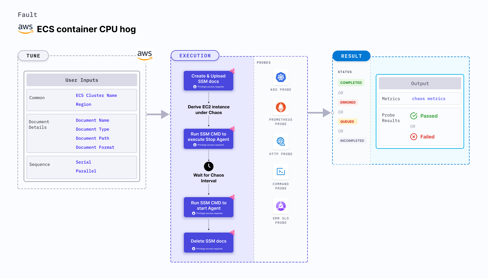

## Introduction

ECS container CPU hog disrupts the state of infrastructure resources. It induces stress on the AWS ECS container using Amazon SSM Run command, which is carried out using SSM documentation that is in-built into the fault. This fault:
- Causes CPU chaos on the containers of the ECS task using the given `CLUSTER_NAME` environment variable for a specific duration.
- To select the Task Under Chaos (TUC), use the service name associated with the task. If you provide the service name along with the cluster name, all the tasks associated with the given service will be selected as chaos targets.




## Use cases
ECS Container CPU hog:
- Evicts the application (task container) thereby impacting its delivery. These issues are known as noisy neighbour problems. 
- Simulates a lack of CPU for processes running on the application, which degrades their performance. 
- Verifies metrics-based horizontal pod autoscaling as well as vertical autoscale, that is, demand-based CPU addition. 
- Scales the nodes based on growth beyond budgeted pods. 
- Verifies the autopilot functionality of (cloud) managed clusters.
- Verifies multi-tenant load issue, wherein when the load increases on one container, it does not cause downtime in other containers. 
- Tests the ECS task sanity (service availability) and recovery of the task containers subject to CPU stress.


:::info note
- Kubernetes version 1.17 or later is required to execute the fault.
- ECS container instance should be in a healthy state.
- ECS container metadata is enabled (disabled by default). To enable it, go to [container metadata](https://docs.aws.amazon.com/AmazonECS/latest/developerguide/container-metadata.html). If your task is running from before, you may need to restart it to get the metadata directory.
- You and the ECS cluster instances have a role with the required AWS access to perform the SSM and ECS operations. Go to [systems manager documentation](https://docs.aws.amazon.com/systems-manager/latest/userguide/setup-launch-managed-instance.html).
- The Kubernetes secret should have the AWS access configuration(key) in the `CHAOS_NAMESPACE`. Below is a sample secret file:
  ```yaml
  apiVersion: v1
  kind: Secret
  metadata:
    name: cloud-secret
  type: Opaque
  stringData:
    cloud_config.yml: |-
      # Add the cloud AWS credentials respectively
      [default]
      aws_access_key_id = XXXXXXXXXXXXXXXXXXX
      aws_secret_access_key = XXXXXXXXXXXXXXX
  ```
- We recommend you use the same secret name, that is, `cloud-secret`. Otherwise, update the `AWS_SHARED_CREDENTIALS_FILE` environment variable in the fault template, and you won't be able to use the default health check probes. 
- Go to [AWS named profile for chaos](./security-configurations/aws-switch-profile) to use a different profile for AWS faults and the [superset permission/policy](./security-configurations/policy-for-all-aws-faults) to execute all AWS faults.
- Go to the [common tunables](../common-tunables-for-all-faults) and [AWS-specific tunables](./aws-fault-tunables) to tune the common tunables for all faults and AWS-specific tunables.
:::

Below is an example AWS policy to execute the fault.

```json
{
    "Version": "2012-10-17",
    "Statement": [
        {
            "Sid": "VisualEditor0",
            "Effect": "Allow",
            "Action": [
                "ecs:UpdateContainerInstancesState",
                "ecs:RegisterContainerInstance",
                "ecs:ListContainerInstances",
                "ecs:DeregisterContainerInstance",
                "ecs:DescribeContainerInstances",
                "ecs:ListTasks",
                "ecs:DescribeClusters"

            ],
            "Resource": "*"
        },
        {
            "Effect": "Allow",
            "Action": [
                "ssm:GetDocument",
                "ssm:DescribeDocument",
                "ssm:GetParameter",
                "ssm:GetParameters",
                "ssm:SendCommand",
                "ssm:CancelCommand",
                "ssm:CreateDocument",
                "ssm:DeleteDocument",
                "ssm:GetCommandInvocation",          
                "ssm:UpdateInstanceInformation",
                "ssm:DescribeInstanceInformation"
            ],
            "Resource": "*"
        },
        {
            "Effect": "Allow",
            "Action": [
                "ec2messages:AcknowledgeMessage",
                "ec2messages:DeleteMessage",
                "ec2messages:FailMessage",
                "ec2messages:GetEndpoint",
                "ec2messages:GetMessages",
                "ec2messages:SendReply"
            ],
            "Resource": "*"
        },
        {
            "Effect": "Allow",
            "Action": [
                "ec2:DescribeInstances"
            ],
            "Resource": [
                "*"
            ]
        }
    ]
}
```

## Fault tunables
 <h3>Mandatory tunables</h3>
    <table>
        <tr>
        <th> Tunable </th>
        <th> Description </th>
        <th> Notes </th>
        </tr>
        <tr> 
        <td> CLUSTER_NAME </td>
        <td> Name of the target ECS cluster. </td>
        <td> For example, <code>cluster-1</code>. </td>
        </tr>
        <tr>
        <td> REGION </td>
        <td> Region name of the target ECS cluster</td>
        <td> For example, <code>us-east-1</code>. </td>
        </tr>
    </table>
    <h3>Optional tunables</h3>
    <table>
      <tr>
        <th> Tunable </th>
        <th> Description </th>
        <th> Notes </th>
      </tr>
      <tr>
        <td> TOTAL_CHAOS_DURATION </td>
        <td> Duration that you specify, through which chaos is injected into the target resource (in seconds). </td>
        <td> Default: 30 s. </td>
      </tr>
      <tr>
        <td> CHAOS_INTERVAL </td>
        <td> Interval between successive instance terminations (in seconds).</td>
        <td> Default: 30 s. </td>
      </tr>
      <tr> 
        <td> AWS_SHARED_CREDENTIALS_FILE </td>
        <td> Path to the AWS secret credentials.</td>
        <td> Default: <code>/tmp/cloud_config.yml</code>. </td>
      </tr>
      <tr> 
        <td> CPU_CORE </td>
        <td> Number of CPU cores to consume.</td>
        <td> Default: 0. </td>
      </tr>
      <tr> 
        <td> CPU_LOAD </td>
        <td> Percentage of the CPU to consume.</td>
        <td> Default: 100. </td>
      </tr>
      <tr>
        <td> SEQUENCE </td>
        <td> Sequence of chaos execution for multiple instances</td>
        <td> Default: parallel. Supports serial sequence. </td>
      </tr>
      <tr>
        <td> RAMP_TIME </td>
        <td> Period to wait before and after injecting chaos (in seconds).  </td>
        <td> For example, 30 s. </td>
      </tr>
    </table>


### CPU cores

Number of cores of the CPU to consume for the target container instances. Tune it by using the ` CPU_CORE` environment variable. When this environment variable is set to 0, all the available CPU resources are consumed.

The following YAML snippet illustrates the use of this environment variable:

[embedmd]:# (./static/manifests/ecs-stress-chaos/cpu-core.yaml yaml)
```yaml
# cpu cores for the stress
apiVersion: litmuschaos.io/v1alpha1
kind: ChaosEngine
metadata:
  name: engine-nginx
spec:
  engineState: "active"
  annotationCheck: "false"
  chaosServiceAccount: litmus-admin
  experiments:
  - name: ecs-container-cpu-hog
    spec:
      components:
        env:
        # provide the cpu core to be hogged
        - name: CPU_CORE
          value: '0'
        - name: REGION
          value: 'us-east-2'
        - name: TOTAL_CHAOS_DURATION
          VALUE: '60'
```

### CPU load

Percentage of CPU to be consumed for the target container instances. Tune it by using the ` CPU_LOAD` environment variable. When CPU load is set to 100, 100 percent of the CPU core is consumed.

The following YAML snippet illustrates the use of this environment variable:

[embedmd]:# (./static/manifests/ecs-stress-chaos/cpu-load.yaml yaml)
```yaml
# cpu load for the stress
apiVersion: litmuschaos.io/v1alpha1
kind: ChaosEngine
metadata:
  name: engine-nginx
spec:
  engineState: "active"
  annotationCheck: "false"
  chaosServiceAccount: litmus-admin
  experiments:
  - name: ecs-container-cpu-hog
    spec:
      components:
        env:
        # provide the cpu load percentage
        - name: CPU_LOAD
          value: '100'
        - name: CPU_CORE
          value: '0'
        - name: TOTAL_CHAOS_DURATION
          VALUE: '60'
```
